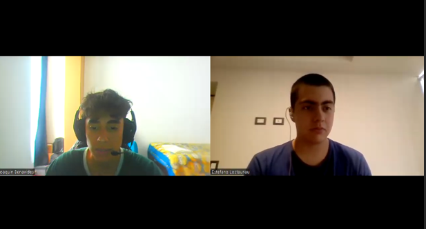
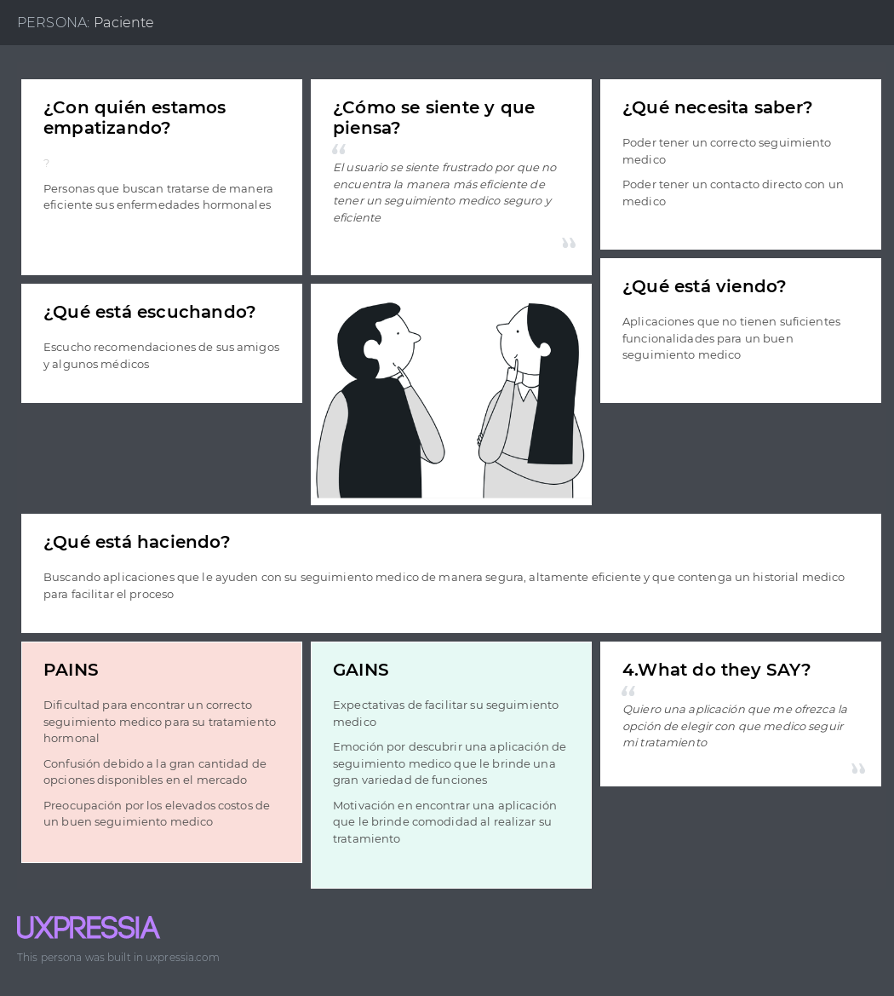
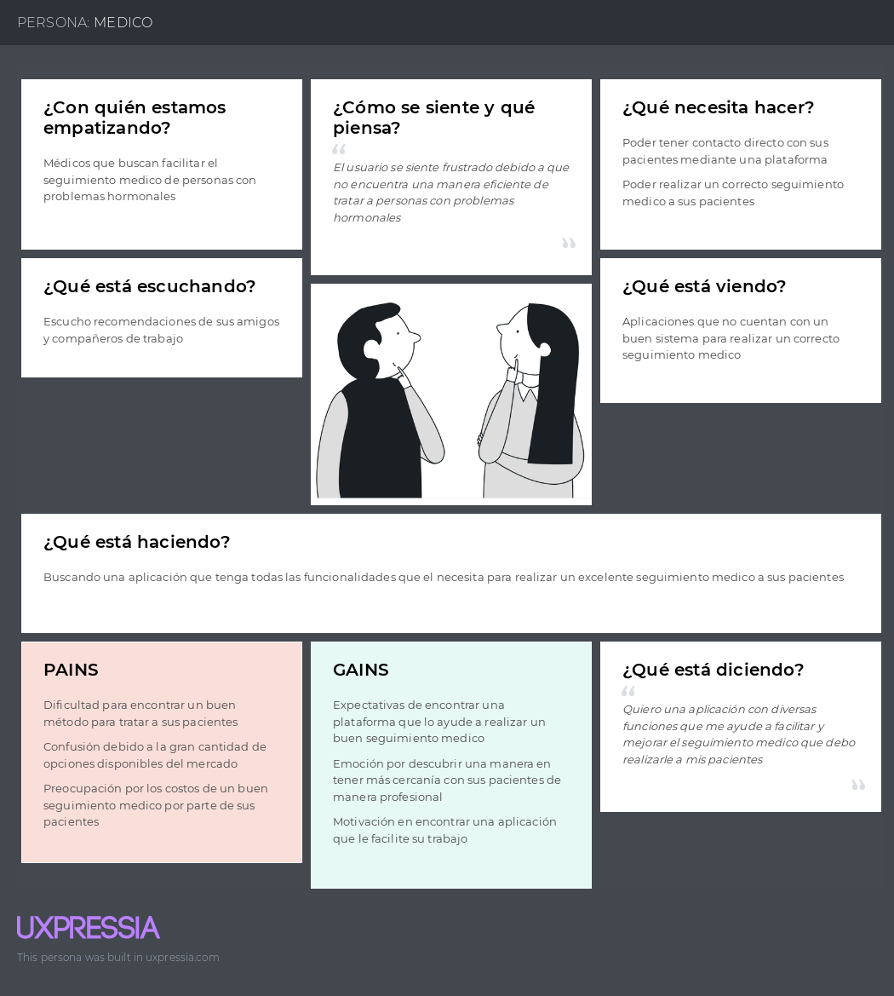
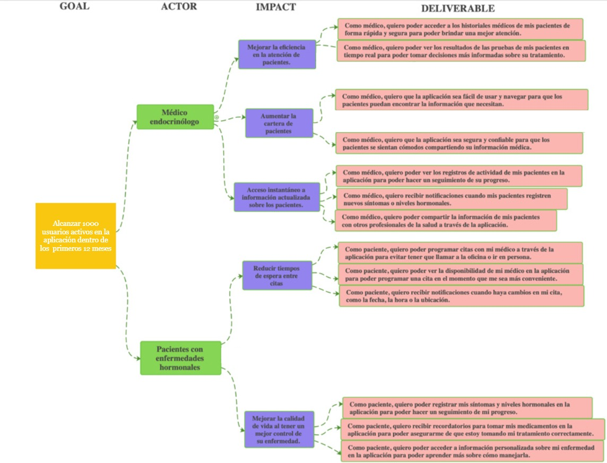
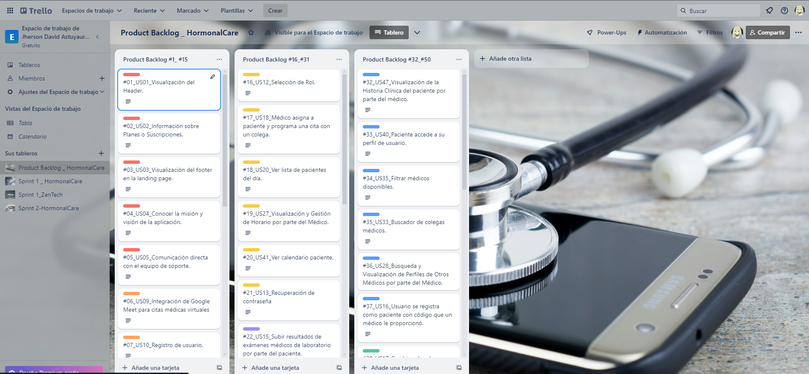

<h1 align="center">Universidad Peruana de Ciencias Aplicadas</h1>

<h2 align="center">Ingeniería de Software</h2>
<h3 align="center">Ciclo 2025-10</h3>

<h1 align="center">SI728 Arquitecturas De Software Emergentes</h1>

<h2 align="center"><strong>NRC:</strong> 4262 </h2>

<strong>Profesor:</strong> Christian Luis De Los Rios Fernandez

<h2 align="center"><strong>Informe de TB1</strong> </h2>

<strong>Nombre del startup:</strong> Ninja Code

<strong>Nombre del producto:</strong> HormonalCare

<h3 align="center">Team Members:</h3>

| Member                             |    Code    |
| :--------------------------------: | :--------: |
| Estefano Sebastian Lostaunau Pereira | U202211742 |
|  |  |
|  |  |
|  |  |
|  |  |

<h3 align="center"><strong>Marzo 2025</strong></h3>

Github: https://github.com/upc-pre-202510-si728-4262-ninjacode

## Registro de versiones del informe

| Versión |    Fecha   |    Autor   |    Descripción de la modificación    |
|:-----:|:--------:|:--------:|:--------:|
| TB1  v.1   | 16/04/2025 | Ninja Code | Para esta entrega se desarrollaron los capitulos I, II, III, IV|

## Project Report Collaboration Insights 

TB1:

## Contenido

### [Registro de versiones del informe](#registro-de-versiones-del-informe)

### [Project Report Collaboration Insights](#project-report-collaboration-insights)

### [Contenido](#contenido)

### [Student Outcome](#student-outcome-1)

### [Capítulo I: Presentación](#capítulo-i-presentación)

[1.1. Startup Profile](#11-startup-profile)

[1.1.1. Descripción de la Startup](#111descripción-de-la-startup)

[1.1.2. Perfiles de integrantes del equipo](#112-perfiles-de-integrantes-del-equipo)

[1.2. Solution Profile](#12-solution-profile)

[1.2.1. Antecedentes y problemática](#121--antecedentes-y-problemática)

[1.2.2. Lean UX Process](#122lean-ux-process)

[1.2.2.1. Lean UX Problem Statements](#1221lean-ux-problem-statements)

[1.2.2.2. Lean UX Assumptions](#1222lean-ux-assumptions)

[1.2.2.3. Lean UX Hypothesis Statements](#1223lean-ux-hypothesis-statements)

[1.2.2.4. Lean UX Canvas](#1224lean-ux-canvas)

[1.3. Segmentos objetivo](#13segmentos-objetivo)

### [Capítulo II:  Requirements Elicitation & Analysis](#capítulo-ii-needfinding-elicitation-&-analysis-1)

[2.1. Competidores](#21-competidores)

[2.1.1. Análisis competitivo](#211-análisis-competitivo)

[2.1.2. Estrategias y tácticas frente a competidores](#212---estrategias-y-tácticas-frente-a-competidores)

[2.2. Entrevistas](#22-entrevistas)

[2.2.1. Diseño de entrevistas](#221---diseño-de-entrevistas)

[2.2.2. Registro de entrevistas](#222---registro-de-entrevistas)

[2.2.3. Análisis de entrevistas](#223--análisis-de-entrevistas)

[2.3. Needfinding](#23------needfinding)

[2.3.1. User Personas](#231------user-personas)

[2.3.2. User Task Matrix](#232---user-task-matrix)

[2.3.3. User Journey Mapping](#233---user-journey-mapping)

[2.3.4. Empathy Mapping](#234---empathy-mapping)

[2.3.5. As-is Scenario Mapping](#235---as-is-scenario-mapping)

[2.4. Ubiquitous Language](#24------ubiquitous-language)

### [CAPÍTULO III: Requirements Specification](#capítulo-iii-requirements-specification-1)

[3.1. To-Be Scenario Mapping](#31-to-be-scenario-mapping)

[3.2. User Stories](#32-user-stories)

[3.3. Impact Mapping](#33-impact-mapping)

[3.4. Product Backlog](#34-product-backlog)

### [CAPÍTULO IV: SOLUTION SOFTWARE DESIGN](#capítulo-iv-solution-software-design)

[4.1. Strategic-Level Domain-Driven Design](#41-strategic-level-domain-driven-design)  

[4.1.1. EventStorming](#411-eventstorming)  

[4.1.1.1. Candidate Context Discovery](#4111-candidate-context-discovery)  

[4.1.1.2. Domain Message Flows Modeling](#4112-domain-message-flows-modeling)  

[4.1.1.3. Bounded Context Canvases](#4113-bounded-context-canvases)  

[4.1.2. Context Mapping](#412-context-mapping)  

[4.1.3. Software Architecture](#413-software-architecture)  

[4.1.3.1. Software Architecture System Landscape Diagrams](#4131-software-architecture-system-landscape-diagrams)  

[4.1.3.2. Software Architecture Context Level Diagrams](#4132-software-architecture-context-level-diagrams)  

[4.1.3.3. Software Architecture Container Level Diagrams](#4133-software-architecture-container-level-diagrams)  

[4.1.3.4. Software Architecture Deployment Diagrams](#4134-software-architecture-deployment-diagrams)  

[4.2. Tactical-Level Domain-Driven Design](#42-tactical-level-domain-driven-design)  

[4.2.1. Bounded Context: IAM](#421-bounded-context-iam)  

[4.2.1.1. Domain Layer](#4211-domain-layer)  

[4.2.1.2. Interface Layer](#4212-interface-layer)  

[4.2.1.3. Application Layer](#4213-application-layer)  

[4.2.1.4. Infrastructure Layer](#4214-infrastructure-layer)  

[4.2.1.5. Bounded Context Software Architecture Component Level Diagrams](#4215-component-level-diagrams)  

[4.2.1.6. Bounded Context Software Architecture Code Level Diagrams](#4216-code-level-diagrams)  

[4.2.1.6.1. Bounded Context Domain Layer Class Diagrams](#42161-domain-layer-class-diagrams)  

[4.2.1.6.2. Bounded Context Database Design Diagram](#42162-database-design-diagram)  

[4.2.2. Bounded Context: Profile](#422-bounded-context-profile)  

[4.2.2.1. Domain Layer](#4221-domain-layer)  

[4.2.2.2. Interface Layer](#4222-interface-layer)  

[4.2.2.3. Application Layer](#4223-application-layer)  

[4.2.2.4. Infrastructure Layer](#4224-infrastructure-layer)  

[4.2.2.5. Bounded Context Software Architecture Component Level Diagrams](#4225-component-level-diagrams)  

[4.2.2.6. Bounded Context Software Architecture Code Level Diagrams](#4226-code-level-diagrams)  

[4.2.2.6.1. Bounded Context Domain Layer Class Diagrams](#42261-domain-layer-class-diagrams)  

[4.2.2.6.2. Bounded Context Database Design Diagram](#42262-database-design-diagram)  

[4.2.3. Bounded Context: MedicalRecord](#423-bounded-context-medicalrecord)  

[4.2.3.1. Domain Layer](#4231-domain-layer)  

[4.2.3.2. Interface Layer](#4232-interface-layer)  

[4.2.3.3. Application Layer](#4233-application-layer)  

[4.2.3.4. Infrastructure Layer](#4234-infrastructure-layer)  

[4.2.3.5. Bounded Context Software Architecture Component Level Diagrams](#4235-component-level-diagrams)  

[4.2.3.6. Bounded Context Software Architecture Code Level Diagrams](#4236-code-level-diagrams)  

[4.2.3.6.1. Bounded Context Domain Layer Class Diagrams](#42361-domain-layer-class-diagrams)  

[4.2.3.6.2. Bounded Context Database Design Diagram](#42362-database-design-diagram)  

[4.2.4. Bounded Context: Payments](#424-bounded-context-payments)  

[4.2.4.1. Domain Layer](#4241-domain-layer)  

[4.2.4.2. Interface Layer](#4242-interface-layer)  

[4.2.4.3. Application Layer](#4243-application-layer)  

[4.2.4.4. Infrastructure Layer](#4244-infrastructure-layer)  

[4.2.4.5. Bounded Context Software Architecture Component Level Diagrams](#4245-component-level-diagrams)  

[4.2.4.6. Bounded Context Software Architecture Code Level Diagrams](#4246-code-level-diagrams)  

[4.2.4.6.1. Bounded Context Domain Layer Class Diagrams](#42461-domain-layer-class-diagrams)  

[4.2.4.6.2. Bounded Context Database Design Diagram](#42462-database-design-diagram)  

[4.2.5. Bounded Context: Notification](#425-bounded-context-notification)  

[4.2.5.1. Domain Layer](#4251-domain-layer)  

[4.2.5.2. Interface Layer](#4252-interface-layer)  

[4.2.5.3. Application Layer](#4253-application-layer)  

[4.2.5.4. Infrastructure Layer](#4254-infrastructure-layer)  

[4.2.5.5. Bounded Context Software Architecture Component Level Diagrams](#4255-component-level-diagrams)  

[4.2.5.6. Bounded Context Software Architecture Code Level Diagrams](#4256-code-level-diagrams)  

[4.2.5.6.1. Bounded Context Domain Layer Class Diagrams](#42561-domain-layer-class-diagrams)  

[4.2.5.6.2. Bounded Context Database Design Diagram](#42562-database-design-diagram)  

[4.2.6. Bounded Context: Communication](#426-bounded-context-communication)  

[4.2.6.1. Domain Layer](#4261-domain-layer)  

[4.2.6.2. Interface Layer](#4262-interface-layer)  

[4.2.6.3. Application Layer](#4263-application-layer)  

[4.2.6.4. Infrastructure Layer](#4264-infrastructure-layer)  

[4.2.6.5. Bounded Context Software Architecture Component Level Diagrams](#4265-component-level-diagrams)  

[4.2.6.6. Bounded Context Software Architecture Code Level Diagrams](#4266-code-level-diagrams)  

[4.2.6.6.1. Bounded Context Domain Layer Class Diagrams](#42661-domain-layer-class-diagrams)  

[4.2.6.6.2. Bounded Context Database Design Diagram](#42662-database-design-diagram)  

## [Conclusiones](#conclusiones)

[Conclusiones y recomendaciones](#conclusiones-y-recomendaciones)

[Video App Validation](#video-app-validation)

[Video About the product](#video-about-the-product)

[Video About the team](#video-about-the-team)

## [Referencias Bibliográficas](#referencias-bibliográficas-1)

## Student Outcome 

El curso contribuye al cumplimiento del Student Outcome ABET 7:

**ABET – EAC - Student Outcome 7**
**Criterio:** La capacidad de adquirir y aplicar nuevos conocimientos según sea necesario, utilizando estrategias de aprendizaje apropiadas.

En el siguiente cuadro se describe las acciones realizadas y enunciados de conclusiones por parte del grupo, que permiten sustentar el haber alcanzado el logro del ABET 7 – EAC - Student Outcome.

|Criterios específicos|Acciones realizadas|Conclusiones|
| - | - | - |
|7.c1. Actualiza conceptos y conocimientos necesarios para su desarrollo profesional y en especial para su proyecto en soluciones de ingeniería de software|
**Astuyauri Calderon Jherson David**	

TB1:Realicé una investigación exhaustiva sobre la telemedicina y sus normativas, a nivel regional y Nacional. También me encargué de actualizar mis conocimientos sobre las últimas actualizaciones de los software que vamos a utilizar, tendencias en usabilidad y experiencia de usuario (UX) para asegurar que la interfaz de HormonalCare sea intuitiva y fácil de usar, puesto que nuestra aplicación móvil debe ser sencilla para los usuarios. 

TB2: Durante la fase de diseño del proyecto HormonalCare, actualicé mis conocimientos en la creación de arquitecturas de software mediante el uso del modelo C4, una herramienta clave para visualizar los diferentes niveles de abstracción de la arquitectura del sistema. También profundicé en el diseño de bases de datos y la implementación del backend, asegurando que las soluciones propuestas cumplieran con los estándares actuales de la industria y las necesidades específicas del proyecto. 
 
 TP: Trabajé en el desarrollo del frontend de la aplicación móvil HormonalCare usando Flutter, enfocándome en crear una interfaz intuitiva. También me encargué de la conexión entre el frontend y el backend mediante APIs RESTful, asegurando una integración fluida y segura entre ambos sistemas. 
 
TB3: Desarrollé la lista de pacientes del día y el módulo de consulta en Flutter, lo cual implicó el aprendizaje de buenas prácticas para la gestión de listas de datos y el uso de widgets dinámicos en Flutter. Además, optimicé la conexión con el backend, asegurando la correcta consulta y visualización de datos de pacientes, una habilidad fundamental para ofrecer una experiencia de usuario fluida y confiable en aplicaciones de salud.
 
TB4: Mi aporte en esta TB4 fue la implementación de la funcionalidad de *medication* dentro del *medical record*. A lo largo de esta tarea, adquirí nuevos conocimientos sobre cómo gestionar de manera eficiente los datos de medicamentos y cómo optimizar la estructura de la base de datos para asegurar una buena integración con el backend. La implementación me permitió aprender a manejar mejor la información médica de los pacientes, dándome cuenta de la importancia de la precisión y la flexibilidad en el diseño de bases de datos para un sistema de salud.
 
TF: A lo largo de este proyecto, he actualizado mis conocimientos en áreas fundamentales para el desarrollo de aplicaciones de salud. Comencé investigando las normativas de la telemedicina, lo cual me permitió comprender mejor los requisitos legales y las mejores prácticas que aplican en este campo. Además, trabajé en la creación de arquitecturas de software utilizando el modelo C4, lo que me ayudó a estructurar y comprender cómo conectar los diferentes componentes de la aplicación de forma coherente. En el frontend, me concentré en asegurarme de que la interfaz de usuario fuera intuitiva, lo cual se convirtió en uno de los pilares del proyecto. He aprendido mucho sobre la integración del frontend con el backend usando APIs RESTful, lo que me permitió garantizar que los datos se compartieran de manera eficiente entre ambos sistemas, ofreciendo una experiencia fluida al usuario. Al final, mi trabajo en la implementación de la funcionalidad del medication dentro del medical record me permitió profundizar en la gestión de datos médicos y la optimización de bases de datos para su integración con el sistema.   

**Chinchihualpa Saldarriaga Luis Sebastian**	

TB1: En esta fase del proyecto, me enfoqué en liderar la creación del Lean UX Canvas y las hipótesis del proyecto, basándome en el análisis de usuarios y competidores. También participé en la definición de User Personas y el mapeo de User Journeys, lo que me permitió aplicar y actualizar conocimientos clave en diseño centrado en el usuario y la creación de historias de usuario. Estas acciones me han ayudado a fortalecer mis habilidades en la gestión de requisitos y a contribuir de manera efectiva al desarrollo del backlog de producto. 
 
 TB2: Para esta TB2, estuve actualizando mis conocimientos sobre modelado de bases de datos relacionales y no relacionales, así como en el diseño de diagramas de clases para optimizar la estructura del sistema. Esto me permitió profundizar en las mejores prácticas para garantizar un diseño de bases de datos eficiente y adaptable a distintas necesidades de ingeniería de software.
 
TP: Trabajé en el backend del sistema de autenticación de la aplicación HormonalCare utilizando Spring Boot. Mi principal tarea fue implementar el sistema de administración de identidades y accesos (IAM) basado en JWT para asegurar que los usuarios tuvieran un inicio de sesión seguro. Esto incluyó la creación de controladores y servicios para la generación y validación de tokens JWT, así como la protección de las rutas de la API.
  
TB3: En esta fase, trabajé en la implementación del perfil de usuario y un nuevo sistema de autenticación mediante el módulo de Sign-In en Flutter. Aprendí y apliqué técnicas avanzadas de diseño de interfaz de usuario y seguridad en autenticación. Para ello, me actualicé en patrones modernos de UI/UX para garantizar que la experiencia de acceso fuera intuitiva y segura, fortaleciendo mis habilidades en diseño de interfaces móviles.
 
TB4: Mi tarea principal durante esta TB4 fue la edición del perfil de usuario en Flutter, además de desarrollar el sistema de *sign up* para los tipos de usuario, específicamente para médicos y pacientes. En este proceso, profundicé en la creación de interfaces de usuario amigables y funcionales, prestando atención a la seguridad en el registro y validación de los datos. Fue un desafío importante porque tuve que integrar múltiples funcionalidades en Flutter, pero el resultado ha sido muy satisfactorio al ver cómo mejora la experiencia de los usuarios al interactuar con la aplicación.
 
TF: Durante el desarrollo de HormonalCare, actualicé y profundicé mis conocimientos en varias áreas clave del backend. Lideré la creación del Lean UX Canvas y la definición de las User Personas, lo cual me permitió aportar una visión clara de las necesidades de los usuarios. En cuanto al backend, trabajé en la implementación del sistema de autenticación usando JWT para asegurar un inicio de sesión seguro para los usuarios. Esto me permitió aplicar y afianzar mis conocimientos sobre la gestión de identidades y accesos (IAM). Además, me involucré en la implementación del perfil de usuario en el frontend de Flutter, lo que me permitió mejorar mis habilidades en diseño de interfaces y seguridad en la autenticación. También profundicé en el proceso de sign up para diferentes tipos de usuarios (médicos y pacientes), lo cual fue crucial para que la aplicación cumpliera con los requisitos de seguridad y funcionalidad.     
 
**Lostaunau Pereira Estéfano Sebatián**

TB1: Contribuí al proyecto actualizando mis conocimientos en la creación de Hypothesis Statements y User Stories. También participé en la presentación de estas estrategias ante el equipo y los stakeholders, destacando cómo nuestras propuestas se posicionarían en el mercado frente a la competencia. 

TB2: En esta fase del proyecto, participé en la configuración del entorno de desarrollo para la implementación backend, aplicando mis conocimientos actualizados en la administración de código fuente y la configuración de despliegue de software. Además, realicé configuraciones avanzadas para las pruebas de sprint, asegurando que el equipo pudiera realizar revisiones continuas de nuestro progreso. Estas tareas me permitieron no solo aplicar conocimientos previos, sino también adquirir nuevas habilidades en la automatización de despliegues y la gestión del ciclo de vida del software, las cuales son fundamentales para el desarrollo y validación de productos backend. 
 
 TP: Me enfoqué en implementar el sistema de autenticación de usuarios en la aplicación HormonalCare utilizando Flutter. Desarrollé las pantallas de registro (Sign Up) y acceso (Sign In), asegurando una experiencia de usuario fluida e intuitiva. Para la seguridad, me apoyé en la conexión con el backend mediante tokens JWT (JSON Web Tokens), lo que permitió mantener la autenticación de forma segura y eficiente.
 
TB3: Implementé la carga y descarga de archivos PDF en Firebase, donde estudié sobre el manejo de almacenamiento en la nube y la transferencia segura de archivos. Esto me permitió mejorar mi comprensión sobre el uso de Firebase para aplicaciones móviles, optimizando la funcionalidad para que los usuarios puedan gestionar documentos médicos de forma segura.
 
TB4: Mi principal contribución en esta TB4 fue la implementación de la carga de archivos mediante Firebase en el *medical record*. Esto me permitió adentrarme en el uso de Firebase como herramienta para gestionar archivos de manera eficiente en una base de datos en la nube. A lo largo de este proceso, aprendí cómo integrar Firebase con Flutter y cómo manejar de forma segura los documentos médicos, lo que representó un reto interesante y un aprendizaje valioso para mi desarrollo profesional.
 
TF: A lo largo de este proyecto, he adquirido y actualizado mis conocimientos en diversas áreas, tanto en backend como en frontend. Fui responsable de la implementación del sistema de autenticación de usuarios utilizando Flutter y JWT, lo que permitió que los usuarios se autenticaran de manera segura y eficiente. Además, aprendí a integrar el frontend con el backend de manera fluida, utilizando APIs RESTful. También trabajé en la carga y descarga de archivos médicos en Firebase, lo que me permitió explorar nuevas tecnologías para el almacenamiento de documentos en la nube. Este proceso me dio una comprensión más profunda sobre cómo integrar servicios en la nube y gestionar archivos de manera eficiente y segura. Además, mi trabajo en la integración de Firebase con Flutter me ayudó a optimizar la funcionalidad de la aplicación para la gestión de archivos médicos, lo cual es fundamental para garantizar la seguridad y el acceso a la información del paciente.      
 
**Quispesivana Torres Claudio Sandro**

TB1: Contribuí al desarrollo del proyecto desarrollando y aportando ideas para la seccion de Lean UX Problem Statement y User Stories, ademas de reforzar lo aprendido segun la documentacion ofical de Lean UX como metodologia agil la cual busca dar importancia a la experiencia de usuario al crear nuestro producto HormonalCare. 
 
 TB2: Para esta TB2, estuve actualizando mis conocimientos en diseño de interfaces de usuario (UI) y experiencia de usuario (UX), enfocándome en las mejores prácticas para el desarrollo de aplicaciones móviles en Android. Esto incluyó la investigación de nuevas tendencias y herramientas para crear Wireframes interactivos y User Flow Diagrams efectivos.
 
 TP:Desarrollé el módulo de backend encargado de la gestión de citas médicas en HormonalCare, utilizando Spring Boot. Implementé las funcionalidades para que los usuarios puedan agendar, cancelar y consultar sus citas. Además, diseñé un sistema de notificaciones para recordar a los usuarios sobre sus próximas citas y logré integrar estas funcionalidades con el frontend de la aplicación mediante APIs RESTful.
 TB3: Me encargué del desarrollo del calendario en Flutter y realicé correcciones en los endpoints de Spring Boot. Esto me ayudó a profundizar en la configuración de endpoints y la integración con el frontend, asegurando una sincronización adecuada entre el sistema y el calendario del usuario. El trabajo en la arquitectura de backend con Spring Boot me permitió fortalecer mis conocimientos en la creación de servicios escalables y en la estructura de APIs RESTful.
 
TB4: Mi aporte en esta TB4 estuvo enfocado en la mejora del calendario de eventos en Flutter, añadiendo colores para diferenciar los tipos de citas. También implementé las funcionalidades *PUT* y *DELETE* para el manejo de citas médicas, lo que permitió que los usuarios pudieran modificar o eliminar sus citas de manera sencilla. A través de este proceso, adquirí una mayor comprensión de cómo gestionar datos en tiempo real y cómo mejorar la interacción del usuario con la aplicación, lo cual es fundamental para garantizar una experiencia de usuario óptima.
 
TF: En este proyecto, actualicé mis conocimientos sobre el desarrollo de interfaces de usuario (UI) y experiencia de usuario (UX) para aplicaciones móviles, específicamente en Flutter. Participé en la creación del Lean UX Problem Statement y en la formulación de las User Stories, lo que me permitió comprender mejor cómo abordar las necesidades del usuario a través de soluciones ágiles y centradas en el diseño. En el backend, fui responsable de desarrollar el módulo para la gestión de citas médicas, asegurando que los usuarios pudieran agendar, cancelar y consultar sus citas de manera eficiente. Implementé un sistema de notificaciones para recordar a los usuarios sobre sus citas próximas, lo que mejoró la funcionalidad y la usabilidad de la aplicación. Además, trabajé en la mejora del calendario de citas en Flutter, añadiendo colores para diferenciar los tipos de citas y mejorando la interacción con el usuario al permitir que modificaran o eliminaran citas fácilmente.      
| TB1: En resumen, como equipo, hemos actualizado y ampliado nuestros conocimientos en áreas fundamentales para el desarrollo del proyecto HormonalCare. Nos enfocamos en investigar exhaustivamente la telemedicina y sus normativas a nivel regional y nacional, así como en mantenernos al día con las últimas tendencias en usabilidad y experiencia de usuario (UX). Colaboramos en la creación del Lean UX Canvas, la formulación de hipótesis, y la definición de User Personas y User Journeys, aplicando conceptos actualizados de diseño centrado en el usuario. También fortalecimos nuestras habilidades en la redacción de Hypothesis Statements y User Stories, asegurando que nuestras propuestas se alineen estratégicamente con las necesidades del mercado y los usuarios. Estas acciones han sido clave para nuestro desarrollo profesional y para la efectiva contribución al proyecto.  TB2: Como grupo, actualizamos nuestros conocimientos en áreas clave como el diseño de arquitecturas con diagramas de clases y bases de datos, junto con la creación de User Flow Diagrams y Wireframes interactivos para Android. También mejoramos la organización del proyecto mediante la gestión del Product Backlog y Sprint Backlog, y aprendimos a configurar entornos de desarrollo y desplegar servicios web RESTful API con documentación, aplicando mejora continua en todo el proceso.    TP:Cada miembro del equipo actualizó y fortaleció los conceptos clave necesarios para su desarrollo profesional. Los miembros que trabajaron en Flutter profundizaron en sus conocimientos de interfaces móviles y la integración con sistemas backend mediante APIs RESTful, mientras que los miembros encargados del backend en Spring Boot consolidaron su comprensión sobre seguridad y gestión de usuarios con JWT, así como sobre la creación de servicios robustos para la funcionalidad de citas médicas. En conjunto, se ha logrado una arquitectura bien definida y segura para HormonalCare, permitiendo ofrecer una solución de software sólida y efectiva.   TB3: En esta fase, todos los miembros del equipo se enfocaron en actualizar y aplicar sus conocimientos en áreas fundamentales para el desarrollo de una aplicación de salud. Cada integrante utilizó tecnologías como Flutter, Firebase y Spring Boot, adaptando sus habilidades para crear soluciones integradas y funcionales. Este proceso de aprendizaje fue clave para ofrecer una experiencia de usuario intuitiva y funcional en cada módulo del proyecto.   TB4: En resumen, como equipo, nuestra colaboración en esta TB4 nos permitió aplicar nuestros conocimientos en tecnologías como Firebase y Flutter, aprendiendo nuevas metodologías y mejores prácticas en el desarrollo de software. Cada uno de nosotros asumió un desafío específico que contribuyó de manera directa al avance del proyecto. A medida que desarrollábamos nuevas funcionalidades, nos dimos cuenta de lo esencial que es mantenernos actualizados con las herramientas y las mejores prácticas de la industria, lo cual no solo mejoró nuestro proyecto, sino también nuestra capacidad profesional.   TF: En este proyecto, el equipo ha demostrado un excelente nivel de actualización y aplicación de conocimientos en varias áreas críticas para el desarrollo de la aplicación HormonalCare. Cada miembro del equipo ha contribuido al proyecto con sus habilidades y conocimientos renovados, desde el diseño de la arquitectura y la seguridad hasta la implementación de interfaces intuitivas y la gestión eficiente de datos médicos. Hemos trabajado en la integración de sistemas backend y frontend utilizando tecnologías como Spring Boot, Flutter, Firebase y JWT, asegurando que la aplicación sea segura, funcional y fácil de usar. A lo largo de este proceso, no solo hemos aplicado nuestras habilidades técnicas, sino que también hemos actualizado constantemente nuestros conocimientos en diseño centrado en el usuario (UX), arquitectura de software, seguridad y tecnologías emergentes, lo que ha permitido que HormonalCare sea una solución robusta, escalable y alineada con las mejores prácticas de la industria.         |
|7.c2. Reconoce la necesidad del aprendizaje permanente para el desempeño profesional y el desarrollo de proyectos en soluciones de tecnologías de ingeniería de software.|
**Astuyauri Calderon Jherson David** 

TB1: Me dediqué a mejorar mis habilidades técnicas a lo largo del proyecto, como mis habilidades en figma y vertabelo. Además, de aprender sobre herramientas modernas como Docker y metodologías ágiles. Ayudé a integrar buenas prácticas para fomentar la calidad de la primera versión del informe para el desarrollo de HormonalCare.
 
TB2: El desarrollo del backend y la arquitectura en HormonalCare me hizo reconocer que el aprendizaje continuo es esencial para mantenerse actualizado en las tecnologías cambiantes. Implementar el modelo C4 y diseñar bases de datos robustas requiere mantenerse al día con las mejores prácticas y nuevas herramientas, lo que me motivó a seguir actualizando mis conocimientos para mejorar tanto la calidad de las soluciones como mi desempeño profesional. 
 
 TP:Reconocí la importancia del aprendizaje continuo al investigar nuevas herramientas como Swagger y Postman para optimizar la conexión entre el frontend y backend, garantizando un rendimiento eficiente y mejorando la calidad de la aplicación móvil.
 
TB3: La implementación de la lista de pacientes del día me hizo ver la necesidad de profundizar en Flutter y en el manejo de datos en tiempo real. También, investigué sobre optimización de interfaz para aplicaciones de salud, entendiendo la importancia de actualizarme constantemente para ofrecer soluciones seguras y prácticas.
 
TB4: Durante esta TB4, me di cuenta de la importancia de seguir aprendiendo y adaptándome a nuevas tecnologías. La implementación de Firebase y la carga de archivos me permitió profundizar en nuevas herramientas para el desarrollo de aplicaciones móviles, lo que me motivó a seguir investigando y mejorando en el uso de la nube y el manejo de bases de datos. Este tipo de retos son los que me impulsan a continuar desarrollándome profesionalmente.
 
TF: A lo largo del desarrollo del proyecto HormonalCare, me di cuenta de la importancia del aprendizaje continuo en mi desarrollo profesional. Durante este proceso, me actualicé en herramientas como Figma y Vertabelo para mejorar mis habilidades de diseño, y aprendí sobre nuevas tecnologías como Docker para la creación de contenedores, lo que me permitió optimizar el flujo de trabajo del equipo. Además, al trabajar en el backend y en la arquitectura del sistema, me di cuenta de que mantenerse al día con las nuevas tecnologías es clave para seguir ofreciendo soluciones eficientes y escalables. La implementación de nuevas herramientas como Swagger y Postman para la optimización de la comunicación entre frontend y backend me permitió aprender sobre buenas prácticas de API, mejorando la calidad de la aplicación móvil.      
 
**Chinchihualpa Saldarriaga Luis Sebastian**	
 
TB1: Durante esta etapa del proyecto, reconocí la importancia del aprendizaje continuo al explorar nuevas metodologías como Lean UX, que no había utilizado previamente. Investigué y me actualicé en técnicas de mapeo de usuarios y análisis competitivo para asegurar que nuestras decisiones estuvieran fundamentadas en las mejores prácticas actuales. Este proceso de aprendizaje constante no solo enriqueció mi comprensión de la gestión de proyectos en ingeniería de software, sino que también me preparó para enfrentar futuros desafíos con una mentalidad de mejora continua y adaptación a nuevas tecnologías y enfoques.

TB2: Durante esta TB2, trabajé en la creación de diagramas de bases de datos relacionales y no relacionales y en un diagrama de clases. Reconocí la importancia del aprendizaje continuo para poder estar al tanto de las nuevas tecnologías y enfoques, que son esenciales para mantenerme actualizado en el campo del desarrollo de software.
 
 TP:Para poder asegurar la autenticación de los usuarios en HormonalCare, me vi en la necesidad de aprender más sobre la implementación de seguridad basada en tokens JWT. Investigando diversas fuentes y documentación de Spring Boot Security, pude mejorar mi comprensión sobre la validación y creación de tokens. También fue importante aprender sobre técnicas de protección de endpoints en APIs RESTful, lo que fortaleció la seguridad de nuestra aplicación.
 
TB3: La creación de un sistema de autenticación y perfil en Flutter me llevó a estudiar nuevas prácticas de seguridad y tendencias en autenticación móvil. Esta experiencia me mostró la importancia de la actualización constante en temas de seguridad y diseño de interfaces, necesarias para proteger los datos de usuario y mejorar la usabilidad de aplicaciones críticas.
 
TB4: Mi experiencia al trabajar en el sistema de *sign up* y la edición del perfil me permitió comprender lo crucial que es el aprendizaje continuo para poder adaptarse a las nuevas demandas del desarrollo móvil. Aprendí sobre la integración de nuevas funciones en Flutter, lo que me impulsó a investigar más sobre cómo mejorar la seguridad y la experiencia de usuario. Este proceso me ha motivado a seguir aprendiendo para aplicar mejores prácticas en mis futuros proyectos.
 
TF: Durante el desarrollo de HormonalCare, entendí la necesidad de aprender de manera continua para mantenerme actualizado en las últimas tendencias y tecnologías. Investigué sobre Lean UX, JWT para la autenticación de usuarios, y la integración de bases de datos. Todo esto me ayudó a mejorar la seguridad y la calidad de la aplicación. La implementación de JWT en el sistema de autenticación me llevó a profundizar mis conocimientos en seguridad y protección de datos. Además, al trabajar con Flutter, investigué sobre nuevas técnicas de diseño de interfaces móviles, lo que me permitió mejorar la experiencia de usuario y mantener la seguridad de la información personal de los usuarios.
 
**Lostaunau Pereira Estéfano Sebatián**

TB1: Me enfoqué en fortalecer mi desarrollo profesional a través del aprendizaje continuo, lo que me permitió mejorar en la redacción y presentación de documentación técnica. Adapté mis escritos para comunicar con claridad y precisión tanto a audiencias técnicas como no técnicas, asegurando que todos los stakeholders comprendieran los avances y propuestas del proyecto.

TB2: Durante esta entrega, reconocí la necesidad de actualizarme en herramientas de colaboración y documentación de pruebas para Sprints, como parte del proceso de validación del producto backend. Investigando y aplicando nuevas metodologías de revisión de código y estrategias para la integración continua, adquirí conocimientos que no había implementado en proyectos anteriores. Este aprendizaje fue clave para documentar correctamente las pruebas y la evidencia de ejecución de los sprints. A través de este proceso, fortalecí mis habilidades en la validación continua y me aseguré de que el equipo aplicara las mejores prácticas de la industria, lo que me ayudará a enfrentar proyectos futuros con una base técnica más sólida. 

 TP: Durante el desarrollo del sistema de autenticación de la aplicación HormonalCare en Flutter, identifiqué la necesidad de actualizar mis conocimientos sobre estrategias de seguridad móvil. Investigué sobre el uso de JWT y otras tecnologías para asegurar la autenticación, y también estudié mejores prácticas de seguridad en el manejo de credenciales de usuarios, lo que me permitió implementar un sistema de autenticación robusto y seguro.
 
TB3: Al trabajar con la carga y descarga de PDF en Firebase, reconocí la necesidad de actualizarme en la gestión de almacenamiento en la nube. Investigué cómo asegurar la transmisión de archivos y aprendí a integrar Firebase de forma eficiente en Flutter, lo cual fortaleció mis habilidades en manejo de archivos y optimización de datos.
 
TB4: En esta TB4, entendí que el aprendizaje permanente es esencial para seguir desarrollándome como profesional. La implementación de Firebase para la carga de archivos fue una excelente oportunidad para aprender sobre la integración de bases de datos en la nube y cómo mejorar la seguridad en el manejo de datos médicos. Este conocimiento me animó a seguir explorando nuevas tecnologías para mejorar la calidad de mis aplicaciones.
 
TF: Mi enfoque durante el proyecto fue actualizar mis conocimientos en diversas áreas clave, especialmente en el desarrollo seguro de aplicaciones. Me di cuenta de que el aprendizaje continuo es esencial para mantenerme al día con las nuevas herramientas, como JWT para la autenticación y Firebase para la carga de archivos en la nube. La investigación y la aplicación de estas tecnologías me permitió no solo mejorar la seguridad en la autenticación, sino también integrar soluciones de almacenamiento en la nube de manera eficiente. Además, profundicé en herramientas de colaboración y documentación de pruebas, lo que me ayudó a mejorar la calidad del producto y optimizar el proceso de desarrollo, asegurando que todo el equipo estuviera alineado en cada fase del proyecto.      
 
**Quispesivana Torres Claudio Sandro**

TB1: Para esta entrega tuve que recapitular lo aprendido sobre las metodologias agiles, puesto que el seguir con el aprendizaje de esta nos ayudo a tener mejor desarrollada cada una de nuestras User Stories que contribuiran al desarrollo del Product Backlog y Springs, que al final tendra como consecuencia la buena particion y distribucion de trabajos para la elaboracion cualquier proyecto de software, ya sea en este o en un futuros proyectos.

TB2: Para esta TB2, estuve trabajando en User Flow Diagrams y Wireframes interactivos de una app móvil en Android, con el fin de mejorar la experiencia del usuario y asegurar una navegación eficiente dentro de la aplicación.
 
 TP: Para la creación del módulo de citas médicas, fue crucial investigar y aprender sobre patrones de diseño de microservicios y la optimización del manejo de bases de datos en Spring Boot. Además, estudié nuevas técnicas para la gestión eficiente de notificaciones y recordatorios de citas, lo que me permitió ofrecer una solución más escalable y eficiente dentro del backend.
 
TB3: La integración del calendario y la configuración de endpoints en Spring Boot me hizo investigar sobre microservicios y sincronización de datos en tiempo real. Esto reafirmó la importancia del aprendizaje continuo, ya que trabajar en aplicaciones con múltiples componentes me demanda actualizarme en patrones de arquitectura y desarrollo ágil.
 
TB4: Trabajar en la visualización del calendario y las funcionalidades *PUT* y *DELETE* me permitió profundizar en mis conocimientos sobre la gestión de datos en tiempo real y cómo optimizar la interacción de los usuarios con la aplicación. Cada nuevo reto me mostró la importancia de seguir aprendiendo sobre nuevas herramientas y patrones de diseño para mejorar la calidad del software que desarrollo. Este proceso de constante aprendizaje me anima a seguir mejorando mis habilidades profesionales.
 
TF: En esta fase del proyecto, comprendí la importancia de seguir aprendiendo, ya que el entorno tecnológico siempre está en constante evolución. Trabajé en la implementación de microservicios y la optimización de bases de datos en Spring Boot, lo que me motivó a actualizar mis conocimientos en patrones de diseño y prácticas de seguridad. La integración del sistema de citas médicas y el calendario en Flutter me permitió profundizar en la gestión de datos en tiempo real y aprender nuevas metodologías para mejorar la interacción del usuario. Este proceso me mostró que el aprendizaje constante es crucial para adaptarme a las nuevas demandas del desarrollo de software y ofrecer soluciones eficientes.      
| TB1: En conclusion, reconocemos la importancia del aprendizaje permanente para nuestro desempeño profesional y el desarrollo exitoso de proyectos en soluciones de tecnologías de ingeniería de software. A lo largo del proyecto HormonalCare, cada miembro se comprometió a mejorar sus habilidades técnicas y profesionales. Nos dedicamos a profundizar en herramientas y metodologías modernas como Figma, Vertabelo, Docker, y metodologías ágiles, lo que nos permitió integrar buenas prácticas y asegurar la calidad en cada etapa del proyecto. Además, nos enfocamos en mejorar nuestra capacidad para redactar y presentar documentación técnica, adaptando nuestras comunicaciones para que fueran claras y precisas tanto para audiencias técnicas como no técnicas. Este enfoque en el aprendizaje continuo nos ha fortalecido como profesionales y ha sido crucial para la eficiente colaboración y desarrollo del proyecto, sentando una base sólida para futuros desafíos.  TB2: Como grupo, reconocemos la importancia del aprendizaje continuo para mantenernos al día con las tecnologías de software. A lo largo de la TB2, nos enfocamos en mejorar nuestras habilidades en áreas clave como el diseño de arquitecturas de software, el uso de bases de datos relacionales y no relacionales, y el desarrollo de interfaces móviles con Wireframes interactivos. Además, adoptamos nuevas herramientas para la gestión de proyectos con el Product Backlog y el Sprint Backlog, y aprendimos a implementar y documentar servicios web RESTful API, lo que refuerza nuestra capacidad para adaptarnos y mejorar constantemente en un entorno en evolución.    TP: Todo el equipo reconoció la importancia del aprendizaje permanente para el éxito del proyecto y su desarrollo profesional. El avance de la aplicación HormonalCare demandó que cada miembro explorara nuevas herramientas y tecnologías para optimizar la seguridad, la eficiencia del sistema y la experiencia de usuario. Investigaciones sobre JWT, mejores prácticas de seguridad, optimización de bases de datos y diseño de APIs fueron fundamentales para asegurar la calidad de la solución. Este ciclo resaltó cómo el aprendizaje continuo es esencial para mantenerse actualizado y preparado ante los desafíos de un entorno tecnológico en constante evolución.   TB3: Todos reconocemos la importancia del aprendizaje permanente en el desarrollo de software. Cada miembro se actualizó en temas específicos, como el manejo de autenticación segura, gestión de archivos en la nube, y sincronización de datos en tiempo real. Esta fase nos mostró cómo adaptarnos a nuevas tecnologías es esencial para desarrollar soluciones robustas y eficientes en proyectos de ingeniería de software.   TB4: En resumen, como equipo, esta TB4 nos permitió reflexionar sobre la importancia de mantenernos actualizados y aprender de manera constante. Cada uno de nosotros tuvo que investigar y adaptarse a nuevas herramientas y tecnologías, lo que refuerza nuestro compromiso con el aprendizaje continuo. A través de este proceso, hemos mejorado nuestras habilidades en Flutter, Firebase y en la gestión de aplicaciones móviles en general, lo que nos posiciona mejor para afrontar los desafíos futuros en el desarrollo de software.   TF: En el proyecto HormonalCare, el equipo ha demostrado un fuerte compromiso con el aprendizaje continuo, reconociendo la necesidad de actualizar constantemente nuestros conocimientos y habilidades para adaptarnos a las tecnologías cambiantes y mejorar el desempeño profesional. A lo largo del desarrollo, cada miembro del equipo investigó y aplicó nuevas herramientas y tecnologías, como JWT, Firebase, Docker, Postman, Swagger, y Lean UX, que nos permitieron optimizar el diseño, la seguridad, y la experiencia de usuario de la aplicación.        ||

## Objetivos SMART 
|                                                |                    |                   |                               | Specific - Específico                                                                 | Measurable - Medible                                                                               | Ambitious - Ambicioso                                                                                 | Relevant - Relevante                                                                                  | Time-bound - Tiempo Límite                                                |
|--------------------------------------------------|--------------------------|-----------------|----------------------------------|--------------------------------------------------------------------------------------|------------------------------------------------------------------------------------------------------|--------------------------------------------------------------------------------------------------------|--------------------------------------------------------------------------------------------------------|---------------------------------------------------------------------------------------------|
| Nombre del estudiante             |          Descripción del objetivo            |     Fecha de inicio      |          Fecha de cumplimiento o esperada           | ¿Qué se va a lograr? El objetivo indica con especificidad, cuál es el proceso, servicio o producto en cuestión, para qué área es relevante, u otro detalle clave que brinde contexto. | ¿Tiene KPI o métrica clara? El enunciado tiene una meta con indicador (KPI) o métrica clara, que determinará si el objetivo se cumplió. Idealmente, describe el impacto (lo que vamos a lograr) más que el entregable (lo que vamos a hacer). | ¿Es retador y va más allá de sus funciones? El objetivo inspira y reta a pensar acciones para dar el salto que se requiere para el logro, no se lograría sin una estrategia y un foco potentes. | ¿Está alineado a la estrategia? Existe una explicación clara respecto a cómo el objetivo impacta sobre los objetivos estratégicos de la Institución o Laureate Perú. Brinda una noción del alcance del objetivo. | ¿Cuándo se cumplirá? En caso que la expectativa de fecha de cumplimiento sea previa al cierre de ciclo académico, el enunciado contiene de forma explícita la fecha límite para alinear el objetivo. 
| Jherson David Astuyauri Calderon          | Desarrollar la primera versión de la conexión entre la pantalla principal de la aplicación móvil (home) en Flutter y el backend desarrollado en Spring Boot. | 24/08/2024   | 24/10/2024                       | Implementar la primera versión de la aplicación móvil en Flutter, asegurando la conexión entre el frontend y el backend. | Tener una versión funcional de la app con la interfaz de usuario y las APIs del backend integradas y operativas. | Desarrollar e integrar las capas frontend y backend en 2 meses. | Este objetivo es esencial para probar la funcionalidad básica de la app y avanzar hacia el lanzamiento del MVP. | La primera versión debe estar lista en 2 meses. 
| Estefano Sebastian Lostaunau Pereira          | Desarrollar una pantalla de historial médico que permita a los médicos revisar, registrar y ajustar planes de tratamiento para pacientes con enfermedades hormonales, utilizando un máximo de tres pantallas. | 25/08/2024      | 24/10/2024                       | Implementar una pantalla de historial médico optimizada que permita a los médicos realizar las acciones clave de seguimiento en tres pantallas o menos, mejorando la eficiencia del flujo de trabajo. | Reducir a tres o menos el número de pantallas necesarias para completar las acciones clave, y mejorar la satisfacción del usuario en un 25% según encuestas de usabilidad. | Requiere rediseñar la navegación y agrupar funciones esenciales, demandando un enfoque innovador y centrado en el usuario. | Apoya la estrategia de NinjaCode de mejorar la eficiencia médica y aumentar la adopción de la herramienta entre los profesionales de salud. | 
Claudio Sandro Quispesivana Torres         | Implementar la funcionalidad de registro (Sign Up) e inicio de sesión (Log In) en la app móvil HormonalCare.  | 26/08/2024	      | 24/10/2024                       | Desarrollar y desplegar las funcionalidades básicas de registro de usuarios y log in en la aplicación móvil. | Tener el sistema de registro y log in funcional, permitiendo a los usuarios crear cuentas y acceder a la app sin problemas. | Este objetivo implica aprender a manejar la autenticación básica y es clave para el acceso de los usuarios a la app. | Este objetivo es crucial para asegurar que los usuarios puedan comenzar a utilizar la app, lo cual es esencial para cualquier aplicación. | El sistema de registro y log in debe estar completamente implementado y funcional dentro de 2 meses. |
Luis Sebastian Chinchihualpa Saldarriaga        | Realizar el despliegue de la base de datos en un entorno de producción funcional.	  | 01/09/2024	      | 09/09/2024                       | Configurar y desplegar la base de datos en un entorno de producción, asegurando que sea accesible y esté operativa.	| Confirmar que la base de datos esté desplegada y accesible sin errores, con al menos un 99% de disponibilidad.	| Involucra la configuración de servidores y la optimización de la base de datos para producción.	| Es fundamental para que la aplicación esté completamente operativa y accesible para los usuarios finales.	| El despliegue debe estar completado y probado dentro de 1 mes.
|

## Capítulo-I: Presentación
### 1.1. Startup Profile
#### 1.1.1.Descripción de la Startup

Toiota es una startup compuesta por estudiantes de la Facultad de Ingeniería y Ciencias de la Universidad Peruana de Ciencias Aplicadas (UPC), dedicada a optimizar el seguimiento médico de pacientes con enfermedades crónicas. Nuestra visión es abordar los desafíos existentes en el sistema de atención médica peruano, enfocándonos en mejorar el tratamiento y monitoreo de la diabetes, una de las condiciones de salud más prevalentes y críticas en el país.

En el Perú, el sistema de atención médica para personas con diabetes enfrenta barreras significativas. La falta de seguimiento continuo, la escasa personalización del tratamiento y la sobrecarga de los centros de salud —especialmente en el ámbito estatal— complican la calidad de vida de los pacientes y limitan la capacidad de los profesionales de salud para brindar atención oportuna. En este contexto, Toiota ha desarrollado soluciones tecnológicas que permiten un monitoreo constante, personalizado y automatizado para mejorar la gestión de la diabetes.

Nuestro enfoque se centra en la comunicación efectiva, seguridad de datos y una gestión eficiente de la información clínica de nuestros usuarios. La aplicación HormonalCare, desarrollada por Toiota, proporciona una experiencia optimizada para el seguimiento médico de la diabetes tipo 1 y tipo 2 en el Perú. Con HormonalCare, buscamos transformar la manera en que los pacientes y profesionales de la salud gestionan esta condición, integrando tecnología médica avanzada con soluciones móviles e IoT que permiten monitoreo continuo y respuesta inmediata ante eventos críticos como la hiperglucemia.

Nuestra misión es clara y potente: mejorar la calidad de vida de las personas con diabetes mediante soluciones tecnológicas inteligentes y accesibles. Aspiramos a liderar la industria de salud digital en América Latina, siendo reconocidos por la innovación, seguridad y excelencia en experiencia de usuario que ofrece HormonalCare en la gestión integral de la diabetes.

Logo del Startup:

Logo del Producto:

#### 1.1.2. Perfiles de integrantes del equipo

|||
|-|-|
| **ESTÉFANO SEBASTIÁN LOSTAUNAU PEREIRA** | |
| **INGENIERIA DE SOFTWARE** ||
| **U202211742** ||
| Hola, soy Estéfano Lostaunau. Tengo 20 años, actualmente curso el octavo ciclo de la carrera de Ingeniería de Software. Estudié esta carrera por sus diversos enfoques con los que cuenta. Me gusta la programación y se programar en C++, Python y WEB. Mis conocimientos contribuirán al equipo para desarrollar las actividades propuestas. Me considero una persona responsable, colaborativa y perfeccionista.||

|||
|-|-|
| **.** | |
| **INGENIERIA DE SOFTWARE** ||
| **U** ||
|||

|||
|-|-|
| **.** | |
| **INGENIERIA DE SOFTWARE** ||
| **U** ||
|||

|||
|-|-|
| **.** | |
| **INGENIERIA DE SOFTWARE** ||
| **U** ||
|||

   
### 1.2. Solution Profile
   #### 1.2.1.  Antecedentes y problemática
La diabetes mellitus, tanto en su tipo 1 como tipo 2, representa una de las principales preocupaciones de salud pública en el Perú y el mundo. Esta enfermedad crónica afecta a personas de todas las edades y géneros, y requiere una atención médica integral, monitoreo constante y ajustes continuos en el tratamiento para mantener niveles de glucosa dentro de rangos seguros. En Lima, al igual que en muchas otras ciudades del país, los sistemas de atención médica enfrentan retos significativos en el manejo y seguimiento de personas con diabetes.

Desde la administración de insulina hasta el control de la dieta y el ejercicio, el tratamiento de la diabetes exige un alto grado de adherencia por parte del paciente y un seguimiento médico cercano. Sin embargo, factores como la escasez de endocrinólogos, la sobrecarga del sistema de salud y la falta de herramientas tecnológicas adecuadas impiden una gestión eficaz de la enfermedad. Estas deficiencias agravan la situación en los centros de salud estatales, donde la demanda supera ampliamente la oferta de atención especializada.

Estudios como los realizados por Farías y Bardales (2021) sobre la adherencia al tratamiento en pacientes con diabetes tipo 2 en el Hospital Reátegui, y por Pocohuanca-Ancco, Villacorta y Hurtado-Roca (2021) sobre la no adherencia al tratamiento antihipertensivo, destacan la gravedad de esta situación: 40% de los pacientes con diabetes tipo 2 no cumplen su tratamiento adecuadamente. Este panorama dificulta la labor médica y pone en riesgo la salud de millones de personas. Además, datos del INEI (2014) revelan que el tiempo promedio para obtener una cita médica es de 17 días a nivel nacional, y hasta 19 días en EsSalud. El 49.3% de los ciudadanos considera la demora en la atención como el principal problema del sistema de salud, seguido por el maltrato (34.4%) y la falta de medicamentos (18.1%).

Las estadísticas refuerzan la urgencia del problema: solo hay 10 endocrinólogos por cada medio millón de peruanos (Manrique, 2015), y el INEI (2020) reporta que el 4.5% de la población mayor de 15 años padece diabetes mellitus, una cifra que va en aumento. Asimismo, la coexistencia con otras comorbilidades como la obesidad (24.6%) y la hipertensión (21.7%) incrementa el riesgo de complicaciones graves.

Frente a esta realidad, Toiota ha identificado una oportunidad crucial: el desarrollo de una plataforma tecnológica que permita la gestión eficiente del tratamiento de la diabetes, integrando funcionalidades como el seguimiento de niveles de glucosa, monitoreo de administración de insulina mediante dispositivos IoT, y una comunicación fluida entre pacientes y profesionales de la salud. La aplicación HormonalCare busca reducir los tiempos de espera, mejorar la adherencia al tratamiento y ofrecer una atención más coordinada, personalizada e inmediata a pacientes con diabetes.

Este enfoque se apoya en experiencias exitosas como el piloto “Teletriaje y Teleurgencias” implementado por el Centro Nacional de Telemedicina – CENATE, que logró reducir el tiempo de espera de 4 o 5 horas a tan solo 15 minutos, gracias a la digitalización de las historias clínicas. Además, el 71.1% de la población peruana ya cuenta con acceso a Internet (OPS, 2023), lo que permite escalar soluciones digitales de salud con mayor facilidad.

A continuación, se aplica el método de las 5W’s y 2H’s para describir la problemática:

**What:** ¿Cuál es el problema?

El principal problema es el manejo deficiente de la diabetes en la ciudad de Lima. Esta condición crónica requiere monitoreo constante, administración precisa de medicamentos (como la insulina) y acceso a atención médica especializada. Sin embargo, factores como la falta de endocrinólogos, la baja adherencia al tratamiento y los largos tiempos de espera hacen que muchos pacientes estén en riesgo constante de sufrir complicaciones graves.

**Why:** ¿Por qué es un problema?

Porque la diabetes no tratada o mal gestionada puede derivar en enfermedades cardiovasculares, insuficiencia renal, ceguera y amputaciones. Además, las altas tasas de no adherencia al tratamiento, evidenciadas por los estudios citados, incrementan el riesgo de complicaciones agudas (como la hipoglucemia o hiperglucemia severa) y deterioro crónico del paciente.

**Who:** ¿Quiénes se ven involucrados en el problema?

Principalmente, los pacientes con diabetes tipo 1 y tipo 2, quienes deben mantener un control estricto de su condición. También se ven afectados los profesionales de la salud, especialmente endocrinólogos y médicos generales, quienes enfrentan dificultades para brindar seguimiento debido a la saturación del sistema y la falta de herramientas de monitoreo remoto.

**Where:** ¿Dónde se produce el problema?

En Lima y en general en los entornos urbanos del Perú, especialmente en los establecimientos del Ministerio de Salud (MINSA) y EsSalud, donde los tiempos de espera y la falta de recursos dificultan la atención oportuna a los pacientes con enfermedades crónicas como la diabetes.

**When:** ¿Cuándo se convierte en un problema?

Desde el momento en que un paciente no logra mantener sus niveles de glucosa dentro de rangos seguros debido a la falta de seguimiento médico o dificultades para cumplir su tratamiento. El problema se agrava con el tiempo, aumentando el riesgo de hospitalizaciones, complicaciones o incluso la muerte.

**How:** ¿Cómo puede ayudar esta aplicación a abordar esta problemática?

La aplicación propuesta busca abordar esta problemática de varias maneras:

   1. Facilitar el acceso a especialistas mediante videoconsultas y una gestión eficiente de citas médicas.

   2. Realizar un seguimiento continuo de niveles de glucosa usando tecnología IoT y registros diarios automatizados.

   3. Automatizar alertas en caso de niveles anormales, y activar dispensadores de insulina de forma segura en el hogar del paciente.

   4. Mejorar la adherencia al tratamiento mediante recordatorios, educación personalizada y contacto directo con el médico.

   5. Generar un historial médico digital accesible y actualizado, que mejore la toma de decisiones clínicas.

**How much:** ¿Cuál sería el impacto al implementar esta aplicación?

La implementación de esta aplicación podría tener un impacto significativo en el manejo de la diabetes en la ciudad de Lima y, potencialmente, en todo el Perú. Algunas de las consecuencias positivas incluyen:

   1. Reducción significativa en las complicaciones derivadas de la diabetes mal gestionada.

   2. Mayor adherencia al tratamiento gracias a monitoreo activo y comunicación personalizada.

   3. Disminución de hospitalizaciones y costos asociados a emergencias diabéticas.

   4. Mejora en la calidad de vida de los pacientes, con mayor autonomía y control sobre su salud.

   5. Optimización del sistema de salud pública al reducir la carga en consultas presenciales innecesarias.

#### 1.2.2.	Lean UX Process.
   ##### 1.2.2.1.	Lean UX Problem Statements.
   
En Lima, Perú, la gestión de la diabetes mellitus enfrenta desafíos críticos, especialmente debido a la falta de acceso a servicios especializados como endocrinología y la baja adherencia al tratamiento por parte de los pacientes. Esta situación se ve agravada por barreras tecnológicas, económicas y sociales que dificultan un control adecuado de esta enfermedad crónica. Aunque existen soluciones digitales en el mercado, muchas no logran responder de forma efectiva a las necesidades del paciente diabético peruano, sobre todo en términos de monitoreo constante, personalización y acompañamiento médico.

HormonalCare, desarrollado por Toiota, ha sido diseñado para enfrentar estos retos. Nuestro objetivo es mejorar el acceso a servicios especializados, aumentar la adherencia al tratamiento de la diabetes y fomentar el autocuidado mediante el uso de tecnología sencilla, eficiente y conectada. Sin embargo, reconocemos que todavía enfrentamos limitaciones para lograr completamente estos objetivos, especialmente en contextos de baja conectividad o limitada alfabetización digital.

Vemos una oportunidad única de diferenciarnos mediante la integración de tecnologías IoT que permitan un monitoreo continuo de los niveles de glucosa en sangre y una gestión automatizada de la insulina, todo desde una plataforma accesible y fácil de usar. A diferencia de otras soluciones, nuestro enfoque prioriza la usabilidad para pacientes que pueden no estar familiarizados con tecnología avanzada, así como la comunicación directa con profesionales de salud a través de canales digitales.

Aun así, operamos bajo ciertas restricciones clave:

- Recursos financieros limitados para el desarrollo y escalado de la plataforma.

- Barreras regulatorias en el sector salud peruano, especialmente en lo relativo a telemedicina y dispositivos médicos conectados.

- Necesidad de asegurar que la plataforma sea funcional incluso con infraestructura tecnológica básica, considerando que muchos usuarios solo cuentan con teléfonos móviles de gama media o baja.

Nuestro principal desafío es entonces optimizar HormonalCare para superar estas limitaciones, aprovechando la oportunidad de posicionarnos como una solución digital líder en el tratamiento y seguimiento de la diabetes en Lima y eventualmente en todo el Perú.

Nos enfocamos en:

- Ampliar el acceso a atención médica especializada mediante consultas remotas y triage digital.

- Incrementar la adherencia al tratamiento mediante alertas, recordatorios y retroalimentación médica personalizada.

- Reducir complicaciones y costos en salud pública con intervenciones tempranas, monitoreo proactivo y tecnologías accesibles.

   ##### 1.2.2.2.	Lean UX Assumptions.

Features:

1. Comunicación y consulta de datos: Plataforma que permite una comunicación fluida y segura entre médicos y pacientes, con acceso compartido a datos clínicos relevantes como niveles de glucosa, alimentación, actividad física y tratamientos.
2. Monitoreo en historial clínico: Registro centralizado y actualizado del historial clínico del paciente con diabetes, incluyendo controles de glucosa, uso de insulina, mediciones de laboratorio y evolución clínica.
3. Reuniones médicas virtuales: Consultas médicas online mediante videollamadas, facilitando un seguimiento regular y personalizado sin necesidad de desplazamientos.
4. Gestión de pacientes: Asignación organizada de pacientes a médicos endocrinólogos o generales, programación de controles y seguimiento continuo, con visibilidad compartida del avance terapéutico.
5. Análisis estadístico y de datos: Generación automática de gráficos y reportes que muestren la evolución de los niveles de glucosa, la adherencia al tratamiento y alertas ante situaciones de riesgo como hipoglucemia o hiperglucemia.

Business Outcomes:

1. Incremento de la eficiencia en la atención médica: Se reducen los tiempos de espera y se optimiza la capacidad de los médicos al permitir consultas breves, frecuentes y basadas en datos reales.
2. Mejora en la calidad del tratamiento: Permite un monitoreo más constante y personalizado de la diabetes, mejorando la toma de decisiones clínicas.
3. Mayor satisfacción del usuario: Una plataforma fácil de usar y con funcionalidades diseñadas según las necesidades reales del paciente y el médico mejora la experiencia de ambos.

Users:

1. Médicos endocrinólogos y generales: Profesionales de la salud que requieren herramientas para monitorear el control glicémico de sus pacientes, tomar decisiones terapéuticas más rápidas y mejorar la adherencia al tratamiento.
2. Pacientes con diabetes: Personas que viven con diabetes tipo 1 o tipo 2, que usan la plataforma para registrar sus niveles de glucosa, compartir resultados de exámenes y recibir acompañamiento médico continuo.

User Outcomes & Benefits:

1. Mayor acceso a la atención especializada: Especialmente valioso para pacientes en zonas rurales o con movilidad limitada, permitiendo consultas sin necesidad de desplazamiento.

2. Seguimiento personalizado del tratamiento: Permite ajustar insulina, medicamentos y dieta en función de datos reales y recientes del paciente.

3. Mejor experiencia de usuario: Al reducir la fricción entre paciente y médico, se favorece la continuidad del tratamiento y se mejora la calidad del cuidado.

Business Assumptions:
1. Creemos que nuestros usuarios necesitan una forma más ágil y continua de manejar la diabetes, y que la telemedicina reduce significativamente los costos y barreras logísticas para el tratamiento.

2. Podemos resolver estas necesidades con una plataforma que combine monitoreo, comunicación y consultas virtuales, eliminando la necesidad de citas presenciales constantes.

3. Nuestros clientes iniciales serán médicos endocrinólogos y clínicos que atienden a personas con diabetes y buscan herramientas para mejorar la adherencia terapéutica.

4. El mayor valor que buscan los clientes es la simplicidad, eficiencia y organización del tratamiento, con acceso rápido a datos actualizados del paciente y mejor comunicación.

5. El cliente también se beneficia con funciones como el registro autónomo de glucosa, asignación de pacientes a colegas, visualización inmediata de historial clínico y análisis automático de los resultados de laboratorio cargados por el paciente.

6. Captaremos nuestros primeros usuarios mediante periodos de prueba gratuita, donde los médicos podrán experimentar el valor de la plataforma antes de suscribirse.

7. Obtendremos ingresos mediante suscripciones mensuales o anuales de médicos, que podrán gestionar su cartera de pacientes con diabetes de forma más eficiente.

8. Nuestra competencia más cercana son las plataformas propias de hospitales públicos o clínicas privadas como Teleatiendo (Essalud), que aunque ofrecen telemedicina, carecen de una experiencia especializada y personalizada para diabetes.

9. Nuestra ventaja frente a ellos radica en la experiencia de usuario, la facilidad de navegación, la personalización para diabetes, y un mejor control evolutivo del paciente.

10. El mayor riesgo es perder escalabilidad si se produce un aumento abrupto en la cantidad de usuarios concurrentes.

11. Lo resolveremos con gestión escalable de infraestructura, monitoreo constante de servidores y ampliación dinámica de capacidad según demanda.

12. Asumimos que tanto pacientes como médicos están dispuestos a adoptar nuevas tecnologías, que perciben a la telemedicina como segura, y que no surgirán barreras regulatorias significativas que limiten el uso de nuestra plataforma.

User Assumptions:

1.	¿Quien es el usuario?

El usuario principal de la plataforma son los médicos endocrinólogos o generales que atienden a pacientes con diabetes. También los pacientes, quienes tendrán acceso gratuito a una interfaz personalizada donde podrán cargar y consultar información sobre su tratamiento, niveles de glucosa, resultados de pruebas y otros datos relevantes para su control.

2.	¿Dónde encaja nuestro producto en su trabajo o vida?

El producto se integra en la rutina diaria del médico como una herramienta para gestionar de manera más eficiente el seguimiento de sus pacientes diabéticos. Los médicos podrán tener acceso remoto a los datos del paciente, facilitando el monitoreo y mejorando la calidad del tratamiento. Por otro lado, los pacientes usan la plataforma como apoyo para el autocontrol de su diabetes, pudiendo seguir su tratamiento de manera autónoma y comunicarse con su médico sin la necesidad de desplazamientos. Esto es especialmente útil en zonas rurales o remotas donde el acceso a atención especializada es limitado.

3.	¿Qué problemas soluciona nuestro producto?

El producto facilita el acceso a atención médica especializada en endocrinología, lo cual es fundamental para personas con diabetes, especialmente en áreas rurales donde los servicios médicos son escasos. Además, permite que los médicos realicen un seguimiento constante de sus pacientes sin necesidad de citas presenciales, lo que optimiza el tiempo tanto para médicos como pacientes. La plataforma organiza el historial clínico y permite que el médico monitorice el progreso de la diabetes de manera eficiente. Por último, mejora la experiencia del paciente al eliminar la necesidad de largos desplazamientos y tiempos de espera, ofreciendo una alternativa más accesible y conveniente para el tratamiento de la diabetes.

4.	¿Cuándo y cómo es nuestro producto usado?

El servicio se utiliza cuando el paciente tiene la posibilidad de realizar un autodiagnóstico cargando información relevante sobre su salud en la plataforma, como sus niveles de glucosa, resultados de exámenes y síntomas. Luego, el paciente puede programar una consulta virtual con su médico, quien lo monitoreará durante la videollamada. Los datos proporcionados por el paciente son procesados por la plataforma, que genera un análisis estadístico detallado para que el médico pueda tomar decisiones informadas sobre el tratamiento. Estos datos se almacenan de manera segura en el historial clínico del paciente, al cual solo el médico asignado tiene acceso, y puede compartirlo con colegas en caso de ser necesario.

5.	¿Cuáles son las funcionalidades más importantes?

Las funcionalidades clave son el monitoreo continuo de los niveles de glucosa, el análisis detallado de los datos clínicos y la gestión eficiente de los resultados de los exámenes de laboratorio. Estas funciones son esenciales para los médicos, quienes necesitan acceder rápidamente a información precisa para tomar decisiones sobre el tratamiento. Además, la plataforma permite la transferencia ágil de datos entre médicos, lo cual es crucial cuando un paciente necesita ser referido a un especialista o cuando se delega el seguimiento a otro profesional de la salud.

6.	¿Cómo debe verse nuestro producto y como debe comportarse?

El producto debe ser simple, intuitivo y eficaz, para que tanto los pacientes como los médicos se sientan cómodos al utilizarlo. La interfaz debe ser fácil de navegar, sin complicaciones, y garantizar que los usuarios puedan acceder a toda la información relevante de manera clara y directa. Buscamos que la experiencia del usuario sea lo más agradable posible, asegurando que tanto médicos como pacientes se sientan respaldados y apoyados durante su uso, facilitando así un manejo efectivo de la diabetes sin complicaciones innecesarias.

   ##### 1.2.2.3.	Lean UX Hypothesis Statements. 

1. Creemos que, al desarrollar una aplicación que permita una gestión eficiente y eficaz de los registros médicos, un seguimiento de los niveles de glucosa y una comunicación fluida entre los profesionales de la salud involucrados en el tratamiento de pacientes diabéticos en Lima, podremos reducir significativamente los tiempos de espera para obtener atención médica especializada. Sabremos que hemos tenido éxito, cuando observemos una disminución sustancial en los tiempos de espera reportados por los usuarios de nuestra aplicación en comparación con los datos previos a su implementación.

2. Creemos que, al digitalizar los registros médicos y facilitar una comunicación inmediata entre los profesionales de la salud, podremos mejorar la eficiencia en el proceso de atención médica de pacientes con diabetes en Lima, reduciendo así la carga de trabajo y optimizando los recursos disponibles. Sabremos que hemos tenido éxito, cuando observemos una mejora en la eficiencia del proceso de atención médica para pacientes diabéticos, medida a través de la reducción de quejas relacionadas con tiempos de espera y la optimización del flujo de trabajo de los profesionales de la salud.

3. Creemos que, al ofrecer una herramienta tecnológica que facilite el ajuste de tratamientos, reduzca los tiempos de traslado y mejore la coordinación entre profesionales de la salud, lograremos incrementar la adherencia al tratamiento y el cumplimiento de los objetivos terapéuticos por parte de los pacientes diabéticos en Lima. Sabremos que hemos tenido éxito, cuando observemos un aumento notable en la adherencia al tratamiento y el cumplimiento de los objetivos terapéuticos por parte de los pacientes que utilicen nuestra aplicación en comparación con aquellos que no lo hacen.

4. Creemos que, al ofrecer una plataforma que permita una gestión centralizada de los registros médicos y una coordinación más efectiva entre los diferentes especialistas involucrados en el tratamiento de la diabetes, podremos mejorar la calidad de vida de los pacientes al garantizar una atención más integral y personalizada. Sabremos que hemos tenido éxito, cuando observemos una mejora en la percepción de la calidad de vida de los pacientes diabéticos, evaluada a través de encuestas de satisfacción y testimonios positivos que reflejen una experiencia de atención médica más satisfactoria y efectiva.

   ##### 1.2.2.4.	Lean UX Canvas.

[https://miro.com/app/board/uXjVIFaFq5g=/?share_link_id=396708128599](https://miro.com/app/board/uXjVIFaFq5g=/?share_link_id=396708128599)

### 1.3.	Segmentos objetivo.

**Pacientes con diabetes en Lima:** 

Este grupo enfrenta numerosos desafíos en el manejo de su condición médica. A pesar de la alta prevalencia de la diabetes en la región, los pacientes se ven afectados por la falta de acceso oportuno a endocrinólogos y especialistas en diabetes, la escasez de recursos en el sistema de salud y las dificultades para realizar un seguimiento adecuado de sus niveles de glucosa. Muchos experimentan largos tiempos de espera, baja adherencia al tratamiento, y falta de atención personalizada, lo que puede provocar complicaciones graves, como neuropatía, enfermedades cardiovasculares y ceguera, afectando significativamente su calidad de vida. Los pacientes buscan soluciones que les brinden una atención más eficiente, coordinada e inmediata, así como herramientas para monitorear sus niveles de glucosa y otros síntomas de manera constante.

**Profesionales de la salud (endocrinólogos):**

Los endocrinólogos y médicos generales en Lima enfrentan retos importantes en el manejo de pacientes con diabetes. La escasez de especialistas en endocrinología y la alta demanda de atención a pacientes diabéticos dificultan su labor, mientras que la sobrecarga de trabajo y la falta de herramientas para un seguimiento eficaz complican la gestión adecuada de los tratamientos. Los médicos necesitan soluciones innovadoras que optimicen su tiempo, faciliten el monitoreo remoto de los niveles de glucosa de los pacientes, mejoren la comunicación con otros profesionales de la salud involucrados en el tratamiento, y les permitan ofrecer atención más personalizada y coordinada.

## Capítulo-II: Needfinding

### 2.1. Competidores

Algunos de los competidores a los que HormonalCare podría enfrentarse son:

- MyTherapy: Esta aplicación permite a los usuarios realizar un seguimiento de su medicación y recordatorios de citas médicas. También ofrece funciones de seguimiento de síntomas y permite crear informes que pueden compartirse con los médicos.

- Cara Care: Es una aplicación diseñada para el seguimiento y tratamiento del acné hormonal. Utiliza inteligencia artificial para analizar fotografías de la piel y proporcionar recomendaciones personalizadas de tratamiento.

- iClinic: Una aplicación de gestión médica que permite a los pacientes llevar un registro de sus consultas médicas, medicamentos, resultados de laboratorio y síntomas. Puede ser útil para el seguimiento de enfermedades diabeticas mediante el registro de síntomas y medicamentos recetados.

#### 2.1.1. **Análisis competitivo**

<table><tr><th colspan="6" valign="top"><b>Competitive Analysis Landscape</b></th><th colspan="1"></th><th colspan="1"></th></tr>
<tr><td colspan="3" valign="top">¿Por qué llevar a cabo este análisis?  </td><td colspan="3" valign="top">Este análisis se lleva a cabo para poder investigar, analizar y comparar el comportamiento de los competidores directos o indirectos en el mercado.</td><td colspan="1"></td><td colspan="1"></td></tr>
<tr><td colspan="2" valign="top"><b>Nombre</b></td><td colspan="1" valign="top"><b>HormonalCare</b></td><td colspan="1" valign="top"><b>MyTherapy</b></td><td colspan="1" valign="top"><b>Cara Care</b></td><td colspan="1" valign="top"><b>iClinic</b></td><td colspan="1"></td><td colspan="1"></td></tr>

<tr><td colspan="1" rowspan="4" valign="top"><b>Perfil</b></td><td colspan="1" rowspan="2" valign="top"><b>Overview</b></td><td colspan="1" rowspan="2" valign="top">Plataforma tecnológica sólida y centrada en el paciente para el seguimiento médico de diabetes en el Perú. Con funciones que van desde el acceso a especialistas hasta el seguimiento continuo, la educación y la comunicación mejorada.</td><td colspan="1" rowspan="2" valign="top">Aplicación integral diseñada para ayudar a las personas a gestionar su salud y bienestar de manera efectiva, facilitando el seguimiento de la medicación, el registro de síntomas y estados de ánimo, y la comunicación con los profesionales médicos.</td><td colspan="1" rowspan="2" valign="top">Aplicación integral diseñada para ayudar a las personas a gestionar y mejorar las condiciones de la piel, ofreciendo seguimiento de síntomas, asesoramiento personalizado, educación sobre la piel y comunicación con profesionales de la salud para un cuidado óptimo de la piel.</td><td colspan="1" rowspan="2" valign="top">Aplicación integral diseñada para mejorar la eficiencia y la calidad de la atención médica al ofrecer funciones de gestión de pacientes, programación de citas, historiales clínicos electrónicos, facturación y comunicación segura entre profesionales de la salud y pacientes.</td><td colspan="1"></td><td colspan="1"></td></tr>
<tr><td colspan="1"></td><td colspan="1"></td></tr>
<tr><td colspan="1" rowspan="2" valign="top"><b>Ventaja competitiva ¿Qué valor ofrece a los clientes?</b></td><td colspan="1" rowspan="2" valign="top">
Acceso conveniente a especialistas, seguimiento personalizado, educación, comunicación efectiva y mejora de la calidad de vida para los pacientes con diabetes.

</td><td colspan="1" rowspan="2" valign="top">Un conjunto integral de herramientas que pueden mejorar la calidad de vida de los usuarios al facilitar la gestión de su salud y el seguimiento de su tratamiento médico.</td><td colspan="1" rowspan="2" valign="top">Enfoque personalizado, seguimiento integral, educación y recursos, comunicación con profesionales de la salud y enfoque en el bienestar integral.</td><td colspan="1" rowspan="2" valign="top">Gestión de consultorios médicos, que mejora la eficiencia operativa, la experiencia del paciente, el acceso a la información, la seguridad de datos y la adaptabilidad a las necesidades del cliente.</td><td colspan="1"></td><td colspan="1"></td></tr>
<tr><td colspan="1"></td><td colspan="1"></td></tr>
<tr><td colspan="1" rowspan="2" valign="top"><b>Perfil de Marketing</b></td><td colspan="1" valign="top"><b>Mercado objetivo</b></td><td colspan="1" valign="top">Pacientes con diabetes que buscan una mejor gestión de su salud y profesionales de la salud especializados en endocrinología que desean mejorar la atención que brindan a sus pacientes.</td><td colspan="1" valign="top">Personas que enfrentan desafíos específicos en la gestión de su salud y medicación, así como en los profesionales de la salud que buscan mejorar la adherencia del paciente y la eficacia del tratamiento.</td><td colspan="1" valign="top">Desde aquellos que ya experimentan afecciones dermatológicas hasta aquellos interesados en el cuidado preventivo y el bienestar integral de la piel.</td><td colspan="1" valign="top">abarca tanto el sector público como el privado de la atención médica, y está dirigido a profesionales y establecimientos que deseen mejorar la gestión de sus consultorios médicos, la calidad de la atención al paciente y la eficiencia operativa.</td><td colspan="1"></td><td colspan="1"></td></tr>
<tr><td colspan="1" valign="top"><b>Estrategias de Marketing</b></td><td colspan="1" valign="top">Crear contenido educativo, utilizar redes sociales para promocionar la aplicación, colaborar con influencers en el campo de la salud y asistir a eventos médicos, conferencias y ferias comerciales relacionadas con la endocrinología.</td><td colspan="1" valign="top">Utilización de plataformas de publicidad en línea como Google Ads, Facebook Ads, etc. Colaboración con influencers y profesionales de la salud en redes sociales y colaboración con organizaciones de salud.</td><td colspan="1" valign="top">Utilizar plataformas como Facebook e instagram para promocionar la aplicación, trabajar con influencers y expertos en cuidado de la piel para aumentar la visibilidad de la aplicación y utilizar anuncios pagados en redes sociales y sitios web relacionados con la salud y el bienestar.</td><td colspan="1" valign="top">Utilización de plataformas de publicidad en línea como Google Ads, Facebook Ads, etc. Colaboración con influencers y profesionales de la salud en redes sociales y colaboración con organizaciones de salud.</td><td colspan="1"></td><td colspan="1"></td></tr>
<tr><td colspan="1" rowspan="3" valign="top"><b>Perfil de producto</b></td><td colspan="1" valign="top"><b>Productos y Servicios</b></td><td colspan="1" valign="top">Ofrece una aplicación diseñada para mejorar la gestión de diabetes, facilitando el acceso a especialistas, ofreciendo seguimiento personalizado de la salud, proporcionando educación y recursos, gestionando citas médicas y facilitando la comunicación segura entre pacientes y profesionales de la salud.</td><td colspan="1" valign="top">Ofrece una suscripción premium que desbloquea características adicionales, como la capacidad de agregar recordatorios ilimitados, personalizar recordatorios con mensajes de voz y acceder a análisis avanzados de datos de salud.</td><td colspan="1" valign="top">Ofrece una combinación de tecnología móvil, seguimiento de síntomas y tratamiento, asesoramiento personalizado, comunicación con profesionales de la salud y educación sobre la piel para ayudar a las personas a gestionar y mejorar las condiciones de la piel de manera efectiva.</td><td colspan="1" valign="top">Ofrece una gama de productos y servicios diseñados para ayudar a los profesionales de la salud a gestionar de manera eficiente sus consultorios médicos, mejorar la atención al paciente y cumplir con las regulaciones de privacidad y seguridad de datos en el sector de la atención médica.</td><td colspan="1"></td><td colspan="1"></td></tr>
<tr><td colspan="1" valign="top"><b>Precios y Costos</b></td><td colspan="1" valign="top">Ofrece una suscripción mensual que brinda a los usuarios acceso a contenido exclusivo, funciones avanzadas y una experiencia sin publicidad a $8.95 USD al mes.</td><td colspan="1" valign="top">Ofrece una suscripción premium a $10 USD al mes, con posibles descuentos si se opta por planes trimestrales o anuales.</td><td colspan="1" valign="top">Ofrece una suscripción premium a $10 USD al mes, con posibles descuentos si se opta por planes trimestrales o anuales.</td><td colspan="1" valign="top">Los precios de suscripción mensual suelen oscilar entre $50 y $300 por usuario, dependiendo de las funcionalidades incluidas y el nivel de soporte ofrecido. Algunos proveedores también ofrecen descuentos por volumen para consultorios médicos con múltiples usuarios.</td><td colspan="1"></td><td colspan="1"></td></tr>
<tr><td colspan="1" valign="top"><b>Canales de distribución</b></td><td colspan="1" valign="top">
- Página web

- Aplicaciones móviles en dispositivos iOS y Android.
</td><td colspan="1" valign="top">
- Página web

- Aplicaciones móviles en dispositivos iOS y Android.
</td><td colspan="1" valign="top">
- Página web

- Aplicaciones móviles en dispositivos iOS y Android.
</td><td colspan="1" valign="top">
- Página web

- Aplicaciones móviles en dispositivos iOS y Android.
</td><td colspan="1"></td><td colspan="1"></td></tr>
<tr><td colspan="1" rowspan="4" valign="top"><b>Análisis FODA</b></td><td colspan="1" valign="top"><b>Fortalezas</b></td><td colspan="1" valign="top">
- Acceso rápido a médicos a través de video consultas.

- Plataforma tecnológica segura y eficiente

- Seguimiento continuo de los niveles de glucosa y síntomas de los pacientes.
</td><td colspan="1" valign="top">
- Interfaz intuitiva y fácil de usar 

- Funcionalidades avanzadas como recordatorios personalizables.

- Disponibilidad en múltiples plataformas móviles

- Integración con dispositivos y aplicaciones de salud.
</td><td colspan="1" valign="top">
- La capacidad de proporcionar recomendaciones y consejos personalizados basados en la información del usuario 

- Comunicación con profesionales de la salud

- Enfoque en el bienestar integral

- Educación y recursos
</td><td colspan="1" valign="top">
- Ofrece un conjunto completo de herramientas para la gestión de consultorios médicos, que incluye programación de citas, gestión de pacientes, historiales clínicos electrónicos y facturación Interfaz intuitiva

- Seguridad y cumplimiento normativo

- Soporte técnico y formación:
</td><td colspan="1"></td><td colspan="1"></td></tr>
<tr><td colspan="1" valign="top"><b>Debilidades</b></td><td colspan="1" valign="top">
- Dependencia de la conectividad a internet

- Posible resistencia por parte de algunos pacientes a adoptar tecnologías de salud digital.

- Limitaciones en la disponibilidad de especialistas para consultas presenciales.
</td><td colspan="1" valign="top">
- Dependencia de la tecnología móvil

- Algunas características avanzadas pueden requerir una suscripción premium

- La competencia en el mercado de aplicaciones de salud y bienestar. 
</td><td colspan="1" valign="top">
- La aplicación móvil depende en gran medida de la tecnología

- Competencia en el mercado.

- Requerimiento de datos personales

- Necesidad de actualizaciones constantes
</td><td colspan="1" valign="top">
- Competencia en el mercado

- Dependiendo de las características y el alcance del plan de suscripción, los costos pueden ser prohibitivos para algunos consultorios médicos

- Adaptabilidad a mercados específicos
</td><td colspan="1"></td><td colspan="1"></td></tr>
<tr><td colspan="1" valign="top"><b>Oportunidades</b></td><td colspan="1" valign="top">
 

Potencial para expandir la aplicación a otras regiones o países.

Colaboraciones con organizaciones de salud pública para llegar a más pacientes.
</td><td colspan="1" valign="top">
- El crecimiento continuo del mercado de salud digital 

- La posibilidad de colaboraciones estratégicas con proveedores de atención médica

- El desarrollo de nuevas características y servicios innovadores.
</td><td colspan="1" valign="top">
- Expansión a nuevos mercados

- Colaboraciones estratégicas.

- La integración con tecnologías emergentes, como inteligencia artificial o realidad aumentada.

- Investigación y desarrollo continuos
</td><td colspan="1" valign="top">
- Crecimiento del mercado de salud digital

- Innovación tecnológica

- Expansión geográfica
</td><td colspan="1"></td><td colspan="1"></td></tr>
<tr><td colspan="1" valign="top"><b>Amenazas</b></td><td colspan="1" valign="top">
- Competencia de otras aplicaciones de salud digital que ofrecen servicios similares.

- Posible falta de confianza por parte de algunos pacientes en la seguridad y privacidad de los datos médicos en línea.
</td><td colspan="1" valign="top">
- La preocupación por la privacidad de los datos de salud y la seguridad de la información puede afectar la confianza de los usuarios en la aplicación.

- La competencia de otras aplicaciones de salud y bienestar
</td><td colspan="1" valign="top">
- Competencia de otras plataformas de suscripción

- Problemas legales de derechos de autor

- Limitaciones de catálogo

- Cambios en las preferencias de los usuarios
</td><td colspan="1" valign="top">
- Cambios en las regulaciones y políticas gubernamentales en el sector de la salud 

- Las amenazas de seguridad cibernética

- Competidores emergentes
</td><td colspan="1"></td><td colspan="1"></td></tr>
</table>

#### 2.1.2.   **Estrategias y tácticas frente a competidores.**

A continuación, vamos a incluir las estrategias y tácticas preliminares que nuestro startup implementará para afrontar a nuestros competidores, de modo que aplicaremos lo siguiente:

- Diseñar una interfaz de usuario intuitiva y amigable, superando la competencia en términos de facilidad de uso y experiencia del usuario.
- Implementar un sistema de seguimiento y análisis de datos avanzado, permitiendo una optimización proactiva de los tratamientos y diferenciándonos por nuestro enfoque basado en la evidencia.
- Brindar un servicio al cliente excepcional, ofreciendo soporte técnico y asesoramiento médico personalizado, destacándonos como una solución integral y confiable.
- Establecer políticas de precios flexibles y competitivas, garantizando una mayor accesibilidad a nuestra solución y capturando diferentes segmentos de mercado.
- Ofrecer un acceso fácil y rápido a la información médica personal, permitiendo a los pacientes monitorear y comprender mejor su condición de salud a través de nuestra aplicación.
- Proporcionar herramientas interactivas para el autocuidado y la gestión de la salud, como recordatorios de medicación, seguimiento de síntomas y consejos de estilo de vida saludable
- Incorporar funciones de telemedicina y consulta en línea, permitiendo a los pacientes acceder a atención médica inmediata y sin barreras geográficas desde la comodidad de sus hogares.
- Garantizar la privacidad y seguridad de los datos del paciente, estableciendo altos estándares de protección de la información personal y médica dentro de la aplicación.

### 2.2. Entrevistas.
#### 2.2.1.   Diseño de entrevistas.

El diseño de entrevistas es una parte fundamental de nuestro enfoque para comprender a fondo las necesidades, expectativas y desafíos de nuestros usuarios, tanto pacientes como médicos endocrinólogos. A través de entrevistas bien estructuradas, buscamos obtener información directa y valiosa que nos permita validar nuestras hipótesis, descubrir nuevas perspectivas y adaptar el desarrollo de la aplicación para que realmente satisfaga las demandas del mundo real. Estas entrevistas están diseñadas para explorar tanto aspectos funcionales como emocionales, capturando experiencias personales y opiniones que serán esenciales para guiar las decisiones de diseño y desarrollo en las etapas posteriores del proyecto.

**Para los médicos especialistas:**
1.	¿Cuál es su especialidad médica y cuántos años lleva ejerciéndola?
2.	¿Ejerce su práctica médica en el sector privado o público?
3.	¿Cómo calificaría la satisfacción de los pacientes en los centros de salud tradicionales estatales y cómo cree que una aplicación podría mejorar esta experiencia?
4.	¿Cuáles considera que son las enfermedades más frecuentes en su área de especialización?
5.	¿Cuáles son las mayores dificultades que enfrenta al hacer seguimiento a sus pacientes con diabetes?
6.	¿Qué porcentaje de sus pacientes cumple con el tratamiento prescrito y alcanza los objetivos planteados en la evaluación médica?
7.	¿Con qué frecuencia realiza el seguimiento de sus pacientes y si considera que es indispensable realizarlo de manera presencial o puede ser a distancia a través de tecnologías de comunicación?
8.	¿Cuán frecuente es para usted modificar el tratamiento de sus pacientes en función de los resultados de seguimiento, como análisis de laboratorio, peso y síntomas variados?
9.	¿Consideraría que es importante una aplicación para el seguimiento y tratamiento de diabetes?
10.	¿Qué ventajas cree que podría ofrecerle a usted y a sus pacientes la utilización de una aplicación para el seguimiento y tratamiento de diabetes?
11.	¿Cuáles son las condiciones básicas que deberían cumplirse para que pueda darse una atención efectiva a través de una aplicación?
12.	¿Qué funcionalidades le gustaría que tuviera la aplicación por enfermedad a tratar?, ¿cuáles crees que deberían ser las principales?
13.	¿Cree que la implementación de esta aplicación podría aumentar su cartera de pacientes y la demanda de sus servicios?

Preguntas complementarias:
*	¿Cuál es su nombre?
*	¿Cuántos años tiene?
*	¿En qué localidad labora? 
*	¿Cuál es su estado civil?
*	¿Cuál es su rango salarial aproximado?
*	¿Cuál sería la frase con la que te sientes más identificado?
*	En una escala del 1 al 10, ¿hasta qué punto te sientes motivado por recompensas, reconocimientos o beneficios materiales en tu vida personal o profesional?
*	En una escala del 1 al 10, ¿hasta qué punto sientes que el miedo o la preocupación por ciertas consecuencias te impulsan a tomar decisiones o actuar de cierta manera?
*	En una escala del 1 al 10, ¿hasta qué punto te sientes motivado por alcanzar metas, superar desafíos o destacar en tus actividades?
*	En una escala del 1 al 10, ¿hasta qué punto te sientes motivado por aprender, desarrollarte personal o profesionalmente, y buscar nuevas experiencias?
*	En una escala del 1 al 10, ¿hasta qué punto te sientes motivado por demostrar fortaleza física, mental o emocional, y superar obstáculos?
*	En una escala del 1 al 10, ¿hasta qué punto te sientes motivado por interactuar con otras personas, establecer conexiones sociales y formar parte de grupos o comunidades?
*	¿Qué dispositivos tecnológicos usa más en su cargo como médico?
*	¿Qué sistema operativo usa más en su cargo como médico?
*	¿Cuál es su navegador web favorito?
*	¿Cuáles son las marcas de los dispositivos, artículos o softwares que te ayudan en tu labor en tu día a día?

**Para los pacientes:**
1. ¿Qué tipo de diabetes padeces y cuánto tiempo llevas siendo diagnosticado/a con ella?
2. ¿Cuáles son las principales dificultades que enfrentas en el seguimiento y tratamiento de tu diabetes?
3. ¿Con qué frecuencia visitas a tu médico endocrinólogo para seguimiento y ajuste de tratamiento?
4. ¿Te resulta complicado cumplir con el tratamiento médico prescrito? ¿Qué factores influyen en tu adherencia al tratamiento?
5. ¿Qué aspectos de tu tratamiento o seguimiento médico te gustaría que fueran más fáciles o convenientes?
6. ¿Has tenido alguna experiencia negativa o frustrante en la atención médica relacionada con tu diabetes? ¿Qué mejorarías de esa experiencia?
7. ¿Utilizarías una aplicación móvil para llevar un registro de tu historial médico, resultados de análisis de glucosa y comunicarte con tu médico?
8. ¿Qué características consideras más importantes en una aplicación diseñada para el seguimiento y tratamiento de diabetes?
9. ¿Cómo preferirías recibir recordatorios o alertas sobre tu medicación y citas médicas?
10. ¿Qué información te gustaría poder compartir con tu médico a través de una aplicación para facilitar tu seguimiento y tratamiento?
11. ¿Te sentirías más seguro/a con la posibilidad de comunicarte con tu médico de forma remota a través de una aplicación?
12. ¿Consideras que una aplicación podría mejorar tu calidad de vida y control sobre tu diabetes?

Preguntas complementarias:
*	¿Cuál es su nombre?
*	¿Cuántos años tiene?
*	¿En qué localidad vive? 
*	¿Cuál es su estado civil?
*	¿Cuál es su rango salarial aproximado?
*	¿Cuál sería la frase con la que te sientes más identificado?
*	En una escala del 1 al 10, ¿hasta qué punto te sientes motivado por recompensas, reconocimientos o beneficios materiales en tu vida personal o profesional?
*	En una escala del 1 al 10, ¿hasta qué punto sientes que el miedo o la preocupación por ciertas consecuencias te impulsan a tomar decisiones o actuar de cierta manera?
*	En una escala del 1 al 10, ¿hasta qué punto te sientes motivado por alcanzar metas, superar desafíos o destacar en tus actividades?
*	En una escala del 1 al 10, ¿hasta qué punto te sientes motivado por aprender, desarrollarte personal o profesionalmente, y buscar nuevas experiencias?
*	En una escala del 1 al 10, ¿hasta qué punto te sientes motivado por demostrar fortaleza física, mental o emocional, y superar obstáculos?
*	En una escala del 1 al 10, ¿hasta qué punto te sientes motivado por interactuar con otras personas, establecer conexiones sociales y formar parte de grupos o comunidades?
*	¿Qué dispositivos tecnológicos usa más?
*	¿Qué sistema operativo usa más?
*	¿Cuál es su navegador web favorito?
*	¿Cuáles son las marcas de los dispositivos, artículos o softwares que te ayudan en tu labor en tu día a día?

#### 2.2.2.   Registro de entrevistas.
##### >Segmento de usuario – Médicos endocrinólogos.

***Médico 1:***
| Datos del médico: | Entrevista |
|---|---|
|  
Nombres:  Luis Hernán
 
Apellidos: Chinchihualpa Montes
 
 Edad: 53 años
 
 Localidad: La Molina 
 
 Timing: 0 
 
 Duración: 4:59 
 
 Link: [https://upcedupe-my.sharepoint.com/:v:/g/personal/u202211742_upc_edu_pe/EUllch4GompOqxssrbxIvcoBUD8-Mf3YKlc-FjtRF528dA?e=FGGt36&nav=eyJyZWZlcnJhbEluZm8iOnsicmVmZXJyYWxBcHAiOiJTdHJlYW1XZWJBcHAiLCJyZWZlcnJhbFZpZXciOiJTaGFyZURpYWxvZy1MaW5rIiwicmVmZXJyYWxBcHBQbGF0Zm9ybSI6IldlYiIsInJlZmVycmFsTW9kZSI6InZpZXcifX0%3D]
|  |
| Resumen:
Luis Chinchihualpa proporciona una visión detallada de sus opiniones sobre la atención endocrinológica actual y la telemedicina. Destaca los desafíos presentes en la atención endocrinológica, como los largos tiempos de espera y la escasez de médicos, resaltando la importancia de mejorar la accesibilidad y la eficiencia del servicio. En cuanto a la telemedicina, considera que una aplicación ideal debería ser fácil de usar y ofrecer información clara sobre la patología y el tratamiento, así como permitir el registro de datos del paciente y facilitar el seguimiento del progreso. Destaca el potencial de la telemedicina para mejorar la calidad de vida de los pacientes con enfermedades endocrinas. Además, se menciona que Luis utiliza macOS como sistema operativo, Google Chrome como navegador web y un iPhone como dispositivo móvil, mostrando familiaridad con el ecosistema de productos de Apple. También se destaca su experiencia con programas propios de Essalud y Minsa para la gestión de pacientes.
 | 

| **Fila 2** |
***Médico 2:***
| Datos del médico: | Entrevista |
|---|---|
|  
Nombres:  Ricardo 
 
Apellidos: Durand
 
 Edad: 48 años
 
 Localidad: Surco
 
 Timing: 4:59 
 
 Duración: 4:59 
 
 Link: [https://upcedupe-my.sharepoint.com/:v:/g/personal/u202211742_upc_edu_pe/EUllch4GompOqxssrbxIvcoBUD8-Mf3YKlc-FjtRF528dA?e=FGGt36&nav=eyJyZWZlcnJhbEluZm8iOnsicmVmZXJyYWxBcHAiOiJTdHJlYW1XZWJBcHAiLCJyZWZlcnJhbFZpZXciOiJTaGFyZURpYWxvZy1MaW5rIiwicmVmZXJyYWxBcHBQbGF0Zm9ybSI6IldlYiIsInJlZmVycmFsTW9kZSI6InZpZXcifX0%3D]
|  |
| Resumen:
Ricardo Durand, endocrinólogo con 3 años de experiencia en el sector privado, destaca la alta satisfacción de los pacientes debido a la rapidez de atención en comparación con el sector público. Sugiere el desarrollo de una aplicación para facilitar el control y la comunicación con el médico, especialmente en el manejo de la diabetes, que constituye el 95% de sus consultas y enfrenta dificultades en el control glucémico. 
Propone un seguimiento remoto para reducir la necesidad de citas presenciales, especialmente efectivo para pacientes estables, mientras que los recién diagnosticados podrían requerir visitas mensuales. Recomienda que la aplicación sea fácil de usar para una experiencia eficaz tanto para pacientes como para médicos.

 | 

| Resumen |
***Médico 3:***
| Datos del médico: | Entrevista |
|---|---|
|  
Nombres:  Roxana 
 
Apellidos: Podésta
 
 Edad: 38 años
 
 Localidad: La Victoria 
 
 Timing: 9.58 
 
 Duración: 5:00 
 
 Link: [https://upcedupe-my.sharepoint.com/:v:/g/personal/u202211742_upc_edu_pe/EUllch4GompOqxssrbxIvcoBUD8-Mf3YKlc-FjtRF528dA?e=FGGt36&nav=eyJyZWZlcnJhbEluZm8iOnsicmVmZXJyYWxBcHAiOiJTdHJlYW1XZWJBcHAiLCJyZWZlcnJhbFZpZXciOiJTaGFyZURpYWxvZy1MaW5rIiwicmVmZXJyYWxBcHBQbGF0Zm9ybSI6IldlYiIsInJlZmVycmFsTW9kZSI6InZpZXcifX0%3D]
|  |
| Resumen:
Roxana Podesta, endocrinóloga con 5 años de experiencia, describe las dificultades en la atención actual: largos tiempos de espera (4-5 meses) y baja adherencia al tratamiento. La telemedicina, mediante una aplicación, podría mejorar la accesibilidad, el seguimiento y la satisfacción del paciente. Las enfermedades más comunes son diabetes, resistencia a la insulina, obesidad, problemas de tiroides y dislipidemias. La falta de seguimiento adecuado y los largos tiempos de espera impactan negativamente en la salud del paciente. Se propone una aplicación que facilite la comunicación, el registro de datos, el seguimiento y la organización de citas. Esta herramienta optimizaría el tiempo del médico y la atención al paciente, especialmente para aquellos que requieren un seguimiento más estrecho. Además, se menciona que la doctora utiliza iOS como sistema operativo, Google Chrome como navegador web y un iPhone como dispositivo móvil. También se destaca su experiencia con programas propios de Essalud y Minsa para la gestión de pacientes.
 | 

 | 

##### >Segmento de usuario – Pacientes con diabetes.

***Paciente 1:***
| Datos del paciente: | Entrevista |
|---|---|
|  
Nombres:  Joaquin 
 
Apellidos: Benavides
 
 Edad: 20 años
 
 Localidad: San Miguel 
 
 Timing: 14:58 
 
 Duración: 4:52 
 
 Link: [https://upcedupe-my.sharepoint.com/:v:/g/personal/u202211742_upc_edu_pe/EUllch4GompOqxssrbxIvcoBUD8-Mf3YKlc-FjtRF528dA?e=FGGt36&nav=eyJyZWZlcnJhbEluZm8iOnsicmVmZXJyYWxBcHAiOiJTdHJlYW1XZWJBcHAiLCJyZWZlcnJhbFZpZXciOiJTaGFyZURpYWxvZy1MaW5rIiwicmVmZXJyYWxBcHBQbGF0Zm9ybSI6IldlYiIsInJlZmVycmFsTW9kZSI6InZpZXcifX0%3D]
|  |
| Resumen:
Joaquín Benavides ha enfrentado desafíos en el seguimiento de su tratamiento para el hipotiroidismo debido a la burocracia en los servicios de salud y las largas esperas para consultas médicas. A pesar de visitar a su endocrinólogo cada tres meses, ha tenido dificultades al explicar sus síntomas a médicos poco familiarizados con su condición, lo que ha retrasado el tratamiento adecuado y afectado su adherencia al mismo. Para mejorar su experiencia, Joaquín estaría interesado en una aplicación móvil que le ayude a recordar tomar su medicación diaria, proporcione información sobre el hipotiroidismo y facilite la comunicación directa con su médico para consultas o ajustes en el tratamiento. Considera esencial que esta aplicación ofrezca características como recordatorios de medicación personalizables, acceso fácil a información relevante y una vía segura de comunicación con su médico.

 | 

***Paciente 2:***
| Datos del paciente: | Entrevista |
|---|---|
|  
Nombres:   
 
Apellidos: 
 
 Edad: 
 
 Localidad: 
 
 Timing:
 
 Duración:  
 
 Link: <a target="_blank"  href="https://upcedupe-my.sharepoint.com/:v:/g/personal/u20201a938_upc_edu_pe/EWOQfe2fRKdBgs7PGz-VsvkB9ZMJdgLD7jOrLKUO2DduDQ?nav=eyJyZWZlcnJhbEluZm8iOnsicmVmZXJyYWxBcHAiOiJPbmVEcml2ZUZvckJ1c2luZXNzIiwicmVmZXJyYWxBcHBQbGF0Zm9ybSI6IldlYiIsInJlZmVycmFsTW9kZSI6InZpZXciLCJyZWZlcnJhbFZpZXciOiJNeUZpbGVzTGlua0NvcHkifX0&e=MahkYZ" title="Title">Microsoft Stream

|  |
| Resumen: 
 El paciente ... 
| 

***Paciente 3:***
| Datos del paciente: | Entrevista |
|---|---|
|  
Nombres: Sebastian  
 
Apellidos: Chacayan
 
 Edad: 20
 
 Localidad: Surco 
 
 Timing: 24.42 
  
 Duración: 4:10 
 
 Link: [https://upcedupe-my.sharepoint.com/:v:/g/personal/u202212112_upc_edu_pe/EZcAvGxH5d1DjTjYl8yHYjgBzB9foMkuORSMWEQZgMr8sA?] e=0M1zbd&nav=eyJyZWZlcnJhbEluZm8iOnsicmVmZXJyYWxBcHAiOiJTdHJlYW1XZWJBcHAiLCJyZWZlcnJhbFZpZXciOiJTaGFyZURpYWxvZy1MaW5rIiwicmVmZXJyYWxBcHBQbGF0Zm9ybSI6IldlYiIsInJlZmVycmFsTW9kZSI6InZpZXcifX0%3D 
|   |
| Resumen:
 El entrevistado es una joven con hipertiroidismo diagnosticado hace aproximadamente 2 años. Enfrenta desafíos con los cambios constantes en sus niveles de glucosa, que afectan su estado de ánimo y energía, y la dificultad de ajustar la medicación para controlar síntomas como ansiedad y fatiga. Visita a su endocrinólogo cada 3 meses. A veces le resulta complicado cumplir con el tratamiento debido a efectos secundarios y la interferencia de la rutina diaria. Le gustaría un sistema de recordatorios más efectivo y acceso a recursos educativos sobre su enfermedad. Ha tenido experiencias frustrantes con largos tiempos de espera y comunicación limitada con su médico. Utilizaría una aplicación móvil para llevar un registro médico y comunicarse con su médico, destacando la importancia de una interfaz fácil de usar, recordatorios personalizables y comunicación segura. Prefiere recibir notificaciones en su teléfono móvil y compartir información relevante con su médico a través de la aplicación. Se sentiría más seguro con la posibilidad de comunicarse remotamente con su médico y cree que una aplicación mejoraría significativamente su calidad de vida y control sobre su diabetes.

| 

#### 2.2.3.  Análisis de entrevistas.
##### >Segmento de usuario – Pacientes con diabetes.
1)	De la pregunta, "¿Qué diabetes padeces y cuánto tiempo llevas siendo diagnosticado/a con ella?" se puede concluir que:

El 100% de los pacientes entrevistados padecen diabetes, con un 66.7% diagnosticado con hipotiroidismo y el restante 33.3% con hipertiroidismo. En cuanto al tiempo desde el diagnóstico, dos pacientes (66.7%) han sido diagnosticados hace aproximadamente 5 años, mientras que el tercero (33.3%) fue diagnosticado hace aproximadamente 2 años. Esto sugiere una prevalencia significativa de hipotiroidismo en la muestra, con una duración promedio del diagnóstico en torno a los 5 años.

2)	De la pregunta, "¿Cuáles son las principales dificultades que enfrentas en el seguimiento y tratamiento de tu diabetes?" se puede concluir que:

El 100% de los pacientes reportan dificultades en el seguimiento y tratamiento de su diabetes. La mayoría de ellos (66.7%) mencionan la necesidad constante de ajustar la dosis de medicación para mantener los niveles de glucosa estables, debido a la lentitud de los servicios de salud en la programación de citas. Además, un paciente (33.3%) destaca las dificultades para seguir los controles y recordar tomar la medicación, mientras que otro (33.3%) menciona los cambios constantes en los niveles de glucosa, que afectan su estado de ánimo y energía, así como la dificultad para ajustar la medicación y controlar los síntomas como la ansiedad y la fatiga. 

3)	De la pregunta, "¿Con qué frecuencia visitas a tu médico endocrinólogo para seguimiento y ajuste de tratamiento?" se puede concluir que:

El 100% de los pacientes entrevistados visitan a su médico endocrinólogo con una frecuencia de cada 3 meses para seguimiento y ajuste de tratamiento. Esto indica una consistencia en la atención médica programada, lo que sugiere una práctica estándar en el manejo de la diabetes en la muestra analizada.

4)	De la pregunta, "¿Te resulta complicado cumplir con el tratamiento médico prescrito? ¿Qué factores influyen en tu adherencia al tratamiento?" se puede concluir que:

El 66.7% de los pacientes mencionan dificultades para cumplir con el tratamiento médico prescrito. Uno de los factores principales es la disponibilidad y los altos costos de la medicación, así como la dificultad para obtenerla debido a la falta de facilitación por parte de los hospitales. Además, otro paciente (33.3%) señala los efectos secundarios de la medicación, como la pérdida de apetito o problemas para conciliar el sueño, así como la interferencia de la rutina diaria en los horarios de medicación. 

5)	De la pregunta, "¿Qué aspectos de tu tratamiento o seguimiento médico te gustaría que fueran más fáciles o convenientes?" se puede concluir que:

El 100% de los pacientes expresan deseos de que el seguimiento médico y el tratamiento sean más fáciles y convenientes. Un aspecto comúnmente mencionado es la necesidad de una aplicación que facilite la adherencia al tratamiento, proporcionando recordatorios sobre la medicación y ofreciendo información útil sobre la enfermedad. También destacan la importancia de facilitar el contacto con el médico y obtener resultados de manera más rápida y accesible. Además, expresan el deseo de acceder a recursos educativos sobre su enfermedad y opciones de tratamiento. Esto indica una demanda clara de soluciones tecnológicas que mejoren la experiencia del paciente y simplifiquen la gestión de la diabetes.

6)	De la pregunta, "¿Has tenido alguna experiencia negativa o frustrante en la atención médica relacionada con tu diabetes? ¿Qué mejorarías de esa experiencia?" se puede concluir que:

El 66.7% de los pacientes reportan haber experimentado frustraciones en la atención médica relacionada con diabetes, principalmente debido a los largos tiempos de espera para las citas médicas. Además, los pacientes mencionan la dificultad para comunicarse con su médico entre visitas como un aspecto negativo de su experiencia.

7)	De la pregunta, "¿Utilizarías una aplicación móvil para llevar un registro de tu historial médico, resultados de análisis de glucosa y comunicarte con tu médico?" se puede concluir que:

El 100% de los pacientes están dispuestos a utilizar una aplicación móvil para llevar un registro de su historial médico, resultados de análisis de glucosa y comunicarse con su médico. Esto sugiere un interés generalizado en herramientas tecnológicas que faciliten la gestión de su diabetes y mejoren la comunicación con los profesionales de la salud. 

8)	De la pregunta, "¿Qué características consideras más importantes en una aplicación diseñada para el seguimiento y tratamiento de diabetes?" se puede concluir que:

El 100% de los pacientes destacan la importancia de ciertas características clave en una aplicación diseñada para el seguimiento y tratamiento de diabetes. Esto incluye la necesidad de recordatorios para la medicación, acceso fácil a información sobre la patología que afecta al paciente y la capacidad de comunicarse de manera segura con el médico. Además, mencionan la importancia de la facilidad de uso, la seguridad de los datos personales y la disponibilidad de recordatorios para tomar la medicación. 

9)	De la pregunta, "¿Cómo preferirías recibir recordatorios o alertas sobre tu medicación y citas médicas?" se puede concluir que:

El 100% de los pacientes expresan preferencia por recibir recordatorios o alertas sobre su medicación y citas médicas a través de notificaciones push en su teléfono móvil. Destacan la importancia de la personalización, mencionando la posibilidad de ajustar la frecuencia y el contenido de los recordatorios según sus necesidades individuales. Esto resalta la conveniencia que ofrecen las notificaciones para mejorar la adherencia al tratamiento y la puntualidad en las citas médicas.

10)	De la pregunta, "¿Qué información te gustaría poder compartir con tu médico a través de una aplicación para facilitar tu seguimiento y tratamiento?" se puede concluir que:

El 100% de los pacientes desean poder compartir información relevante con su médico a través de una aplicación para facilitar su seguimiento y tratamiento. Esto incluye síntomas, cambios en el peso, efectos secundarios de la medicación y cualquier otra información que pueda ayudar al médico a comprender mejor su situación. 

11)	De la pregunta, "¿Te sentirías más seguro/a con la posibilidad de comunicarte con tu médico de forma remota a través de una aplicación?" se puede concluir que:

El 100% de los pacientes expresan sentirse más seguros con la posibilidad de comunicarse con su médico de forma remota a través de una aplicación. Destacan la conveniencia y rapidez que esto proporcionaría para abordar preocupaciones, recibir asesoramiento rápido y hacer preguntas sobre su tratamiento.

12)	De la pregunta, "¿Consideras que una aplicación podría mejorar tu calidad de vida y control sobre tu diabetes?" se puede concluir que:

El 100% de los pacientes consideran que una aplicación podría mejorar significativamente su calidad de vida y control sobre su diabetes. Destacan que una aplicación bien diseñada podría ofrecer un mejor control sobre la enfermedad, una comunicación rápida con el equipo médico y herramientas para gestionar el tratamiento de manera más efectiva.

Finalmente, se realizó una encuesta de Formulario de Google para la obtención de datos extra sobre nuestro segmento pacientes:

Resultados de las respuesta de los pacientes: https://docs.google.com/spreadsheets/d/18ymG7icz4uSKDMLTZHZjehKpsIX3hhprjjFXo9H5tQ8/edit?usp=sharing

##### >Segmento de usuario – Médicos endocrinólogos.
Conclusión:
1)	De la pregunta "¿Cuál es su especialidad médica y cuántos años lleva ejerciéndola?" podemos concluir que: 

La especialidad médica más común entre las respuestas es Endocrinología, representando el 100% de las respuestas. Respecto a la experiencia laboral, se observa una variedad en los años de ejercicio, con un promedio de 5.3 años y una desviación estándar de aproximadamente 2.1 años. La respuesta más común es 8 años de experiencia, seguida por 5 años y luego 3 años.

2)	De la pregunta "¿Ejerce su práctica médica en el sector privado o público?" podemos concluir que:

Existe una diversidad en las modalidades de ejercicio médico entre los entrevistados. El 66.7% ejerce en ambos sectores (tanto público como privado), mientras que el 33.3% ejerce únicamente en el sector privado. Esto sugiere una preferencia hacia la diversificación de la práctica médica entre los sectores público y privado, posiblemente influenciada por consideraciones financieras y de accesibilidad para los pacientes.

3)	De la pregunta "¿Cómo calificaría la satisfacción de los pacientes en los centros de salud tradicionales estatales y cómo cree que una aplicación podría mejorar esta experiencia?" podemos concluir que:

Se puede observar que existe una percepción generalizada de insatisfacción entre los pacientes respecto a los servicios ofrecidos en el sector público. El 66.7% de los médicos entrevistados destacan problemas como largos tiempos de espera para citas, infraestructura limitada y disponibilidad reducida de medicamentos. Sin embargo, el 33.3% considera que la experiencia en el sector privado es más satisfactoria, atribuyéndolo a la rapidez de la consulta. Todos los médicos coinciden en que una aplicación podría mejorar la experiencia del paciente, con un enfoque en agilizar los tiempos de espera para citas y mejorar la comunicación entre médico y paciente, lo que podría potencialmente aumentar la adherencia al tratamiento y el seguimiento del mismo.

4)	De la pregunta "¿Cuáles considera que son las enfermedades más frecuentes en su área de especialización?" podemos concluir que:

De acuerdo con las respuestas de los médicos entrevistados, se puede observar que hay un consenso en cuanto a las enfermedades más frecuentes en el área de endocrinología. El 100% de los médicos mencionan la diabetes como una de las principales patologías, con porcentajes específicos del 95% y un énfasis generalizado en su importancia. Además, trastornos relacionados con el peso, como la obesidad y el sobrepeso, son destacados por todos los médicos, con el 66.7% mencionando específicamente la obesidad como un factor de riesgo para la diabetes. Otras enfermedades endocrinas comunes incluyen trastornos de la glándula tiroides, resistencia a la insulina, síndrome de ovario poliquístico, así como dislipidemias. La prevalencia de ciertas condiciones, como el síndrome de ovario poliquístico, parece variar entre el sector público y privado, siendo más frecuente en el último, según el 33.3% de los médicos entrevistados. 

5)	De la pregunta "¿Cuáles son las mayores dificultades que enfrenta al hacer seguimiento a sus pacientes con diabetes?" podemos concluir que:

El 66.7% de los médicos identifican largos tiempos de espera para conseguir una cita con un endocrinólogo, que puede variar entre 1 y 4 meses, debido a la escasez de especialistas, especialmente en el sector privado. Esto resalta la importancia de abordar la accesibilidad a la atención médica especializada en endocrinología. Además, el 33.3% de los médicos menciona dificultades en el control continuo de la enfermedad, especialmente con respecto al ajuste de la dosificación de insulina, lo que destaca la necesidad de soluciones alternativas para garantizar un seguimiento efectivo de los pacientes.

6)	De la pregunta "¿Qué porcentaje de sus pacientes cumple con el tratamiento prescrito y alcanza los objetivos planteados en la evaluación médica?" podemos concluir que:

Existe una marcada diferencia en el cumplimiento del tratamiento entre el sector público y privado. En el sector público, solo el 10-15% de los pacientes cumplen con el tratamiento, lo que refleja una lucha diaria y se atribuye en parte a la limitada rapidez en el contacto médico-paciente. Por otro lado, en el sector privado, el 90% de los pacientes cumplen con el tratamiento, principalmente porque lo están pagando de su propio bolsillo. En cuanto a los objetivos relacionados con la diabetes, el 70% de los pacientes en el sector privado los alcanzan, mientras que en el sector público este porcentaje tiende a ser más bajo. Además, en general, entre el 60-70% de los pacientes cumplen con sus objetivos, lo que sugiere que el cumplimiento del tratamiento puede verse influenciado por diversos factores, incluyendo el acceso y la capacidad de pago.

7)	De la pregunta "¿Con qué frecuencia realiza el seguimiento de sus pacientes y si considera que es indispensable realizarlo de manera presencial o puede ser a distancia a través de tecnologías de comunicación?" podemos concluir que:

Según los médicos entrevistados, el 66.7% considera que la tecnología puede agilizar el seguimiento de pacientes con diabetes, permitiendo una comunicación más rápida y eficiente. El 33.3% menciona la posibilidad de utilizar teleconsulta y exámenes de laboratorio facilitados por el paciente, especialmente para enfermedades estables como la diabetes. Además, sugieren variar la frecuencia de seguimiento según la condición del paciente, con intervalos más cortos para nuevos casos. Esto sugiere una adaptación hacia un enfoque más flexible y tecnológico en el seguimiento de pacientes con diabetes.

8)	De la pregunta "¿Cuán frecuente es para usted modificar el tratamiento de sus pacientes en función de los resultados de seguimiento, como análisis de laboratorio, peso y síntomas variados?" podemos concluir que:

La frecuencia de modificación del tratamiento varía según el estado del paciente y la estabilidad de su condición médica. En casos de pacientes nuevos o recién diagnosticados, la frecuencia de ajustes en el tratamiento tiende a ser más alta, con modificaciones mensuales e incluso diarias en algunos casos. Por otro lado, para pacientes con condiciones estables y regímenes de tratamiento establecidos, la frecuencia de modificación es menor, con controles regulares que pueden espaciarse a intervalos de tres o cuatro meses. Esta variabilidad en la frecuencia de modificación del tratamiento refleja la necesidad de una atención médica personalizada y adaptable a las necesidades cambiantes de los pacientes en función de su estado de salud y respuesta al tratamiento.

9)	De la pregunta "¿Consideraría que es importante una aplicación para el seguimiento y tratamiento de diabetes?" podemos concluir que:

Se destaca la importancia de una aplicación para el seguimiento y tratamiento de diabetes, especialmente en el contexto actual de la telemedicina, que se ha vuelto más común debido a la pandemia de COVID-19. La implementación de una aplicación podría agilizar el contacto entre médicos y pacientes, permitiendo alcanzar los objetivos terapéuticos de manera más rápida y mejorando la salud en general. Además, se señala que una aplicación sería especialmente útil para pacientes que requieren un seguimiento más cercano, como aquellos que utilizan insulina, ya que el tratamiento con esta hormona es dinámico y requiere ajustes frecuentes. La disponibilidad de una base de datos de pacientes con sus respectivas patologías y seguimientos actualizaría sería fundamental para garantizar un control adecuado, especialmente en entornos de atención médica pública.

10)	De la pregunta "¿Qué ventajas cree que podría ofrecerle a usted y a sus pacientes la utilización de una aplicación para el seguimiento y tratamiento de diabetes?" podemos concluir que:

La utilización de una aplicación para el seguimiento y tratamiento de diabetes ofrecería ventajas significativas tanto para los pacientes como para los médicos. Para los pacientes, implicaría menos costos y tiempo de movilización, además de permitirles continuar con su rutina diaria sin interrupciones. Esto aumentaría la accesibilidad al tratamiento. Para los médicos, la aplicación proporcionaría la capacidad de atender a más pacientes de manera más eficiente, lo que tendría un impacto económico positivo. Además, permitiría una modificación más rápida del tratamiento y una mejor gestión de la atención. En resumen, la aplicación mejoraría la adherencia al tratamiento, la calidad de la atención y reduciría los tiempos de espera para los pacientes, mientras que para los médicos facilitaría la organización y gestión de la atención médica.

11)	De la pregunta "¿Cuáles son las condiciones básicas que deberían cumplirse para que pueda darse una atención efectiva a través de una aplicación?" podemos concluir que:

Se destacan varias condiciones básicas que deben cumplirse para que la atención a través de una aplicación sea efectiva. En primer lugar, la aplicación debe ser accesible, intuitiva y fácil de usar, especialmente para pacientes de edad avanzada. Esto incluye características como botones grandes y visibles, así como una interfaz clara y sencilla. Además, la aplicación debe ser rápida y compatible con diferentes sistemas operativos, asegurando una conectividad adecuada incluso en áreas con condiciones climáticas adversas. También es crucial que la aplicación proporcione información clara y concisa sobre la patología del paciente, sus objetivos de tratamiento y el plan terapéutico utilizado. Por último, la aplicación debe contar con características como notificaciones y alertas para facilitar la comunicación entre el médico y el paciente, garantizando así una atención efectiva y oportuna.

12)	De la pregunta "¿Qué funcionalidades le gustaría que tuviera la aplicación por enfermedad a tratar?, ¿cuáles crees que deberían ser las principales?" podemos concluir que:

Las funcionalidades deseadas para una aplicación de seguimiento y tratamiento de diabetes varían entre los médicos, pero hay algunas características principales que destacan. En primer lugar, la capacidad de registrar y monitorear datos relevantes para cada condición, como niveles de glucosa, parámetros de laboratorio y síntomas, es fundamental. Esto incluye la generación de informes y gráficos para una mejor visualización del progreso del paciente. Además, la aplicación debe permitir establecer objetivos claros y enviar recordatorios de medicación para mejorar la adherencia al tratamiento. También es importante que la aplicación facilite la exportación de datos para compartir información con otros profesionales de la salud y garantizar una atención coordinada. Por último, características específicas para cada enfermedad, como la generación de tablas basadas en resultados de laboratorio para el hipertiroidismo o la capacidad de registrar diferentes parámetros para pacientes diabéticos, son deseables para una atención personalizada y efectiva.

13)	De la pregunta "¿Cree que la implementación de esta aplicación podría aumentar su cartera de pacientes y la demanda de sus servicios?" podemos concluir que:

La implementación de esta aplicación podría tener un impacto positivo tanto en la cartera de pacientes como en la demanda de servicios. En primer lugar, facilitaría una comunicación más eficiente y una mejor gestión de los pacientes, lo que podría resultar en una mayor satisfacción y fidelidad por parte de estos. Esto podría conducir indirectamente a un aumento en la cartera de pacientes, ya que fortalecería la relación médico-paciente y evitaría la pérdida de clientes. Además, al mejorar la eficiencia en el seguimiento y tratamiento de enfermedades crónicas, como la diabetes, la aplicación podría liberar tiempo para que los médicos atiendan a nuevos pacientes, aumentando así la demanda de servicios médicos. En el sector estatal, donde la demanda ya supera la oferta, la implementación de la aplicación podría mejorar el seguimiento de los pacientes crónicos y liberar citas para nuevos pacientes, lo que haría que los servicios fueran más accesibles y, en última instancia, aumentaría la demanda de atención médica.

Finalmente, se realizó una encuesta de Formulario de Google para la obtención de datos extra sobre nuestro segmento médico:

Resultados de las respuestas de los médicos: https://docs.google.com/spreadsheets/d/1AG_PKOa8czbNz00sYfzPndJZ8FENAuJ3JxAp0Lld1-Y/edit?usp=sharing

### 2.3.      Needfinding.
#### 2.3.1.      User Personas.
La creación de User Personas es una práctica fundamental para comprender las necesidades, motivaciones y comportamientos de los usuarios. Un User Persona es una representación ficticia de un usuario típico de un producto o servicio, basada en datos reales de investigación de usuarios. Para esta ocasión se tomo en cuenta las respuestas que se dieron en la encuesta de Google Formularios, las respuestas que se dieron de durante la entrevista, tanto reacciones y la forma de expresarse de cada entrevistado, y el análisis de entrevista de cada segmento.

**Segmento paciente:**

Enlace User Persona Paciente: https://drive.google.com/file/d/1BVOK0Y27CCRhW_B7TyWO5fIP3flDIwbG/view?usp=sharing

**Segmento médico:**

Enlace User Persona Médico: https://drive.google.com/file/d/1XPcrQL0Lfm-PvvzwE2hlTeC6D1LPRmwk/view?usp=sharing

### 2.3.2.   **User Task Matrix.** 

La User Task Matrix es una herramienta que permite identificar y analizar las tareas clave que los usuarios realizan en un proyecto, así como la frecuencia e importancia de estas tareas para cada usuario específico. Este cuadro ayuda a entender mejor las necesidades y prioridades de los diferentes usuarios, lo que facilita la toma de decisiones y la optimización de las funciones del proyecto para mejorar la experiencia de todos los involucrados.

|**Task Matrix**|**Dr. Luis Chinchihualpa  Frecuencia    Importancia**|**Dr. Ricardo Durand  Frecuencia    Importancia**|**Dra. Roxana  Frecuencia    Importancia**|
**Joaquin Benavides**

 **Frecuencia    Importancia**
|**Arnold Castrejón  Frecuencia    Importancia**|**Alicia Garrido  Frecuencia    Importancia**||
| :-: | :-: | :-: | :-: | :-: | :-: | :-: | :- |
|**Registrar información médica personal.**|A veces Alta|A veces Alta|A veces Alta|A veces Alta|A veces Alta|A veces Alta||
|**Realizar seguimiento de la diabetes.**|Siempre Alta|Siempre Alta|Siempre Alta|Siempre Alta|Siempre Alta|Siempre Alta||
|**Acceder a información médica personal.**|A veces Alta|A veces Alta|A veces Alta|A veces Media|A veces Media|A veces Media||
|**Analizar resultados de seguimiento.**|Siempre Media|Siempre Media|Siempre Media|Siempre Media|Siempre Media|Siempre Media||
|**Educarse sobre la diabetes.**|Siempre Alta|Siempre Alta|Siempre Alta|Siempre Media|Siempre Alta|Siempre Alta||
|**Discutir el plan de tratamiento.**|Siempre Alta|Siempre Alta|Siempre Alta|Siempre Alta|Siempre Alta|Siempre Alta||
|**Evaluar la efectividad del tratamiento.**|A veces Alta|Siempre Alta|Siempre Alta|A veces Baja|Siempre Media|Siempre Media||
|**Planificar citas de seguimiento.**|A veces Alta|A veces Alta|A veces Alta|A veces Media|A veces Alta|A veces Alta||
|**Manejar efectos secundarios del tratamiento.**|Siempre Alta|Siempre Alta|Siempre Alta|Siempre Media|Siempre Alta|Siempre Alta||
|**Compartir preocupaciones y cambios en la salud.**|A veces Alta|A veces Alta|A veces Alta|A veces Media|A veces Alta|A veces Alta||

#### 2.3.3.   User Journey Mapping.

El User Journey Mapping es una herramienta esencial en nuestro proyecto que nos permite visualizar y entender el recorrido completo de nuestros usuarios, tanto médicos como pacientes, dentro de la aplicación. A través de este mapeo, desglosamos cada interacción y experiencia, desde el primer contacto hasta la consecución de sus objetivos. Esta visión nos ayuda a identificar puntos críticos para mejorar, garantizando que la aplicación sea intuitiva, eficiente y que responda a las necesidades emocionales y funcionales de ambos tipos de usuarios.

**User persona: Paciente**

Este User Journey Map sigue el viaje de un paciente que busca mejorar la gestión de su tratamiento hormonal a través de una aplicación especializada. Desde el descubrimiento de la aplicación hasta el seguimiento remoto de su progreso, exploraremos las experiencias, expectativas y desafíos que enfrenta el paciente a lo largo de su viaje para una atención médica más efectiva y personalizada.

https://upcedupe-my.sharepoint.com/:i:/g/personal/u202218451_upc_edu_pe/EUt6YmBmmqBJhEAYMyU2sPoBD9v3z6-n6IC-Brbiz4juBA?e=3t796F

**User persona: Médico**

Este User Journey Map sigue el viaje de un médico endocrinólogo que integra una aplicación de gestión de diabetes en su práctica clínica. Desde la evaluación y la integración de la aplicación hasta el seguimiento remoto del progreso del paciente, exploraremos cómo esta herramienta mejora la coordinación, la eficiencia y la calidad de la atención médica para pacientes con diabetes.

https://upcedupe-my.sharepoint.com/:i:/g/personal/u202218451_upc_edu_pe/ETzIplWry45GpxiDIa5cCrkB4mnJmWMK7207a6WB_jAnnA?e=0eRKCh

#### 2.3.4.   Empathy Mapping.

El Empathy Mapping es una herramienta clave en nuestro proyecto que nos permite profundizar en la comprensión de nuestros usuarios, tanto pacientes como médicos, desde una perspectiva más emocional y cognitiva. A través de este mapeo, capturamos las percepciones, sentimientos, pensamientos y preocupaciones que experimentan al interactuar con nuestra aplicación. Esta visión nos ayuda a empatizar con ellos, identificando necesidades no evidentes y posibles frustraciones. Al integrar esta empatía en el proceso de diseño, buscamos crear una aplicación que no solo sea funcional, sino que también resuene emocionalmente con nuestros usuarios, asegurando una experiencia de uso más completa y satisfactoria.

**Paciente:**

El Empathy Map del paciente nos permite adentrarnos en el mundo emocional y cognitivo de aquellos que utilizan la aplicación para gestionar su diabetes. Exploramos lo que el paciente piensa, siente, ve, dice, escucha y hace en relación con su tratamiento y el uso de la aplicación. Al comprender sus preocupaciones, frustraciones, deseos y motivaciones, podemos diseñar una experiencia que no solo aborde sus necesidades funcionales, sino que también brinde apoyo emocional en un proceso que, a menudo, es desafiante y cargado de incertidumbre.

**Médico:**

El Empathy Map del médico endocrinólogo nos ayuda a capturar las percepciones y emociones que experimentan los profesionales de la salud al integrar la aplicación en su práctica clínica. A través de este mapeo, identificamos lo que los médicos piensan y sienten en relación con la gestión de diabetes, sus expectativas sobre la tecnología, y cómo estos factores influyen en su interacción con la aplicación. Esta comprensión nos permite desarrollar una herramienta que no solo sea eficiente y precisa, sino que también respalde al médico en su misión de ofrecer la mejor atención posible, aliviando sus posibles frustraciones y facilitando su flujo de trabajo.

#### 2.3.5.   As-is Scenario Mapping.

El **As Is scenario mapping** es una herramienta que analiza y documenta el estado actual de un proceso para identificar fortalezas y áreas de mejora. En nuestro proyecto, este mapeo implicó definir objetivos, identificar stakeholders y recopilar datos clave sobre el proceso de atención médica. A través de una lluvia de ideas, cada miembro del equipo identificó aspectos relevantes, que se discutieron y se plasmaron en el mapa. Este gráfico refleja el estado actual del proceso para el User Persona: **Paciente**.

**User Persona: Paciente**

**User Persona: Médico**

https://miro.com/app/board/uXjVKaoDitI=/

### 2.4.      Ubiquitous Language.

## CAPÍTULO III: REQUIREMENTS SPECIFICATION

### 3.1. To-Be Scenario Mapping.

To-Be Scenario Mapping es una técnica que ayuda a visualizar el futuro ideal de un proceso al identificar y planificar mejoras. Permite mapear cómo se resolverán los problemas actuales y cómo se implementarán nuevas soluciones para optimizar la eficiencia y la experiencia de los usuarios.

Nuestro equipo, durante el proceso de elaboración del mapa "To Be" involucró la generación de ideas y propuestas de mejora mediante una lluvia de ideas individual. Se identificaron soluciones potenciales para abordar los desafíos y problemas identificados en el mapa "As Is". Luego, se definieron las fases del proceso como columnas en el mapa "To Be" y se representaron las mejoras propuestas para cada fase. Estas mejoras incluyeron la implementación de soluciones tecnológicas para agilizar la gestión de citas, mejorar el acceso a la información del paciente y facilitar la comunicación entre médicos y pacientes.

**User Persona: Paciente**

**User Persona: Médico**

https://miro.com/app/board/uXjVKaoDitI=/

### 3.2. User Stories.
En la siguiente tabla, se presentan las User Stories junto con sus criterios de aceptación correspondientes para nuestro proyecto "HormonalCare". Las User Stories representan las funcionalidades clave que se desean implementar en la aplicación para mejorar la experiencia de los usuarios, tanto pacientes como médicos endocrinólogos. 

|
**Epic / Story** 

**ID**
|**Título**|**Descripción**|**Criterios de Aceptación**|**Relacionado con (Story ID/ Epic ID)**|
| - | - | - | - | - |
|Epic001.|Gestión de Suscripciones.|**Como usuario interesado en acceder a servicios premium, quiero poder suscribirme fácilmente para tener acceso a funciones adicionales y mejorar mi experiencia en la plataforma.**|**-**|US17, US32 y US38.|
|Epic002 |Gestión de horarios y calendarios |**Como usuario quiero tener la capacidad de organizar y gestionar mis horarios donde se incluyan las citas médicas programadas y los horarios de medicación en un calendario integrado para optimizar mi planificación diaria y asegurarme de no perder ninguna tarea del calendario.**|**-**|US08, US27, US41 y US43.|
|Epic003|Gestión de citas médicas.|**Como usuario, quiero poder programar y gestionar citas médicas de manera sencilla para garantizar una atención oportuna y eficiente.**|**-**|US09, US14, US18, US25, US31, US37 Y US44.|
|Epic004|Gestión de exámenes.|**Como usuario quiero poder gestionar mis exámenes para obtener un tratamiento personalizado eficiente.**|**-**|US15, US24.|
|Epic005|Gestión de la historia clínica exámenes médicos|Como usuario deseo gestionar la historia clínica de un paciente para observar los antecedentes y ajustar el proceso.|**-**|US29, US45, US47, US48, US49 & US50.|
|Epic006|Gestión de comunicación médica – paciente.|Como usuario, quiero poder comunicarme de manera segura y efectiva para hacer preguntas, obtener asesoramiento y recibir seguimiento.|**-**|US06, US21, US30 y US39.|
|Epic007|Gestión de notificaciones.|Como usuario de la plataforma, quiero recibir notificaciones relevantes y personalizadas sobre citas, recordatorios de medicación y actualizaciones importantes para mantenerme informado y organizado en todo momento|**.**|US07, US22, US42 y US46.|
|Epic008|Gestión de medicación y tratamiento.|
**Como paciente con un régimen de medicación, quiero recibir recordatorios y seguimiento de dosis para asegurarme de tomar mis medicamentos según lo prescrito y mantenerme en buen estado de salud.**

|**-**|US19, US20 y US23.|
|Epic 009|Gestión de la landing page|**Como visitante interesado en el proyecto, quiero encontrar información clara y atractiva sobre los servicios ofrecidos en la landing page para comprender rápidamente los beneficios y funcionalidades que ofrece la plataforma.**|**-**|US01, US02, US03, US04, US05.|
|Epic 010|Registro de usuarios|**Como nuevo usuario, quiero poder registrarme de manera rápida y sencilla para acceder a todas las funciones y servicios de la plataforma y comenzar a beneficiarme de sus características.**|**-**|US10, US11, US12, US13 y US16.|
|Epic 011|Gestión de perfiles de usuario|**Como usuario registrado, quiero tener la capacidad de personalizar mi perfil y ajustar mis preferencias para adaptar la experiencia de la plataforma a mis necesidades individuales.**|**-**|US26, US28 y US40.|
|Epic 012|Gestión de búsquedas y filtros|**Como usuario de información específica, quiero contar con herramientas de búsqueda avanzadas y filtros para encontrar rápidamente la información relevante dentro de la plataforma y mejorar mi experiencia de usuario.**|**-**|US33, US34, US35 y US36.|
|Epic 013|Recolección de datos fisiológicos desde el parche|**Como usuario, quiero que el parche registre automáticamente datos como glucosa, temperatura y ritmo cardíaco, para monitorear continuamente la salud del paciente y facilitar su seguimiento clínico.**|**-**|US59, US60 y US61.|
|Epic 014|Cálculo automático de la dosis de insulina|**Como usuario, quiero que el parche calcule automáticamente la dosis de insulina con base en parámetros clínicos, para evitar errores y asegurar un tratamiento más preciso.**|**-**|US62 y US63.|
|Epic 015|Administración automática de insulina|**Como usuario, quiero que el parche administre insulina de forma automática, registrando cada evento y permitiendo control previo del paciente, para mantener la glucosa estable y segura.**|**-**|US64, US65 y US66.|
|Epic 016|Conectividad entre dispositivos|**Como usuario, quiero que los datos del parche se sincronicen automáticamente con la app móvil y servidores, para tener acceso en tiempo real desde cualquier lugar.**|**-**|US67 y US68.|
|Epic 017|Alertas y control desde la app|**Como usuario, quiero recibir alertas y poder configurar o desactivar el autosuministro desde la app, para actuar con rapidez y adaptar el tratamiento a cada situación.**|**-**|US69, US70 y US71.|
|Epic 018|Seguridad y privacidad de los datos|**Como usuario, quiero que los datos estén protegidos y solo accesibles por usuarios autorizados, para garantizar la privacidad y el cumplimiento de normativas.**|**-**|US72 y US73.|
|US01 |
Visualización del Header.

|Como como visitante deseo observar un header con varias secciones para conocer más sobre el producto.|
**Escenario 1:** Un visitante explora el header.

**Dado que** el visitante visita la landing page.

**Cuando** el visitante observa las secciones disponibles en el header.

**Entonces** el visitante encuentra fácilmente información relevante para su interés profesional.

**Escenario 2:** Un visitante hace clic en una sección del header.

**Dado que** el visitante endocrinólogo observa la landing page

**Cuando** el visitante hace clic en una sección específica del header.

**Entonces** el visitante es redirigido a la página correspondiente con más detalles sobre esa sección.
|Epic009|
|
US02

|Información sobre Planes o Suscripciones.|Como como visitante deseo observar una sección con información de los planes o suscripciones de la app para elegir el que mejor se ajusta a mi situación.|
**Escenario 1:** Un visitante considera las opciones de suscripción.

**Dado que** el visitante está interesado en suscribirse a "HormonalCare".

**Cuando** el visitante explora la sección de planes o suscripciones.

**Entonces** el visitante comprende claramente las características y beneficios de cada opción disponible.

**Escenario 2:** Un visitante solicita más información sobre un plan específico.

**Dado que** el visitante está interesado en un plan de suscripción.

**Cuando** el visitante solicita más detalles sobre ese plan específico.

**Entonces** el sistema proporciona información detallada sobre las características y beneficios de ese plan.
|Epic009|
|US03|Visualización del footer en la landing page.|Como visitante, quiero acceder rápidamente a información relevante sobre la aplicación para informarme o revisar información adicional.|
**Escenario 1:** Un visitante busca información adicional.

**Dado que** un visitante quiere encontrar información sobre la aplicación.

**Cuando** revisa el footer de la landing page.

**Entonces** encuentra enlaces rápidos hacia secciones como "Acerca de Nosotros", "Contacto" y "Planes de Suscripción".

**Escenario 2:** Un visitante busca acceso rápido a las redes sociales o recursos adicionales.

**Dado que** el visitante desea acceder a las redes sociales o recursos adicionales relacionados con la app.

**Cuando** busca en el footer de la landing page.

**Entonces** el visitante encuentra enlaces directos a las redes sociales de la aplicación y recursos como blogs o artículos relacionados.
|Epic009|
|US04|Conocer la misión y visión de la aplicación|Como visitante deseo conocer más sobre la misión, visión y valores de la empresa detrás de la aplicación.|
Escenario 1: Un visitante busca información sobre la empresa.

Dado que el visitante está interesado en conocer más sobre la empresa detrás de la aplicación.

Cuando navega hacia la sección "Acerca de Nosotros".

Entonces el visitante encuentra una descripción clara de la misión, visión y valores de la empresa.

Escenario 2: Un usuario busca entender la historia y el equipo detrás de la aplicación.

Dado que el visitante desea conocer la historia y el equipo detrás de la aplicación.

Cuando el visitante explora la sección "Acerca de Nosotros".

Entonces el visitante encuentra una breve historia de la empresa y una presentación del equipo clave involucrado en el desarrollo y mantenimiento de la aplicación.
|Epic009|
|US05|Comunicación directa con el equipo de soporte|Como visitante de la aplicación, deseo poder comunicarme directamente con el equipo de soporte para solucionar problemas técnicos o comentarios sobre la plataforma.|
Escenario 1: Un visitante busca asistencia o tiene preguntas sobre la aplicación.

Dado que el visitante necesita asistencia o tiene preguntas sobre la aplicación.

Cuando el visitante busca la sección "Contáctanos".

Entonces el visitante encuentra múltiples canales de comunicación, como un formulario de contacto, dirección de correo electrónico y números de teléfono, para ponerse en contacto con el equipo de soporte.

Escenario 2: Un visitante tiene un problema técnico y necesita ayuda inmediata.

Dado que el visitante experimenta un problema técnico mientras utiliza la aplicación.

Cuando el visitante accede a la sección "Contáctanos".

Entonces el visitante encuentra información clara sobre cómo reportar problemas técnicos urgentes y recibe una respuesta rápida y efectiva del equipo de soporte.
|Epic009|
|US06|Integración de Twilio para comunicación por chat entre pacientes y doctores.|Como desarrollador, necesito integrar Twilio en nuestra aplicación médica para permitir la comunicación por chat entre pacientes y doctores.|
**Escenario 1:** Iniciar chat entre paciente y doctor.

**Dado que** un paciente desea comunicarse con su doctor a través de chat en la aplicación.

**Cuando** el paciente inicia un chat con el doctor seleccionado.

**Entonces** la aplicación utiliza Twilio para establecer una conexión de chat en tiempo real entre el paciente y el doctor.

**Escenario 2:** Enviar mensaje en el chat.

**Dado que** un paciente y un doctor están en una conversación de chat a través de la aplicación.

**Cuando** el paciente o el doctor envía un mensaje.

**Entonces** la aplicación utiliza Twilio para enviar el mensaje al destinatario en tiempo real.
|Epic006|
|US07|Integración de Twilio para notificaciones en la aplicación médica.|Como desarrollador, necesito integrar Twilio en nuestra aplicación médica para enviar notificaciones importantes a pacientes y doctores.|
**Escenario 1:** Enviar notificación de cita programada.

**Dado que** un paciente tiene una cita médica programada en la aplicación.

**Cuando** llega la hora de la cita.

**Entonces** la aplicación utiliza Twilio para enviar una notificación de recordatorio al paciente.

**Escenario 2:** Enviar notificación de cambio de horario de cita.

**Dado que** se ha producido un cambio en la hora de una cita médica programada.

**Cuando** se actualiza la hora de la cita.

**Entonces** la aplicación utiliza Twilio para enviar una notificación al paciente sobre el cambio de horario.
|Epic007|
|US08|Integración de Google Calendar para visualizar citas médicas y medicamentos.|Como desarrollador, necesito integrar Google Calendar en nuestra aplicación médica para permitir que los usuarios visualicen sus citas médicas programadas y los horarios de medicación.|
**Escenario 1:** Visualizar citas médicas en Google Calendar.

**Dado que** un paciente desea ver sus citas médicas programadas en la aplicación.

**Cuando** accede a la función de calendario dentro de la aplicación.

**Entonces** la aplicación utiliza la API de Google Calendar para mostrar las citas médicas del paciente en su calendario personalizado.

**Escenario 2:** Visualizar horarios de medicación en Google Calendar.

**Dado que** un paciente desea ver los horarios de medicación programados en la aplicación.

**Cuando** accede a la sección de horarios de medicación dentro de la aplicación.

**Entonces** la aplicación utiliza la API de Google Calendar para mostrar los horarios de medicación junto con los medicamentos correspondientes en su calendario personalizado.
|Epic002|
|US09|Integración de Google Meet para citas médicas virtuales|Como desarrollador, necesito integrar Google Meet en nuestra aplicación médica para permitir citas médicas virtuales entre pacientes y doctores.|
**Escenario 1:** Programar cita médica virtual.

**Dado que** un paciente desea programar una cita médica virtual en la aplicación.

**Cuando** selecciona un horario disponible y elige la opción de cita médica virtual.

**Entonces** la aplicación genera automáticamente un enlace de Google Meet para la reunión.

**Escenario 2:** Unirse a la reunión virtual de Google Meet.

**Dado que** ha llegado el momento de una cita médica virtual programada.

**Cuando** el paciente o el doctor accede a la cita médica en la aplicación.

**Entonces** la aplicación utiliza el enlace de Google Meet para iniciar automáticamente la reunión virtual.
|Epic003|
|US10|Registro de usuario.|Como usuario de "HormonalCare" quiero poder registrarme en la aplicación para guardar mi cuenta en la plataforma.|
**Escenario 1:** Registro exitoso.

**Dado que** un visitante desea registrarse en "HormonalCare".

**Cuando** proporciona la información necesaria para el registro.

**Entonces** el sistema crea una nueva cuenta de usuario y envía un mensaje de confirmación.

**Escenario 2:** Registro fallido por correo electrónico inválido.

**Dado que** un visitante intenta registrarse con un correo electrónico inválido.

**Cuando** proporciona la información necesaria para el registro.

**Entonces** el sistema muestra un mensaje de error indicando que el correo electrónico es inválido.
|Epic010|
|US11|Inicio de sesión con cuenta de HormonalCare|Como usuario de "HormonalCare" quiero iniciar sesión con mi cuenta registrada para acceder a mis configuraciones de forma rápida y segura.|
**Escenario 1:** Inicio de sesión con una cuenta registrada.

**Dado que** un usuario registrado elige iniciar sesión con su cuenta creada.

**Cuando** el usuario autentica correctamente su correo y contraseña.

**Entonces** el sistema le concede acceso a su cuenta de "HormonalCare".

**Escenario 2:** Inicio de sesión fallido por contraseña incorrecta.

**Dado que** un usuario registrado elige iniciar sesión.

**Cuando** el usuario ingresa una contraseña incorrecta.

**Entonces** el sistema muestra un mensaje de error y no completa el inicio de sesión.
|Epic010|
|US12|Selección de Rol|Como usuario de "HormonalCare" deseo poder elegir el rol de paciente o médico para utilizar la app según mis necesidades.|
**Escenario 1:** Un usuario elige su rol como paciente.

**Dado que** el usuario está registrando sus preferencias iniciales en la aplicación.

**Cuando** elige el rol de "paciente".

**Entonces** el sistema personaliza la interfaz y las opciones disponibles según el rol de paciente.

**Escenario 2:** Un usuario elige su rol como médico.

**Dado que** el usuario está registrando sus preferencias iniciales en la aplicación.

**Cuando** elige el rol de "médico".

**Entonces** el sistema personaliza la interfaz y las opciones disponibles según el rol de médico.
|Epic010|
|US13|Recuperación de contraseña|Como usuario de "HormonalCare" quiero recuperar mi contraseña para mantener mi cuenta.|
**Escenario 1:** Usuario restablece su contraseña.

**Dado que** un usuario ha olvidado su contraseña.

**Cuando** el usuario ingresa la dirección de correo electrónico asociada a su cuenta.

**Y** el usuario solicita restablecer la contraseña.

**Entonces** el sistema envía un correo electrónico con un enlace válido para restablecer la contraseña.

**Escenario 2:** El usuario confirma su nueva contraseña.

**Dado que** el usuario ha recibido un correo electrónico para restablecer la contraseña.

**Cuando** el usuario hace clic en el enlace proporcionado.

**Entonces** el usuario es redirigido a una página segura donde puede ingresar y confirmar una nueva contraseña.
|Epic010|
|US14|Agendar cita con médico endocrinólogo para usuarios nuevos.|Como paciente quiero poder agendar una cita con un médico endocrinólogo adecuado para recibir tratamiento de mi enfermedad hormonal de manera remota.|
**Escenario 1:** Un paciente busca agendar una cita con un médico.

**Dado que** un paciente necesita agendar una cita con un médico endocrinólogo.

**Cuando** selecciona la opción para ver los médicos disponibles.

**Entonces** es dirigido a la lista de médicos donde puede revisar perfiles basados en calificación, especialidad y costo.

**Escenario 2:** Agendar cita con el médico elegido.

**Dado que** un paciente elige un médico adecuado para su necesidad de tratamiento hormonal.

**Cuando** selecciona el botón para agendar una cita en el perfil del médico.

**Entonces** es redirigido a los horarios disponibles del médico para seleccionar un turno conveniente para su primer consulta.

**Escenario 3:** Pago de la cita programada.

**Dado que** el paciente ha seleccionado un horario de cita con el médico adecuado.

**Cuando** procede a confirmar el horario y realizar el pago.

**Entonces** se le dirige a la página de métodos de pago para elegir entre tarjeta, Yape o Plin.
|Epic003|
|US15|Subir resultados de exámenes médicos de laboratorio por parte del paciente.|Como paciente quiero poder cargar mis resultados de laboratorio para que mi médico pueda revisarlos y recetar el tratamiento adecuado para mi enfermedad hormonal.|
**Escenario 1:** Paciente carga resultados de exámenes médicos.

**Dado que** un paciente ha realizado exámenes médicos por prescripción de su médico tratante.

**Cuando** accede a la opción para subir los resultados de los exámenes.

**Entonces** se muestra una ventana donde puede seleccionar y cargar los archivos de sus exámenes hormonales.

**Escenario 2:** Confirmación del envío de resultados.

**Dado que** el paciente ha seleccionado los archivos de sus exámenes y está listo para enviarlos.

**Cuando** hace clic en el botón de enviar.

**Entonces** los resultados son enviados de manera segura al médico para su revisión y tratamiento.
|Epic004|
|**US16**|Registro de usuario con código proporcionado por médico.|Como paciente quiero poder registrarme usando un código proporcionado por mi médico para que pueda gestionar mi tratamiento de manera remota.|
**Escenario 1:** Registro como paciente.

**Dado que** un usuario desea registrarse en HormonalCare como paciente.

**Cuando** acceda a la pantalla de registro.

**Y** seleccione la opción de registro con código de médico.

**Entonces** podrá ingresar el código proporcionado.

**Escenario 2:** Ingreso de código de médico.

**Dado que** un usuario está registrándose y posee un código de médico.

**Cuando** indique que viene de parte de algún médico.

**Y** ingrese el código correspondiente.

**Entonces** el sistema validará el código para configurar la cuenta del paciente según el médico.
|Epic010|
|**US17**|Cambio de plan de suscripción como médico.|Como médico quiero poder modificar mi plan de suscripción para mejorar mis servicios a los pacientes.|
**Escenario 1:** Acceso a la opción de cambio de plan.

**Dado que** el médico está en su perfil de usuario.

**Cuando** busque la sección de ajuste de plan.

**Entonces** podrá seleccionar la opción para cambiar su plan actual.

**Escenario 2:** Selección y modificación de plan.

**Dado que** el médico está revisando las opciones de plan disponibles.

**Cuando** elija actualizar su plan de suscripción.

**Entonces** se presentarán las diferentes opciones de plan para que el médico seleccione la más adecuada.

**Escenario 3:** Cancelación de suscripción.

**Dado que** el médico ha decidido cancelar su suscripción actual.

**Cuando** confirme la cancelación desde la opción correspondiente.

**Entonces** se procederá según la confirmación del médico.
|Epic001|
|**US18**|Transferencia de paciente y programación de citas entre médicos.|Como médico quiero poder transferir pacientes entre colegas y organizar sus citas de manera eficiente.|
**Escenario 1:** Búsqueda y asignación de colega.

**Dado que** el médico necesita transferir un paciente a un colega.

**Cuando** utilice la función de búsqueda para encontrar al colega.

**Entonces** podrá visualizar y seleccionar al colega adecuado para la transferencia.

**Escenario 2:** Comunicación y transferencia de paciente.

**Dado que** el médico ha seleccionado al colega para la transferencia de un paciente.

**Cuando** inicie la comunicación con el colega para informar sobre la transferencia.

**Entonces** se podrán organizar las citas del paciente con el colega seleccionado sin requerir pago previo.
|Epic003|
|**US19**|Visualización detallada de información de pacientes como médico.|Como médico deseo tener acceso a información detallada de mis pacientes para un seguimiento efectivo de su tratamiento.|
**Escenario 1:** Revisión de información resumida de pacientes.

**Dado que** el médico desea acceder a la información general de sus pacientes.

**Cuando** inicie sesión y acceda a su lista de pacientes.

**Entonces** podrá visualizar un resumen de la información relevante de cada paciente.

**Escenario 2:** Detalle de información específica de paciente.

**Dado que** el médico necesita revisar detalles específicos de un paciente.

**Cuando** seleccione un paciente de la lista.

**Entonces** podrá acceder a toda la información detallada disponible sobre dicho paciente.
|Epic008|
|**US20**|Visualización de lista de pacientes programados para el día como médico.|Como médico deseo ver la lista de pacientes programados para el día para organizar eficientemente mis citas médicas.|
**Escenario 1:** Revisión de pacientes del día.

**Dado que** el médico desea revisar los pacientes agendados para el día.

**Cuando** acceda a la sección correspondiente en la plataforma.

**Entonces** podrá visualizar una lista completa y clara de todos los pacientes programados, con detalles relevantes como nombre, tipo de atención y hora de la cita.

**Escenario 2:** Búsqueda de paciente específico.

**Dado que** el médico está organizando su día de trabajo.

**Cuando** utilice la función de búsqueda para encontrar a un paciente específico.

**Entonces** podrá ubicar rápidamente al paciente dentro de la lista programada para ese día.
|Epic008|
|**US21**|Comunicación directa con el paciente.|Como médico quiero comunicarme de manera directa con los pacientes para resolver consultas y proporcionar orientación médica.|
**Escenario 1:** Acceso al chat con el paciente.

**Dado que** un médico necesita resolver consultas de manera eficiente.

**Cuando** accede a la función de comunicación directa disponible en la plataforma.

**Entonces** puede seleccionar al paciente con quien desea comunicarse y comenzar la conversación.

**Escenario 2:** Recepción de notificaciones de mensajes del paciente.

**Dado que** un médico está interactuando con un paciente a través de la función de comunicación directa.

**Cuando** el paciente responde a la consulta o plantea nuevas preguntas.

**Entonces** el médico recibe una notificación para responder y mantener una conversación fluida hasta resolver todas las consultas.

**Escenario 3:** Archivo de conversaciones con pacientes.

**Dado que** un médico ha finalizado la comunicación con un paciente.

**Cuando** la consulta se ha resuelto satisfactoriamente.

**Entonces** el médico puede cerrar la conversación y archivarla para futuras referencias si es necesario.
|Epic006|
|**US22**|Notificaciones de citas para médicos.|Como médico deseo recibir notificaciones sobre citas programadas para prepararme adecuadamente.|
**Escenario 1:** Acceso a las preferencias de notificación.

**Dado que** un médico desea estar informado sobre sus citas programadas.

**Cuando** accede a la configuración de su cuenta en la plataforma.

**Entonces** encuentra una sección dedicada a las preferencias de notificación.

**Escenario 2:** Configuración de preferencias de notificación.

**Dado que** un médico está configurando sus preferencias de notificación.

**Cuando** elige recibir notificaciones de citas.

**Entonces** puede seleccionar el método de notificación preferido (correo electrónico, mensaje de texto, notificación en la aplicación).

**Escenario 3:** Recepción de notificaciones de citas.

**Dado que** un médico ha configurado sus preferencias para recibir alertas sobre citas.

**Cuando** se programan nuevas citas para el médico en la plataforma.

**Entonces** recibe notificaciones inmediatas sobre las citas programadas mediante el método seleccionado.

**Escenario 4:** Revisión de detalles de notificación de citas.

**Dado que** un médico ha recibido una notificación sobre una cita programada.

**Cuando** revisa la notificación recibida.

**Entonces** la información incluye detalles relevantes como fecha, hora y datos del paciente para facilitar la preparación necesaria.
|Epic007|
|**US23**|Visualización de medicación del paciente.|Como médico deseo ver la medicación actual de cada paciente para evaluar y ajustar las recetas médicas según sea necesario.|
**Escenario 1:** Visualización de la medicación actual del paciente.

**Dado que** un médico necesita revisar la medicación prescrita a un paciente.

**Cuando** accede al perfil del paciente.

**Entonces** encuentra una sección dedicada a la medicación actual del paciente.

**Escenario 2:** Detalle de la lista de medicamentos del paciente.

**Dado que** un médico está revisando la medicación de un paciente.

**Cuando** selecciona la sección de medicación en el perfil del paciente.

**Entonces** se muestra una lista completa de todos los medicamentos prescritos, incluyendo nombre, dosis, frecuencia y duración del tratamiento.

**Escenario 3:** Ajuste de la medicación del paciente.

**Dado que** un médico necesita modificar la receta médica de un paciente.

**Cuando** identifica la necesidad de ajustar la medicación.

**Entonces** puede realizar los cambios necesarios directamente desde el perfil del paciente.
|Epic008|
|**US24**|Visualización de exámenes a evaluar.|Como médico deseo revisar los resultados de los exámenes médicos realizados por cada paciente para personalizar su tratamiento.|
**Escenario 1:** Visualización de exámenes pendientes de evaluación.

**Dado que** un médico necesita personalizar el tratamiento basándose en los resultados de los exámenes médicos.

**Cuando** accede al perfil del paciente.

**Entonces** encuentra una sección dedicada a los resultados de los exámenes médicos.

**Escenario 2:** Revisión detallada de los resultados de los exámenes.

**Dado que** un médico está examinando los resultados de los exámenes de un paciente.

**Cuando** selecciona la sección de resultados de exámenes en el perfil del paciente.

**Entonces** se muestra una lista completa de todos los exámenes realizados, junto con los resultados obtenidos para cada uno.
|Epic004|
|**US25**|Agendar cita con el paciente.|Como médico deseo programar citas médicas con mis pacientes existentes para continuar su tratamiento de manera efectiva.|
**Escenario 1:** Selección de agendar una cita siguiente.

**Dado que** un médico necesita programar una cita de seguimiento con un paciente.

**Cuando** accede al perfil del paciente.

**Entonces** puede seleccionar la opción para agendar una cita siguiente.

**Escenario 2:** Programación de la cita siguiente.

**Dado que** un médico ha seleccionado agendar una cita de seguimiento con un paciente.

**Cuando** elige la fecha y hora adecuadas para la cita médica.

**Entonces** puede reservar la cita dentro de su horario disponible para ambos.
|Epic003|
|**US26**|Edición de Perfil por parte del Médico.|Como médico, quiero poder acceder y editar mi perfil en la plataforma para mantener actualizada mi información profesional.|
**Escenario 1:** Acceso al Perfil.

**Dado que** soy un médico registrado.

**Cuando** inicio sesión en la plataforma.

**Entonces** debo poder acceder a mi perfil médico.

**Escenario 2:** Edición del Perfil.

**Dado que** estoy en mi perfil médico.

**Cuando** deseo realizar cambios en mi información profesional (por ejemplo, especialidad, información de contacto, foto de perfil).

**Entonces** debo poder editar los campos necesarios y guardar los cambios de manera exitosa.
|**Epic 011**|
|**US27**|Visualización y Gestión de Horario por parte del Médico.|Como médico, quiero poder ver mi horario con eventos programados y tener la capacidad de crear nuevos eventos según sea necesario, para organizar eficientemente mis actividades diarias y administrar mi agenda profesional de manera efectiva.|
**Escenario 1:** Visualización del Horario.

**Dado que** soy un médico registrado.

**Cuando** accedo a la página principal de la plataforma.

**Entonces** debo poder ver claramente mi horario con los eventos médicos programados para cada día.  **Escenario 2:** Creación de Nuevo Evento.

**Dado que** estoy visualizando mi horario.

**Cuando** deseo agregar un nuevo evento (como una cita médica, reunión o procedimiento).

**Entonces** debo tener la opción de crear un nuevo evento, especificando la fecha, hora, tipo de evento y detalles relevantes.
|**Epic 002**|
|**US28**|Búsqueda y Visualización de Perfiles de Otros Médicos por parte del Médico.|Como médico, quiero poder buscar a otro médico en la plataforma desde la página principal, para visualizar su perfil con sus datos personales y tener la capacidad de enviar mensajes y asignar pacientes según sea necesario.|
**Escenario 1:** Búsqueda de Médico.

**Dado que** soy un médico registrado y me encuentro en la página principal.

**Cuando** utilizo el buscador para buscar a otro médico por nombre, especialidad u otros criterios.

**Entonces** debo poder encontrar y seleccionar el perfil del médico deseado.  **Escenario 2:** Visualización, Mensaje y Asignación.

**Dado que** he seleccionado el perfil de otro médico.

**Cuando** accedo al perfil, quiero ver información detallada como nombre, apellido, eMail, Nº Colegio, títulos y disponibilidad de citas.

**Entonces** debo poder visualizar todos estos datos de manera clara y organizada.

**Y** quiero tener la opción de enviar un mensaje al médico desde la plataforma y la capacidad de asignar pacientes específicos a ese médico si tengo la autorización correspondiente.
|**Epic011**|
|**US29**|Ver el historial médico de un paciente.|Como médico deseo ver el historial médico de mi paciente para garantizar un tratamiento óptimo.|
**Escenario 1:**  Un médico accede al historial clínico de un paciente.

**Dado que** un médico necesita revisar el historial médico de un paciente para proporcionar un tratamiento óptimo.

**Cuando** accede a la sección de historial médico del paciente en el sistema.

**Entonces** se muestra de manera clara y organizada la información relevante, como diagnósticos previos, tratamientos anteriores, alergias, resultados de exámenes médicos, medicaciones recetadas, entre otros.

**Escenario 2:** El médico observa información específica del historial de un paciente.

**Dado que** un médico está revisando el historial médico del paciente.

**Cuando** necesita información específica, como resultados de exámenes o tratamientos anteriores.

**Entonces** puede acceder a detalles adicionales haciendo clic en los elementos pertinentes del historial médico.
|**Epic005**|
|**US30**|Acceso al Chat desde el Perfil de Otro Médico por parte del Médico.|Como médico, cuando estoy visualizando el perfil de otro médico en la plataforma, quiero tener la capacidad de iniciar un chat directo con ese médico para enviarle mensajes de forma rápida y directa.|
**Escenario 1:** Acceso al Chat desde el Perfil.

**Dado que** soy un médico y estoy visualizando el perfil de otro médico.

**Cuando** deseo comunicarme con ese médico de manera privada.

**Entonces** debo tener la opción clara y accesible para iniciar un chat directo desde el perfil del médico.

**Escenario 2:** Interacción en el Chat Directo.

**Dado que** he iniciado un chat directo con otro médico desde su perfil.

**Cuando** envío un mensaje.

**Entonces** el médico destinatario debe recibir el mensaje de manera inmediata y poder responder en tiempo real.
|**Epic006**|
|**US31**|Asignación de Paciente a Otro Médico con Programación de Cita por parte del Médico.|Como médico, cuando estoy visualizando el perfil de otro médico en la plataforma y deseo asignarle un paciente, quiero tener la capacidad de seleccionar al paciente deseado y luego ver los horarios disponibles del médico para programar una cita con el paciente asignado.|
**Escenario 1:** Selección de Paciente.

**Dado que** soy un médico y estoy en el perfil de otro médico.

**Cuando** decido asignarle un paciente al médico seleccionado.

**Entonces** debo poder elegir al paciente deseado desde una lista de pacientes disponibles.

**Escenario 2:** Programación de Cita con Horarios Disponibles.

**Dado que** he seleccionado al paciente para asignar al médico.

**Cuando** busco los horarios disponibles del médico para programar una cita con el paciente.

**Entonces** debo poder ver los horarios disponibles del médico según el mes seleccionado.

**Y** también debo tener la capacidad de seleccionar y confirmar un horario específico para la cita con el paciente asignado.** 
|**Epic003**|
|**US32**|Cancelación de Plan de Suscripción desde el Perfil por parte del Médico.|Como médico, cuando estoy en mi perfil en la plataforma, quiero tener la capacidad de gestionar mi plan de suscripción, para cancelar la suscripción si así lo deseo.|
**Escenario 1:** Acceso a la Gestión de Suscripción.

**Dado que** soy un médico y estoy en mi perfil en la plataforma.

**Cuando** quiero gestionar mi plan de suscripción.

**Entonces** debo tener la opción clara y visible para acceder a la sección de gestión de suscripción.  **Escenario 2:** Cancelación de Suscripción.

**Dado que** he accedido a la sección de gestión de suscripción.

**Cuando** decido cancelar mi suscripción.

**Entonces** debo poder seleccionar la opción de cancelar mi suscripción.
|**Epic001**|
|**US33**|Buscador de colegas médicos.|Como médico quiero buscar a mis colegas gestionar un seguimiento conjunto de los pacientes.|
**Escenario 1:** Un médico busca correctamente a su colega.

**Dado que** el médico se encuentra en su página principal.

**Cuando** el medico acceda al buscador 

**Y** coloca un correo de un colega

**Entonces** el sistema muestra la información de su colega.

**Escenario 2:** Un médico busca a su colega con un valor inválido.

**Dado que** el médico se encuentra en su página principal.

**Cuando** el medico acceda al buscador 

**Y** coloca el nombre o la especialidad de algún colega

**Entonces** el sistema muestra un mensaje de error indicando que solo es posible buscar por correo.

|**Epic012**|
|**US34**|Visualizar médicos disponibles|Como paciente quiero poder visualizar a los médicos disponibles con campos como especialidad, subespecialidad, tarifa, recomendaciones, nombre y foto para tratar mi enfermedad hormonal|
**Escenario 1:** Paciente nuevo desea buscar un médico

**Dado que** soy un paciente recientemente registrado en la aplicación y no tengo la referencia de un médico y me encuentro en la pestaña principal de la aplicación

**Cuando** hago clic sobre Médicos disponibles

**Entonces** se despliega la interfaz de los médicos disponibles en los que se pueda visualizar todos los médicos disponibles en la plataforma y pueda previsualizar campos como especialidad, subespecialidad, tarifa, recomendaciones, nombre y foto
|**Epic012** |
|**US35**|Filtrar médicos disponibles|Como paciente nuevo en la aplicación quiero poder visualizar a todos los médicos disponibles y poder filtrarlos por campos como su sexo, subespecialidad, recomendaciones, experiencia y rango de tarifas para tomar elegir al mejor doctor de acuerdo con mis preferencias.|
**Escenario 1:** Paciente nuevo desea filtrar y buscar los médicos disponibles

**Dado que** soy un paciente recientemente registrado en la aplicación y no tengo la referencia de un médico y me encuentro visualizando a los médicos disponibles

**Cuando** hago clic sobre los campos de filtro y búsqueda del campo lateral

**Entonces** el sistema ordena, filtra o elige los médicos que cumplan con los filtros ingresados por el usuario con el fin de que pueda tomar la elección que este desee
|**Epic012**|
|**US36**|Selección de médico disponible|Como paciente nuevo quiero poder ver el perfil del médico elegido con campos como su nombre completo, sus años de experiencia, títulos adjuntos e información profesional como su formación de pregrado, postgrado, número de colegio médico, registro nacional de especialista y la tarifa estándar para informarme sobre las bondades de su servicio.|
**Escenario 1:** Paciente nuevo que elige al doctor con el que llevará el tratamiento

**Dado que** soy un paciente recientemente registrado en la aplicación y ya escogí al médico luego de filtrarlo

**Cuando** hago clic sobre su nombre

**Entonces** el sistema muestra el perfil del médico con campos como nombre completo, sus años de experiencia, títulos adjuntos e información profesional como su formación de pregrado, postgrado, número de colegio médico, registro nacional de especialista y la tarifa estándar
|Epic012|
|**US37**|Agendar cita con el médico especialista|Como paciente nuevo quiero ver y elegir el horario disponible del médico para poder agendar mi cita|
**Escenario 1:** Paciente nuevo que elige el horario disponible en el que tendrá su cita

**Dado que** soy un paciente recientemente registrado en la aplicación y ya escogí al médico luego de filtrarlo

**Cuando** hago clic sobre el botón de agendar cita

**Entonces** el sistema muestra despliega una interfaz en la que figura con un calendario los horarios más próximos en los que el médico estará disponible para agendar una cita 
|Epic003|
|**US38**|Pago de cita|Como paciente quiero poder seleccionar el método de pago como tarjeta de débito/crédito, Yape o Plin para poder pagar y agendar mi cita |
**Escenario 1:** Paciente nuevo que escogió el horario disponible en el que tendrá su cita y quiere hacer el pago con tarjeta de débito/crédito.

**Dado que** soy un paciente recientemente registrado en la aplicación

**Y** ya escogí al médico luego de filtrarlo

**Y** ya escogí el horario

**Y** quiero proceder a hacer el pago

**Cuando** hago clic sobre el botón sobre el botón “Confirmar horario y hacer pago”

**Y** escojo el método de pago tarjeta de débito/crédito 

**Y** completo los campos como número de la tarjeta, fecha de expiración, CVV, nombre y apellido, eMail y número de cuotas.

**Entonces** el sistema muestra una pantalla de Pago exitoso.

**Y** se agenda la cita en el calendario del paciente, así como en el calendario del médico.

**Escenario 2:** Paciente nuevo que escogió el horario disponible en el que tendrá su cita y quiere hacer el pago con Yape o Plin

**Dado que** soy un paciente recientemente registrado en la aplicación

**Y** ya escogí al médico luego de filtrarlo

**Y** ya escogí el horario

**Y** quiero proceder a hacer el pago

**Cuando** hago clic sobre el botón sobre el botón “Confirmar horario y hacer pago”

**Y** escojo el método de pago Yape o Plin

**Y** escaneo el código QR

**Entonces** el sistema muestra una pantalla de Pago exitoso.

**Y** se agenda la cita en el calendario del paciente, así como en el calendario del médico.
|Epic001|
|
**US39**

|Comunicación entre el paciente y el médico especialista|Como paciente, quiero poder comunicarme con mi doctor a través de un chat para poder hacer preguntas sobre mi enfermedad hormonal y su tratamiento|
Escenario 1: Paciente quiere comunicarse con el medico por alguna consulta medica

**Dado que** el paciente tiene una pregunta sobre su enfermedad hormonal,

**Cuando** inicia un chat con su médico en la aplicación,

**Y** envía un mensaje con su pregunta,

**Entonces** el médico recibe el mensaje y le responde dentro de las 24 horas.

|Epic006|
|**US40**|
Paciente accede a su perfil de usuario

|
Como paciente, quiero poder ver y editar mi perfil médico en la aplicación, para poder acceder a mi información médica de forma segura y cómoda.

|
Escenario 1: Paciente entra a su perfil de usuario para ver su informacion.

**Dado que** un paciente necesita ver su información médica,

**Cuando** inicia sesión en la aplicación,

**Y** accede a su interfaz de perfil de usuario

**Entonces** la aplicación muestra su nombre completo, correo, contraseña, foto, etc.

Escenario 2: El paciente quiere cambiar su información

**Dado que** un paciente necesita cambiar su información personal,

**Cuando** el paciente se encuentra en su perfil de usuario

**Y** presiona el boton de editar

**Entonces** la aplicación le muestra una interfaz donde cambiar el valor de su nombre, apellido, correo o contraseña.

**Y** puedo visualizar en mi calendario los medicamentes que debo tomar junto con la hora y dosis.
|Epic011|
|**US41**|Ver calendario paciente.|Como paciente, quiero poder ver mi calendario para revisar mis citas programadas y los medicamentes que debo tomar a qué hora.|
Escenario 1: Paciente quiere ver sus citas programadas

**Dado que** soy un paciente registrado en la aplicación

**Y** he programado una cita con un médico que he escogido hace tiempo

**Y** quiero poder ver cuando es la cita

**Cuando** estoy dentro de la aplicación, presiono el icono de calendario

**Entonces** puedo ver claramente todas mis citas programadas con el endocrinólogo, incluyendo la fecha, hora y motivo de cada cita.

Escenario 2: Paciente quiere revisar el horario de su medicación

Dado que soy un paciente con medicación activa 

Y quiero revisar cuando debo tomar mi medicación

Cuando estoy en el interfaz del calendario

Entonces hago clic y filtro para solo ver los medicamentos que debo tomar en el calendario. 
|Epic002|| :- | :- | :- | :- | :- |
|US42|Ver recordatorios de hoy.|
Como paciente, quiero poder visualizar todos los recordatorios programados para el día de hoy, para estár al tanto de mis compromisos médicos y de salud.

|
Escenario 1: Ver citas médicas programadas para hoy

Dado que soy un paciente con citas médicas que desea ver los recordatorios de medicamentos para el día de hoy,

Cuando accedo a la sección de recordatorios en la aplicación,

Entonces debo ver una lista clara y ordenada de todas las citas médicas programadas para hoy, incluyendo la hora de cada cita y el nombre del médico.

Escenario 2: Ver recordatorio de medicamentos para hoy

Dado que soy un paciente con recordatorios de medicamentos para el día de hoy,

Cuando accedo a la sección de recordatorios en la aplicación,

Entonces debo ver una lista clara y ordenada de todos los medicamentos que debo tomar hoy, incluyendo la hora específica para cada dosis si es relevante, así como el nombre del medicamento y cualquier instrucción adicional asociada.
|Epic007|| :- | :- | :- | :- | :- |
|US43|Ver próximas citas.|Como paciente, quiero poder visualizar mis próximas citas médicas programadas, para poder estar preparado y organizado para mis consultas.|
Escenario 1: Ver mis próximas citas programadas

Dado que soy un paciente que desea visualizar sus próximas citas programadas en la aplicación

Cuando le de click a la opción de “Tu próxima cita”

Entonces podré observar todas mis próximas citas con el día, la hora exacta y el nombre del médico que me citó.

Escenario 2: Regresar a mis citas programadas para hoy

Dado que terminé de ver todas mis próximas citas programadas

Cuando le de click al botón de “Atrás”

Entonces regresaré a la visualización de mis recordatorios para el día de hoy
|Epic003|
|US44|Enlace de videoconferencias|Como médico quiero poder acceder a la videollamada programada para poder atender a mi paciente.|
Escenario 1: Acceder a la videollamada para la cita

Dado que soy un médico endocrinólogo registrado en la aplicación

Y me encuentro en la pestaña principal de la aplicación.

Cuando presione el ícono de videollamada junto a los tados de un paciente en específico dentro de la hora programada para cita y dentro de la sección Pacientes de hoy

Entonces el sistema debe abrir un link vinculado a Google Meet  en el que pueda acceder a la videollamada con mi paciente
|Epic003|
|US45|Subir mis exámenes|Como paciente, quiero poder subir mis resultados de exámenes médicos en la aplicación de manera segura y sencilla para que mi médico pueda acceder a ellos y revisarlos cuando sea necesario.|
Escenario 1: Visualizar lista de exámenes pendientes

Dado que soy un paciente registrado en la aplicación

Y deseo visualizar que examenes medicos tengo pendientes para subir

Cuando le de click al botón de “Sube tus exámenes”

Entonces podré observar una lista de los exámenes médico que tengo pendiente 

Escenario 2: Subir examen médico

Dado que deseo subir los resultados de un examen médico

Y me encuentro dentro de la opción de “Sube tus exámenes”

Cuando me dirige al examen que deseo subir dandole click al recuadro de “subir”

Entonces debo poder seleccionar el archivo de mi examen desde mi dispositivo local y cargarlo con éxito en la aplicación

Escenario 3: Verificar carga exitosa del examen médico

Dado que he subido un examen médico a la aplicación

Cuando me dirige a la opción de “subir examen” nuevamente

Entonces el examen que acabo de subir estará tachado.

|Epic005|
|US46|Ver notificaciones|Como paciente, quiero poder recibir notificaciones sobre mensajes enviados por mi médico, para mantenerme informado sobre cualquier comunicación relevante relacionada con mi atención médica.|
Escenario 1: Recibir notificación de nuevo mensaje de médico

Dado que soy un paciente registrado en la aplicación

Cuando un nuevo mensaje es enviado por mi médico a través de la aplicación,

Entonces debo recibir una notificación clara y visible en la página web indicando que tengo un nuevo mensaje

Escenario 2: Acceder a notificación de mensaje de médico

Dado que soy un paciente y he recibido una notificación sobre un nuevo mensaje de mi médico,

Cuando accedo a la sección de mensajes en la aplicación

Entonces debo poder ver una lista de todos los mensajes recibidos junto a otras notificaciones como recordatorios de mis citas y pastillas.

|Epic007|
|US47|Visualización de la Historia Clínica del paciente por parte del médico|Como médico quiero poder visualizar una historia clínica con campos como datos del paciente, motivo de consulta, antecedentes, exámenes médicos, reportes externos y diagnósticos y tratamiento, vinculada al paciente para poder tener un registro del paciente y brindar una mejor atención|
Escenario 1: Médico quiere visualizar los datos médicos del paciente.

Dado que un médico endocrinólogo registrado en la aplicación se encuentra en su página principal

Cuando haga clic en ver la Historia clínica de uno de mis pacientes de mi cartera dentro de la pestaña principal.

Entonces el sistema mostrará los datos clínicos principales del paciente en el panel izquierdo de la interfaz.

Escenario 2: Médico quiere visualizar los antecedentes, razón de consulta, exámenes médicos,reportes externos y diagnósticos y tratamientos.

Dado que un médico endocrinólogo registrado en la aplicación se encuentra en su página principal

Cuando haga clic en ver la Historia clínica de uno de mis pacientes de mi cartera dentro de la pestaña principal.

Entonces el sistema mostrará los antecedentes, razón de consulta, exámenes médicos,reportes externos y diagnósticos y tratamientos del paciente en los distintos paneles derechos de la interfaz.
|Epic005|
|US48|Ingreso de información y edición de la historia clínica del paciente por parte del médico|Como médico quiero poder ingresar y editar la información de la historia clínica de mi paciente para poder tener la información actualizada de la historia clínica.|
Escenario 1: Médico quiere editar la razón de consulta de la historia clínica.

Dado que un médico endocrinólogo registrado en la aplicación se encuentra en la historia clínica del paciente

Cuando haga clic en la pestaña “Razón de consulta” en el panel derecho.

Y haga clic en el botón editar

Entonces el sistema le permitirá editar la información exitente o ingresar nueva información del campo en cuestión y de la sintomatología.

Escenario 2: Médico quiere editar los antecedentes de la historia clínica.

Dado que un médico endocrinólogo registrado en la aplicación se encuentra en la historia clínica del paciente

Cuando haga clic en la pestaña “Antecedentes” en el panel derecho.

Y haga clic en el botón editar

Entonces el sistema le permitirá editar la información exitente o ingresar nueva información en los campos de Antecedentes personales y antecedentes familiares.

Escenario 3: Médico quiere editar la sección de exámenes físicos de la historia clínica.

Dado que un médico endocrinólogo registrado en la aplicación se encuentra en la historia clínica del paciente

Cuando haga clic en la pestaña “Exámenes medicos” en el panel derecho.

Y haga clic en el botón editar de la sección “Examen físico”

Entonces el sistema le permitirá editar la información exitente o ingresar nueva información.

|Epic005|
|US49|Diagnóstico y tratamiento|Como médico quiero poder añadir Diagnósticos y tratamiento a mi paciente para tener un registro detallado de su evolución.|
Escenario 1: Médico quiere añadir un nuevo tratamiento y medicación a su paciente.

Dado que un médico endocrinólogo registrado en la aplicación se encuentra en la historia clínica del paciente

Cuando haga clic en la pestaña “Diagnósticos y tratamiento” en el panel derecho.

Y haga clic en el botón “Añadir” de la sección Tratamiento y medicación.

Entonces el sistema abrirá una pestaña que le permitirá añadir información sobre el tratamiento y poder añadir medicación con campos como el nombre del medicamento, cantidad, concentración y frecuecia en horas.

Escenario 2: Médico quiere añadir un nuevo Diagnóstico a su paciente

Dado que un médico endocrinólogo registrado en la aplicación se encuentra en la historia clínica del paciente

Cuando haga clic en la pestaña “Diagnósticos y tratamiento” en el panel derecho.

Y haga clic en el botón “Añadir” de la sección Diagnóstico

Entonces el sistema abrirá una pestaña que le permitirá añadir información sobre el nuevo Diagnóstico.
|Epic005|
|US50|Añadir medicación|Como médico quiero poder añadir una receta médica vinculada a la medicación para facilitar al paciente la obtención del medicamento.|
Escenario 1: Médico quiere añadir una receta médica para su paciente

Dado que un médico endocrinólogo registrado en la aplicación se encuentra en la historia clínica del paciente

Cuando haga clic en la pestaña “Añadir tratamiento y medicación”

Y haga clic en el botón “Añadir receta médica” 

Entonces el sistema abrirá una pestaña que le permitirá subir un archivo con la receta médica firmada por el paciente

Y le llegará una notifiación al paciente para que pueda descargarla y adquirir el medicamento.

|Epic005|| :- | :- | :- | :- | :- |
|US51|Gestión de Medicamentos|Como desarrollador, necesito implementar el endpoint de medicamentos, para permitir que los usuarios gestionen sus registros de medicación.|
Escenario 1: Agregar un nuevo medicamento

Dado que un usuario desea agregar un nuevo medicamento a su historial médico,

Cuando envía una solicitud POST con la información del medicamento al endpoint /medications,

Entonces el sistema guarda el nuevo medicamento en la base de datos y devuelve una respuesta de éxito.

Escenario 2: Obtener lista de medicamentos

Dado que un usuario desea ver su lista de medicamentos actuales,

Cuando envía una solicitud GET al endpoint /medications,

Entonces el sistema devuelve una lista de todos los medicamentos registrados en el historial médico del usuario.

Escenario 3: Actualizar información de un medicamento

Dado que un usuario desea actualizar la información de un medicamento existente,

Cuando envía una solicitud PUT con los datos actualizados al endpoint /medications/{medicationId},

Entonces el sistema actualiza la información del medicamento correspondiente en la base de datos y confirma la actualización con una respuesta de éxito.

Escenario 4: Eliminar un medicamento

Dado que un usuario desea eliminar un medicamento de su historial médico,

Cuando envía una solicitud DELETE al endpoint /medications/{medicationId},

Entonces el sistema elimina el medicamento correspondiente de la base de datos y devuelve una respuesta de éxito.
|Epic005|
|US52|Gestión de Inscripciones|Como desarrollador, necesito implementar el endpoint de inscripciones, para permitir que los usuarios gestionen sus inscripciones médicas.|
Escenario 1: Crear una nueva inscripción

Dado que un usuario desea crear una nueva inscripción médica,

Cuando envía una solicitud POST con los datos de la inscripción al endpoint /inscriptions,

Entonces el sistema guarda la nueva inscripción en la base de datos y confirma la operación con una respuesta de éxito.

Escenario 2: Obtener lista de inscripciones

Dado que un usuario desea ver su lista de inscripciones médicas,

Cuando envía una solicitud GET al endpoint /inscriptions,

Entonces el sistema devuelve una lista de todas las inscripciones médicas registradas para el usuario.

Escenario 3: Actualizar una inscripción

Dado que un usuario desea actualizar una inscripción médica existente,

Cuando envía una solicitud PUT con los datos actualizados al endpoint /inscriptions/{inscriptionId},

Entonces el sistema actualiza la inscripción correspondiente en la base de datos y devuelve una respuesta de éxito.

Escenario 4: Eliminar una inscripción

Dado que un usuario desea eliminar una inscripción médica,

Cuando envía una solicitud DELETE al endpoint /inscriptions/{inscriptionId},

Entonces el sistema elimina la inscripción correspondiente de la base de datos y confirma la eliminación con una respuesta de éxito.
|Epic005|
|US53|Gestión de Tipos de Medicamentos|Como desarrollador, necesito implementar el endpoint de tipos de medicamentos, para permitir que los usuarios gestionen los tipos de medicamentos disponibles.|
Escenario 1: Agregar un nuevo tipo de medicamento

Dado que un usuario desea agregar un nuevo tipo de medicamento,

Cuando envía una solicitud POST con la información del tipo de medicamento al endpoint /medicationTypes,

Entonces el sistema guarda el nuevo tipo de medicamento en la base de datos y confirma la operación con una respuesta de éxito.

Escenario 2: Obtener lista de tipos de medicamentos

Dado que un usuario desea ver la lista de tipos de medicamentos disponibles,

Cuando envía una solicitud GET al endpoint /medicationTypes,

Entonces el sistema devuelve una lista de todos los tipos de medicamentos registrados.

Escenario 3: Actualizar un tipo de medicamento

Dado que un usuario desea actualizar un tipo de medicamento existente,

Cuando envía una solicitud PUT con los datos actualizados al endpoint /medicationTypes/{medicationTypeId},

Entonces el sistema actualiza la información del tipo de medicamento en la base de datos y devuelve una respuesta de éxito.

Escenario 4: Eliminar un tipo de medicamento

Dado que un usuario desea eliminar un tipo de medicamento,

Cuando envía una solicitud DELETE al endpoint /medicationTypes/{medicationTypeId},

Entonces el sistema elimina el tipo de medicamento correspondiente de la base de datos y confirma la eliminación con una respuesta de éxito.
|Epic005|
|US54|Gestión de Razones de Consulta|Como desarrollador, necesito implementar el endpoint de razones de consulta, para permitir que los usuarios gestionen las razones de sus consultas médicas.|
Escenario 1: Crear una nueva razón de consulta

Dado que un usuario desea agregar una nueva razón de consulta,

Cuando envía una solicitud POST con la información de la razón de consulta al endpoint /reasonOfConsultation,

Entonces el sistema guarda la nueva razón de consulta en la base de datos y confirma la operación con una respuesta de éxito.

Escenario 2: Obtener lista de razones de consulta

Dado que un usuario desea ver la lista de razones de consulta disponibles,

Cuando envía una solicitud GET al endpoint /reasonOfConsultation,

Entonces el sistema devuelve una lista de todas las razones de consulta registradas.

Escenario 3: Actualizar una razón de consulta

Dado que un usuario desea actualizar una razón de consulta existente,

Cuando envía una solicitud PUT con los datos actualizados al endpoint /reasonOfConsultation/{reasonId},

Entonces el sistema actualiza la información de la razón de consulta en la base de datos y devuelve una respuesta de éxito.

Escenario 4: Eliminar una razón de consulta

Dado que un usuario desea eliminar una razón de consulta,

Cuando envía una solicitud DELETE al endpoint /reasonOfConsultation/{reasonId},

Entonces el sistema elimina la razón de consulta correspondiente de la base de datos y confirma la eliminación con una respuesta de éxito.
|Epic005|
|US55|Gestión de Tratamientos|Como desarrollador, necesito implementar el endpoint de tratamientos, para permitir que los usuarios gestionen sus tratamientos médicos.|
Escenario 1: Agregar un nuevo tratamiento

Dado que un usuario desea agregar un nuevo tratamiento a su historial médico,

Cuando envía una solicitud POST con la información del tratamiento al endpoint /treatments,

Entonces el sistema guarda el nuevo tratamiento en la base de datos y confirma la operación con una respuesta de éxito.

Escenario 2: Obtener lista de tratamientos

Dado que un usuario desea ver su lista de tratamientos actuales,

Cuando envía una solicitud GET al endpoint /treatments,

Entonces el sistema devuelve una lista de todos los tratamientos registrados en el historial médico del usuario.

Escenario 3: Actualizar un tratamiento

Dado que un usuario desea actualizar la información de un tratamiento existente,

Cuando envía una solicitud PUT con los datos actualizados al endpoint /treatments/{treatmentId},

Entonces el sistema actualiza la información del tratamiento correspondiente en la base de datos y devuelve una respuesta de éxito.

Escenario 4: Eliminar un tratamiento

Dado que un usuario desea eliminar un tratamiento de su historial médico,

Cuando envía una solicitud DELETE al endpoint /treatments/{treatmentId},

Entonces el sistema elimina el tratamiento correspondiente de la base de datos y confirma la eliminación con una respuesta de éxito.
|Epic005|
|US56|Gestión de Perfiles|Como desarrollador, necesito implementar el endpoint de perfiles, para permitir que los usuarios gestionen la información de los perfiles de pacientes y doctores.|Escenario 1: Crear un nuevo perfil de paciente
Dado que un usuario desea agregar un nuevo perfil de paciente,

Cuando envía una solicitud POST con la información del paciente al endpoint /profiles/patient,

Entonces el sistema guarda el nuevo perfil de paciente en la base de datos y confirma la operación con una respuesta de éxito.
 Escenario 2: Crear un nuevo perfil de doctor
Dado que un usuario desea agregar un nuevo perfil de doctor,

Cuando envía una solicitud POST con la información del doctor al endpoint /profiles/doctor,

Entonces el sistema guarda el nuevo perfil de doctor en la base de datos y confirma la operación con una respuesta de éxito.
 Escenario 3: Obtener lista de perfiles de pacientes
Dado que un usuario desea ver la lista de perfiles de pacientes,

Cuando envía una solicitud GET al endpoint /profiles/patient,

Entonces el sistema devuelve una lista de todos los perfiles de pacientes registrados.
 Escenario 4: Obtener lista de perfiles de doctores
Dado que un usuario desea ver la lista de perfiles de doctores,

Cuando envía una solicitud GET al endpoint /profiles/doctor,

Entonces el sistema devuelve una lista de todos los perfiles de doctores registrados.
 Escenario 5: Actualizar un perfil de paciente
Dado que un usuario desea actualizar un perfil de paciente existente,

Cuando envía una solicitud PUT con los datos actualizados al endpoint /profiles/patient/{patientId},

Entonces el sistema actualiza la información del perfil de paciente en la base de datos y devuelve una respuesta de éxito.
Dado que un usuario desea actualizar un perfil de doctor existente,

Cuando envía una solicitud PUT con los datos actualizados al endpoint /profiles/doctor/{doctorId}

Entonces el sistema actualiza la información del perfil de doctor en la base de datos y devuelve una respuesta de éxito.
 Escenario 7: Eliminar un perfil de paciente
Dado que un usuario desea eliminar un perfil de paciente,

Cuando envía una solicitud DELETE al endpoint /profiles/patient/{patientId},

Entonces el sistema elimina el perfil de paciente correspondiente de la base de datos y confirma la eliminación con una respuesta de éxito.
Escenario 8: Eliminar un perfil de doctor
Dado que un usuario desea eliminar un perfil de doctor,

Cuando envía una solicitud DELETE al endpoint /profiles/doctor/{doctorId},

Entonces el sistema elimina el perfil de doctor correspondiente de la base de datos y confirma la eliminación con una respuesta de éxito.
|Epic005|
|US57|Gestión de Calendario|Como desarrollador, necesito implementar el endpoint de calendario, para permitir que los usuarios gestionen sus eventos y citas médicas.| Escenario 1: Crear un nuevo evento en el calendario
Dado que un usuario desea agregar un nuevo evento a su calendario,

Cuando envía una solicitud POST con la información del evento al endpoint /calendar,

Entonces el sistema guarda el nuevo evento en la base de datos y confirma la operación con una respuesta de éxito.
 Escenario 2: Obtener lista de eventos del calendario
Dado que un usuario desea ver la lista de eventos en su calendario,

Cuando envía una solicitud GET al endpoint /calendar,

Entonces el sistema devuelve una lista de todos los eventos registrados en el calendario del usuario.
 Escenario 3: Actualizar un evento del calendario
Dado que un usuario desea actualizar la información de un evento existente en su calendario,

Cuando envía una solicitud PUT con los datos actualizados al endpoint /calendar/{eventId},

Entonces el sistema actualiza la información del evento correspondiente en la base de datos y devuelve una respuesta de éxito.
Escenario 4: Eliminar un evento del calendario
Dado que un usuario desea eliminar un evento de su calendario,

Cuando envía una solicitud DELETE al endpoint /calendar/{eventId},

Entonces el sistema elimina el evento correspondiente de la base de datos y confirma la eliminación con una respuesta de éxito.
|Epic005|
|**US58|Gestión de Identidad y Acceso|Como desarrollador, necesito implementar el endpoint de gestión de identidad y acceso, para permitir que los usuarios gestionen sus cuentas y permisos.| Escenario 1: Registro de un nuevo usuario
Dado que un nuevo usuario desea registrarse en el sistema,

Cuando envía una solicitud POST con la información de registro al endpoint /identity/register,

Entonces el sistema guarda la nueva cuenta de usuario en la base de datos y confirma la operación con una respuesta de éxito.
 Escenario 2: Inicio de sesión de un usuario
Dado que un usuario desea iniciar sesión en el sistema,

Cuando envía una solicitud POST con sus credenciales al endpoint /identity/login,

Entonces el sistema verifica las credenciales y, si son correctas, devuelve un token de autenticación y una respuesta de éxito.
 Escenario 3: Obtener la información de perfil del usuario
Dado que un usuario desea ver la información de su perfil,

Cuando envía una solicitud GET al endpoint /identity/profile,

Entonces el sistema devuelve la información del perfil del usuario autenticado.
 Escenario 4: Actualizar la información de perfil del usuario
Dado que un usuario desea actualizar la información de su perfil,

Cuando envía una solicitud PUT con los datos actualizados al endpoint /identity/profile,

Entonces el sistema actualiza la información del perfil del usuario en la base de datos y devuelve una respuesta de éxito.
 Escenario 5: Cambiar la contraseña del usuario
Dado que un usuario desea cambiar su contraseña,

Cuando envía una solicitud POST con la nueva contraseña al endpoint /identity/changePassword,

Entonces el sistema actualiza la contraseña del usuario en la base de datos y devuelve una respuesta de éxito.
 Escenario 6: Eliminar una cuenta de usuario
Dado que un usuario desea eliminar su cuenta,

Cuando envía una solicitud DELETE al endpoint /identity/deleteAccount,

Entonces el sistema elimina la cuenta de usuario correspondiente de la base de datos y confirma la eliminación con una respuesta de éxito.
|Epic005|
|US59| 
Medición continua de glucosa.
 | Como paciente deseo que el parche mida continuamente mis niveles de glucosa para controlar mejor mi tratamiento. | 
Escenario 1: El paciente verifica sus niveles.

Dado que el paciente lleva puesto el parche.

Cuando consulta su aplicación móvil.

Entonces puede ver el valor más reciente de su nivel de glucosa.

Escenario 2: El médico revisa la evolución del paciente.

Dado que el médico accede al historial del paciente.

Cuando visualiza las gráficas de glucosa registradas.

Entonces puede evaluar la efectividad del tratamiento.
 |Epic013|
|US60| 
Medición de temperatura y ritmo cardíaco.
 | Como paciente deseo que el parche también mida mi temperatura y ritmo cardíaco para identificar si algo puede estar afectando mis niveles de glucosa. | 
Escenario 1: El paciente revisa sus signos vitales.

Dado que el paciente consulta su aplicación.

Cuando navega a la sección de signos vitales.

Entonces visualiza su temperatura y ritmo cardíaco en tiempo real.

Escenario 2: El sistema detecta una anomalía.

Dado que el sistema registra un ritmo cardíaco anormal.

Cuando el valor supera un umbral predefinido.

Entonces se genera una alerta para el paciente y el médico.
 |Epic013|
|US61| 
Registro automático para seguimiento médico.
 | Como médico deseo que los datos fisiológicos de mis pacientes se registren automáticamente para evaluar su evolución a lo largo del tiempo. | 
Escenario 1: El médico accede al panel de un paciente.

Dado que el paciente ha usado el parche por una semana.

Cuando el médico revisa el informe semanal.

Entonces puede ver los datos detallados organizados por fecha y hora.

Escenario 2: El médico compara datos históricos.

Dado que tiene acceso a registros anteriores.

Cuando selecciona un rango de fechas.

Entonces el sistema muestra la evolución del paciente en gráficos comparativos.
 |Epic013|
|US62| 
Cálculo automático de insulina.
 | Como paciente deseo que el parche pueda calcular automáticamente la insulina que necesito para no tener que hacerlo manualmente. | 
Escenario 1: El sistema realiza un cálculo de insulina.

Dado que el paciente tiene un nivel alto de glucosa.

Cuando el sistema detecta ese valor anormal.

Entonces calcula la dosis de insulina recomendada en base a parámetros personalizados.

Escenario 2: El paciente revisa el cálculo.

Dado que el paciente recibe una notificación con el cálculo realizado.

Cuando abre la app para verificarlo.

Entonces puede ver la dosis sugerida y su fundamento.
 |Epic014|
|US63| 
Validación clínica del cálculo.
 | Como médico deseo asegurarme de que el cálculo de insulina se base en parámetros clínicamente válidos para garantizar la seguridad del tratamiento. | 
Escenario 1: El médico define parámetros personales.

Dado que el paciente ha sido diagnosticado recientemente.

Cuando el médico configura los valores de referencia (peso, sensibilidad, etc.).

Entonces el sistema los guarda para futuros cálculos automáticos.

Escenario 2: El médico audita un cálculo automático.

Dado que el sistema ha generado una dosis específica.

Cuando el médico revisa los registros del día.

Entonces puede ver los factores considerados y aprobar o ajustar la dosis.
 |Epic014|
|US64| 
Administración automática de insulina.
 | Como paciente deseo que el parche me administre insulina automáticamente cuando lo necesite para mantener controlados mis niveles de glucosa sin intervenciones. | 
Escenario 1: El parche detecta la necesidad de insulina.

Dado que los niveles de glucosa han superado el umbral configurado.

Cuando el sistema confirma la dosis necesaria.

Entonces se activa el mecanismo de administración.

Escenario 2: El paciente consulta la última dosis administrada.

Dado que la app registra cada administración.

Cuando el paciente revisa el historial.

Entonces ve la hora, cantidad y motivo de cada dosis aplicada.
 |Epic015|
|US65| 
Notificación previa a administración.
 | Como paciente deseo recibir una notificación antes de que se administre una dosis para sentirme más seguro y poder cancelar si lo deseo. | 
Escenario 1: El paciente recibe una alerta previa.

Dado que el sistema ha calculado una dosis.

Cuando la app emite una notificación.

Entonces el paciente tiene la opción de aceptar o cancelar.

Escenario 2: El paciente cancela la administración.

Dado que recibió la notificación.

Cuando pulsa “Cancelar” en la app.

Entonces el sistema detiene la administración automática.
 |Epic015|
|US66| 
Historial de administración.
 | Como médico deseo acceder al historial de administración de insulina para evaluar la adherencia y eficacia del tratamiento. | 
Escenario 1: El médico revisa el comportamiento del paciente.

Dado que el sistema guarda cada evento de administración.

Cuando accede al perfil del paciente.

Entonces puede ver un resumen por día, dosis y motivos.

Escenario 2: El médico detecta patrones inusuales.

Dado que el historial incluye tendencias.

Cuando compara diferentes semanas.

Entonces puede ajustar el plan de tratamiento si es necesario.
 |Epic015|
|US67| 
Visualización de datos en app móvil.
 | Como paciente deseo que los datos de mi parche se reflejen automáticamente en la app para monitorear mi estado en tiempo real. | 
Escenario 1: El paciente consulta sus datos en la app.

Dado que la app está conectada al parche.

Cuando abre la aplicación.

Entonces ve los valores actuales y tendencias.

Escenario 2: Se pierde la conexión temporalmente.

Dado que hay un error de sincronización.

Cuando el paciente reintenta conectar.

Entonces los datos se actualizan correctamente tras la reconexión.
 |Epic016|
|US68| 
Monitoreo remoto del médico.
 | Como médico deseo poder visualizar los datos recopilados desde la app web para monitorear remotamente a mis pacientes. | 
Escenario 1: El médico accede al panel de control.

Dado que tiene varios pacientes activos.

Cuando entra a la plataforma web.

Entonces puede ver un resumen de estado y alertas prioritarias.

Escenario 2: Revisión de un paciente específico.

Dado que desea hacer seguimiento personalizado.

Cuando filtra por paciente.

Entonces accede a gráficos, niveles y eventos recientes.
 |Epic016|
|US69| 
Alertas por niveles fuera de rango.
 | Como paciente deseo recibir una alerta si mis niveles de glucosa están fuera de rango para poder actuar rápidamente. | 
Escenario 1: El paciente recibe una notificación de emergencia.

Dado que su glucosa ha bajado peligrosamente.

Cuando el sistema detecta el valor crítico.

Entonces emite una alerta sonora y en la app.

Escenario 2: El paciente confirma haber visto la alerta.

Dado que la notificación ha sido leída.

Cuando pulsa “Entendido”.

Entonces el sistema registra la confirmación.
 |Epic017|
|US70| 
Control del autosuministro desde app.
 | Como paciente deseo poder activar o desactivar el autosuministro desde la app para tomar el control si realizo actividades físicas intensas. | 
Escenario 1: El paciente pausa el autosuministro.

Dado que va a realizar ejercicio intenso.

Cuando abre la app y desactiva la opción.

Entonces el sistema detiene la administración automática.

Escenario 2: El paciente vuelve a activarlo.

Dado que finalizó su actividad.

Cuando vuelve a activar el autosuministro.

Entonces el sistema retoma el funcionamiento automático.
 |Epic017|
|US71| 
Configuración de alertas personalizadas.
 | Como médico endocrinólogo deseo configurar límites personalizados para alertas de cada paciente para adaptarlo a sus necesidades individuales. | 
Escenario 1: El médico personaliza rangos de glucosa.

Dado que un paciente es más sensible a ciertos niveles.

Cuando configura el perfil del paciente.

Entonces el sistema actualiza los umbrales de alerta.

Escenario 2: El médico revisa alertas recientes.

Dado que hay un historial configurado por paciente.

Cuando accede al panel de alertas.

Entonces puede ver qué eventos se dispararon y por qué.
 |Epic017|
|US72| 
Protección de datos personales.
 | Como paciente deseo que mis datos estén protegidos y solo sean visibles para mí y mi médico para mantener mi privacidad. | 
Escenario 1: Acceso restringido a los datos.

Dado que se requiere autenticación.

Cuando un usuario intenta ingresar a la app.

Entonces el sistema solicita credenciales válidas.

Escenario 2: Compartición segura con el médico.

Dado que el paciente autoriza el acceso.

Cuando el médico ingresa con su cuenta verificada.

Entonces puede visualizar la información necesaria.
 |Epic018|
|US73| 
Seguridad médica y cumplimiento normativo.
 | Como médico endocrinólogo deseo saber que la información médica de mis pacientes está segura para cumplir con normativas y proteger su salud. | 
Escenario 1: El sistema utiliza cifrado de extremo a extremo.

Dado que los datos viajan entre parche, app y servidor.

Cuando se realiza una transmisión.

Entonces los datos se cifran automáticamente.

Escenario 2: Acceso con doble autenticación.

Dado que el médico accede a información sensible.

Cuando intenta iniciar sesión.

Entonces el sistema solicita un código de verificación adicional.
 |Epic018|

### 3.3. Impact Mapping.

Impact Mapping es una técnica ágil que ayuda a visualizar cómo las acciones del proyecto contribuyen a los objetivos clave. Permite al equipo alinear su trabajo con los resultados esperados, asegurando que cada tarea tenga un impacto positivo en el éxito del proyecto.

Enlace Impact Mapping: https://miro.com/welcomeonboard/MVB5ZGxBeFhzREJkNVNFUEI4RDdGbk56RE5uaXFNODcyZFRnYVgxOFpVOFpwbTFyQmhkb2FDUUtmUjRKRHBDWXwzNDU4NzY0NTIzMzkyNDIwOTIzfDI=?share_link_id=582763360215

### 3.4. Product Backlog.

Para elaborar nuestro **product backlog**, utilizamos la escala Fibonacci (1, 2, 3, 5, ...), donde los **story points** asignados a cada historia de usuario representan la complejidad y el esfuerzo requerido. Las historias están ordenadas por prioridad, asegurando que las tareas más críticas se aborden primero. La historia de usuario base seleccionada por el grupo es la **US016**, ya que consideramos que su nivel de complejidad, frecuencia y riesgo es intermedio, lo que la convierte en una buena referencia para estimar otras historias.

|#Orden|User Story Id|Titulo|Descripción|Story points (1/2/3/5/8)|
| - | - | - | - | - |
|01|US01|Visualización del Header.  |Como como visitante deseo observar un header con varias secciones para conocer más sobre el producto.|3|
|02|US02|Información sobre Planes o Suscripciones.|Como como visitante deseo observar una sección con información de los planes o suscripciones de la app para elegir el que mejor se ajusta a mi situación.|2|
|03|US03|Visualización del footer en la landing page.|Como visitante, quiero acceder rápidamente a información relevante sobre la aplicación para informarme o revisar información adicional.|1|
|04|US04|Conocer la misión y visión de la aplicación.|Como visitante deseo conocer más sobre la misión, visión y valores de la empresa detrás de la aplicación.|2|
|05|US05|Comunicación directa con el equipo de soporte.|Como visitante de la aplicación, deseo poder comunicarme directamente con el equipo de soporte para solucionar problemas técnicos o comentarios sobre la plataforma.|2|
|06|US47|Visualización de la Historia Clínica del paciente por parte del médico.|Como médico quiero poder visualizar una historia clínica con campos como datos del paciente, motivo de consulta, antecedentes, exámenes médicos, reportes externos y diagnósticos y tratamiento, vinculada al paciente para poder tener un registro del paciente y brindar una mejor atención.|3|
|07|US48|Ingreso de información y edición de la historia clínica del paciente por parte del médico.|Como médico quiero poder ingresar y editar la información de la historia clínica de mi paciente para poder tener la información actualizada de la historia clínica.|5|
|08|US23|Ver la medicación del paciente.|Como médico quiero ver la medicación dispuesta a cada paciente para verificar o cambiar la receta médica.|3|
|09|US49|Diagnóstico y tratamiento.|Como médico quiero poder añadir Diagnósticos y tratamiento a mi paciente para tener un registro detallado de su evolución.|3|
|10|US29|Ver el historial médico de un paciente.|Como médico deseo ver el historial médico de mi paciente para garantizar un tratamiento óptimo.|3|
|11|US12|Selección de Rol.|Como usuario de "HormonalCare" deseo poder elegir el rol de paciente o médico para utilizar la app según mis necesidades.|2|
|12|US10|Registro de usuario|Como usuario de "HormonalCare" quiero poder registrarme en la aplicación para guardar mi cuenta en la plataforma.|2|
|13|US14|Agendar cita con médico endocrinólogo para usuarios totalmente nuevos.|Como paciente quiero poder agendar una cita con un médico endocrinólogo que me parezca adecuado tanto en precio como en calificación para poder recibir el tratamiento de mi enfermedad hormonal de manera remota.|3|
|14|US25|Agendar una cita con el paciente.|Como médico quiero agendar una cita médica a un paciente que ya se atiende conmigo para continuar con el tratamiento.|3|
|15|US31|Asignación de Paciente a Otro Médico con Programación de Cita por parte del Médico.|Como médico, cuando estoy visualizando el perfil de otro médico en la plataforma y deseo asignarle un paciente, quiero tener la capacidad de seleccionar al paciente deseado y luego ver los horarios disponibles del médico para programar una cita con el paciente asignado.|5|
|16|US37|Agendar cita con el médico especialista	|Como paciente nuevo quiero ver y elegir el horario disponible del médico para poder agendar mi cita|3|
|17|US43|Ver próximas citas.|Como paciente, quiero poder visualizar mis próximas citas médicas programadas, para poder estar preparado y organizado para mis consultas.|3|
|18|US44|Enlace de videoconferencias|Como médico quiero poder acceder a la videollamada programada para poder atender a mi paciente.|3|
|19|US08|Integración de Google Calendar para visualizar citas médicas y medicamentos.|
Como desarrollador,

Necesito integrar Google Calendar en nuestra aplicación médica

Para permitir que los usuarios visualicen sus citas médicas programadas y los horarios de medicación.
|5|
|20|US11|Inicio de sesión con cuenta de HormonalCare|Como usuario de "HormonalCare" quiero iniciar sesión con mi cuenta registrada para acceder a mis configuraciones de forma rápida y segura.|1|
|21|US18|Médico asigna a paciente y programa una cita con un colega.|Como medico quiero poder realizar un traslado de paciente a otro médico para que pueda tener un horario más flexible.|3|
|22|US20|Ver lista de pacientes del día.|Como médico deseo ver los pacientes del día para tener una cita médica más eficiente.|1|
|23|US27|Visualización y Gestión de Horario por parte del Médico.|Como médico, quiero poder ver mi horario con eventos programados y tener la capacidad de crear nuevos eventos según sea necesario, para organizar eficientemente mis actividades diarias y administrar mi agenda profesional de manera efectiva.|5|
|24|US41|Ver calendario paciente.|Como paciente, quiero poder ver mi calendario para revisar mis citas programadas y los medicamentes que debo tomar a qué hora.|3|
|25|US13|Recuperación de contraseña|Como usuario de "HormonalCare" quiero recuperar mi contraseña para mantener mi cuenta.|3|
|26|` `US15|Subir resultados de exámenes médicos de laboratorio por parte del paciente.|Como paciente quiero poder cargar mis resultados de laboratorio para que mi medico los lea y me recete un determinado tratamiento para mi enfermedad hormonal.|1|
|27|US19|Ver información detallada de los pacientes.|Como medico quiero poder tener de manera organizada los resultados de mis pacientes para que pueda llevar un registro más detallado de su tratamiento.|3|
|28|US24|Ver los exámenes a evaluar.|Como médico deseo observar los exámenes que tengo que evaluar de cada paciente para personalizar su tratamiento.	|3|
|29|US06|Integración de Twilio para comunicación por chat entre pacientes y doctores.|
Como desarrollador,

Necesito integrar Twilio en nuestra aplicación médica

Para permitir la comunicación por chat entre pacientes y doctores.
|5|
|30|US45|Subir mis exámenes.|Como paciente, quiero poder subir mis resultados de exámenes médicos en la aplicación de manera segura y sencilla para que mi médico pueda acceder a ellos y revisarlos cuando sea necesario.	|3|
|31|US50|Añadir medicación.|Como médico quiero poder añadir una receta médica vinculada a la medicación para facilitar al paciente la obtención del medicamento.|2|
|32|US09|Integración de Google Meet para citas médicas virtuales	|
Como desarrollador,

Necesito integrar Google Meet en nuestra aplicación médica

Para permitir citas médicas virtuales entre pacientes y doctores.
|5|
|33|US40|Paciente accede a su perfil de usuario.|Como paciente, quiero poder ver y editar mi perfil médico en la aplicación, para poder acceder a mi información médica de forma segura y cómoda.	|2|
|34|US35|Filtrar médicos disponibles.|Como paciente nuevo en la aplicación quiero poder visualizar a todos los médicos disponibles y poder filtrarlos por campos como su sexo, subespecialidad, recomendaciones, experiencia y rango de tarifas para tomar elegir al mejor doctor de acuerdo con mis preferencias.|3|
|35|US33|Buscador de colegas médicos.|Como médico quiero buscar a mis colegas gestionar un seguimiento conjunto de los pacientes.|2|
|36|US28|Búsqueda y Visualización de Perfiles de Otros Médicos por parte del Médico.|Como médico, quiero poder buscar a otro médico en la plataforma desde la página principal, para visualizar su perfil con sus datos personales y tener la capacidad de enviar mensajes y asignar pacientes según sea necesario.|3|
|37|US16|Usuario se registra como paciente con código que un médico le proporcionó.|Como paciente quiero poder registrarme con el código que me proporciono mi medico endocrinólogo para que sea él quien lleve mi tratamiento de manera remota.|3|
|38|US17|Cambiar plan de suscripción de médico desde su perfil de usuario.|Como medico quiero poder cambiar mi plan de suscripción actual para poder atender a una mayor cartera de clientes.|3|
|39|US07|Integración de Twilio para notificaciones en la aplicación médica.|
Como desarrollador,

Necesito integrar Twilio en nuestra aplicación médica

Para enviar notificaciones importantes a pacientes y doctores.
|5|
|40|US21|Comunicación directa con el paciente.|Como médico quiero comunicarme de forma directa con el paciente para resolver consultas.|5|
|41|US22|Notificaciones a médicos de las citas.	|Como médico deseo recibir notificaciones de las citas para prepárame mejor.|3|
|42|US26|Edición de Perfil por parte del Médico.|Como médico, quiero poder acceder y editar mi perfil en la plataforma para mantener actualizada mi información profesional.|2|
|43|US29|Ver el historial médico de un paciente.|Como médico deseo ver el historial médico de mi paciente para garantizar un tratamiento óptimo.|3|
|44|US30|Acceso al Chat desde el Perfil de Otro Médico por parte del Médico.|Como médico, cuando estoy visualizando el perfil de otro médico en la plataforma, quiero tener la capacidad de iniciar un chat directo con ese médico para enviarle mensajes de forma rápida y directa.|3|
|45|US32|Cancelación de Plan de Suscripción desde el Perfil por parte del Médico.	|Como médico, cuando estoy en mi perfil en la plataforma, quiero tener la capacidad de gestionar mi plan de suscripción, para cancelar la suscripción si así lo deseo.|2|
|46|US36|Selección de médico disponible.|Como paciente nuevo quiero poder ver el perfil del médico elegido con campos como su nombre completo, sus años de experiencia, títulos adjuntos e información profesional como su formación de pregrado, postgrado, número de colegio médico, registro nacional de especialista y la tarifa estándar para informarme sobre las bondades de su servicio.|1|
|47|US38|Pago de cita.|Como paciente quiero poder seleccionar el método de pago como tarjeta de débito/crédito, Yape o Plin para poder pagar y agendar mi cita.|5|
|48|US39|Comunicación entre el paciente y el médico especialista.|Como paciente, quiero poder comunicarme con mi doctor a través de un chat para poder hacer preguntas sobre mi enfermedad hormonal y su tratamiento.|5|
|49|US42|Ver recordatorios de hoy.|Como paciente, quiero poder visualizar todos los recordatorios programados para el día de hoy, para estar al tanto de mis compromisos médicos y de salud.|2|
|50|US46|Ver notificaciones.|Como paciente, quiero poder recibir notificaciones sobre mensajes enviados por mi médico, para mantenerme informado sobre cualquier comunicación relevante relacionada con mi atención médica.|3|
|51|US51|Gestión de Medicamentos|Como desarrollador, necesito implementar el endpoint de medicamentos, para permitir que los usuarios gestionen sus registros de medicación.|5|
|52|US52|Gestión de Inscripciones|Como desarrollador, necesito implementar el endpoint de inscripciones, para permitir que los usuarios gestionen sus inscripciones médicas.|5|
|53|US53|Gestión de Tipos de Medicamentos|Como desarrollador, necesito implementar el endpoint de tipos de medicamentos, para permitir que los usuarios gestionen los tipos de medicamentos disponibles.|5|
|54|US54|Gestión de Razones de Consulta|Como desarrollador, necesito implementar el endpoint de razones de consulta, para permitir que los usuarios gestionen las razones de sus consultas médicas.|5|
|55|US55|Gestión de Tratamientos|Como desarrollador, necesito implementar el endpoint de tratamientos, para permitir que los usuarios gestionen sus tratamientos médicos.|5|
|56|US56|Gestión de Perfiles|Como desarrollador, necesito implementar el endpoint de perfiles, para permitir que los usuarios gestionen la información de los perfiles de pacientes y doctores.|5|
|57|US57|Gestión de Calendario|Como desarrollador, necesito implementar el endpoint de calendario, para permitir que los usuarios gestionen sus eventos y citas médicas.|5|
|58|US58|Gestión de Identidad y Acceso|Como desarrollador, necesito implementar el endpoint de gestión de identidad y acceso, para permitir que los usuarios gestionen sus cuentas y permisos.|5|

**Asimismo, se adjunta el enlace del product backlog en la herramienta indicada.**

https://trello.com/invite/b/66EkeO8t/ATTI7681f5c932b9217761b0224c0051dd4cC0E965E5/product-backlog-hormonalcare

## CAPÍTULO IV: SOLUTION SOFTWARE DESIGN

### 4.1. Strategic-Level Attribute-Driven Design

#### 4.1.1. Design Purpose

#### 4.1.2. Attribute-Driven Design Inputs

##### 4.1.2.1. Primary Functionality (Primary User Stories) 

##### 4.1.2.2. Quality attribute Scenarios

##### 4.1.2.3. Constraints

#### 4.1.3. Architectural Drivers Backlog

#### 4.1.4. Architectural Design Decisions

#### 4.1.5. Quality Attribute Scenario Refinements

### 4.2. Strategic-Level Domain-Driven Design

#### 4.2.1. EventStorming

_(Contenido por completar)_

#### 4.2.2. Candidate Context Discovery

https://miro.com/app/board/uXjVICCoJ1Y=/?share_link_id=374839324168

#### 4.2.3. Domain Message Flows Modeling

_(Contenido por completar)_

#### 4.2.4. Bounded Context Canvases

_(Contenido por completar)_

#### 4.2.5. Context Mapping

https://miro.com/app/board/uXjVIERm9g8=/?share_link_id=539637623176

#### 4.3. Software Architecture

##### 4.3.1. Software Architecture System Landscape Diagram  
**Diagrama de contexto:**  

##### 4.3.2. Software Architecture Context Level Diagrams  
**Diagrama de contexto:**  

##### 4.3.3. Software Architecture Container Level Diagrams  
**Diagrama de contenedores:**  

##### 4.3.4. Software Architecture Deployment Diagrams  
**Diagrama deployment:**

## Conclusiones

### Conclusiones y recomendaciones

#### Conclusiones:

- HormonalCare destaca por su propósito de atender un problema crítico en el ámbito de la salud endocrina: el manejo eficiente y personalizado de desequilibrios hormonales. Al centralizar en una sola aplicación características como registros médicos, control de citas, notificaciones y recomendaciones personalizadas, el proyecto propone una solución integral que responde a necesidades tanto de los pacientes como de los profesionales de la salud. Este enfoque multidimensional no solo mejora la accesibilidad, sino que fomenta la educación y el autocuidado de los usuarios.

- El equipo demostró un sólido conocimiento y aplicación de metodologías ágiles, lo cual es evidente en el uso de herramientas como Trello para la planificación y seguimiento de tareas. La división del trabajo mediante repositorios de GitHub y la implementación de flujos GitFlow facilitó un desarrollo ordenado y la integración eficiente de nuevas funcionalidades. Estas prácticas garantizan una alta calidad del producto final y minimizan los riesgos asociados con conflictos en el código.

- La elección de Flutter para el desarrollo de la aplicación refleja un compromiso con el rendimiento, la portabilidad y la estética. Además, la implementación de Clean Architecture asegura una separación clara entre capas, lo que favorece la mantenibilidad, la escalabilidad y la reutilización del código. Estas decisiones arquitectónicas permiten al sistema adaptarse a futuras extensiones y cambios tecnológicos sin comprometer su funcionalidad.

- El diseño de la interfaz se desarrolló con un enfoque en la usabilidad y accesibilidad, asegurando que tanto pacientes como doctores puedan interactuar fácilmente con la plataforma. Herramientas como Figma y UXPressia permitieron construir prototipos visuales que guían el flujo de trabajo y la navegación del usuario. Además, las validaciones implementadas en el frontend y los mensajes de error intuitivos aseguran una interacción sin problemas y reducen la curva de aprendizaje.

- El uso de plataformas modernas como Vercel y Railway para el despliegue, junto con la automatización de procesos a través de GitHub Actions, asegura que las actualizaciones sean rápidas y sin interrupciones. Además, la distribución de la aplicación Android mediante la landing page proporciona un canal directo para llegar a los usuarios finales de manera eficiente.

- HormonalCare no solo busca resolver un problema técnico, sino que aborda una necesidad médica y social crítica. El enfoque en la sensibilización sobre los trastornos endocrinos y la inclusión de estrategias de marketing digital reflejan un entendimiento del impacto potencial de la herramienta en mejorar la calidad de vida de sus usuarios y en establecer un diálogo más amplio sobre la salud hormonal.

#### Recomendaciones:

- A medida que crezca la base de usuarios, se debe priorizar la optimización de la infraestructura técnica para manejar el incremento de datos y tráfico. Esto incluye la implementación de arquitecturas escalables en la nube, como AWS o Google Cloud, la utilización de bases de datos distribuidas y el uso de sistemas de almacenamiento en caché para mejorar la latencia. Monitorear el rendimiento en tiempo real con herramientas como New Relic garantizará una experiencia de usuario fluida y sin interrupciones.

- Dado el manejo de información médica sensible, es esencial cumplir con normativas internacionales como HIPAA o GDPR. Esto implica implementar protocolos de cifrado robustos para la transmisión y almacenamiento de datos, establecer sistemas de autenticación multifactor y realizar auditorías periódicas de seguridad. Además, se recomienda una política de privacidad clara y transparente que refuerce la confianza de los usuarios en la aplicación.

- Incorporar capacidades basadas en inteligencia artificial, como análisis predictivos, puede enriquecer la experiencia del usuario. Estas funcionalidades podrían sugerir tendencias en los datos hormonales y proporcionar recomendaciones personalizadas. Adicionalmente, la integración con dispositivos IoT podría ofrecer a los usuarios monitoreo en tiempo real, elevando significativamente el valor percibido de la aplicación.

- Se recomienda llevar a cabo pruebas de usuario regulares con grupos diversos para identificar áreas de mejora en la experiencia de usuario y funcionalidad. El uso de metodologías como pruebas A/B permitirá validar cambios específicos en la interfaz o flujo de trabajo, mientras que encuestas detalladas ayudarán a comprender las necesidades y expectativas de los usuarios, guiando mejoras iterativas en la plataforma.

- Para consolidar la presencia en el mercado, se deben establecer alianzas con clínicas, hospitales y asociaciones médicas que validen y promuevan la aplicación. Las campañas en redes sociales, la colaboración con influencers del ámbito médico y la presencia en blogs especializados fortalecerán su alcance. Además, explorar modelos freemium podría permitir a los usuarios acceder a funciones básicas de forma gratuita, con servicios avanzados disponibles en planes premium.

- Dado el potencial global de HormonalCare, se debe planificar la adaptación de la aplicación a diferentes mercados. Esto incluye soporte multilingüe, cumplimiento con normativas de privacidad locales y ajustes en las funcionalidades según las necesidades de los usuarios de distintas regiones. Este enfoque asegurará que el proyecto pueda escalar globalmente mientras mantiene su relevancia y accesibilidad.

### Video About the team

En esta sección, presentamos el video sobre About the team, en el que cada uno menciona en retrospectiva las partes desarolladas en particular para el proyecto y lo que ha aprendido con el desarollo del mismo.

A continuación, puedes ver el video a través de dos plataformas:

Youtube: https://youtu.be/7tG8KmxpN6c (6:40)

Microsoft Stream: https://upcedupe-my.sharepoint.com/:v:/g/personal/u202215099_upc_edu_pe/EYkZt4VfJ55Ou2sDBE28EqoBWABS6r18GKdLR1cCnDQsuQ?nav=eyJyZWZlcnJhbEluZm8iOnsicmVmZXJyYWxBcHAiOiJTdHJlYW1XZWJBcHAiLCJyZWZlcnJhbFZpZXciOiJTaGFyZURpYWxvZy1MaW5rIiwicmVmZXJyYWxBcHBQbGF0Zm9ybSI6IldlYiIsInJlZmVycmFsTW9kZSI6InZpZXcifX0%3D&e=PTGcG4

## Glosario

API (Interfaz de Programación de Aplicaciones): Un conjunto de reglas y definiciones que permite que diferentes aplicaciones se comuniquen entre sí, permitiendo la interacción entre el frontend y el backend de la aplicación.

Backend: Parte del sistema que se encarga de gestionar la lógica de negocio, almacenamiento de datos, autenticación de usuarios, y seguridad. En HormonalCare, gestiona datos médicos y autentica usuarios.

Cita Médica: Es una programación de una consulta entre un paciente y un profesional de la salud, en la que se especifica la fecha, hora y detalles de la consulta. En HormonalCare, los usuarios (pacientes y médicos) gestionan y visualizan sus citas a través del calendario de la aplicación.

Reportes Externos: Documentos o archivos médicos generados fuera del sistema de HormonalCare, como exámenes o informes de laboratorios, que pueden ser cargados y visualizados dentro de la aplicación por los médicos para complementar el historial del paciente.

Exámenes Médicos: Procedimientos realizados para evaluar el estado de salud de un paciente, como análisis de sangre, radiografías, ecografías, entre otros. Estos exámenes son parte de los datos almacenados en el medical record y pueden ser consultados y gestionados por los profesionales de la salud en HormonalCare.

Tratamiento Médico: Plan de acción diseñado por un profesional de la salud para abordar la condición o enfermedad de un paciente. Incluye medicamentos, terapias, intervenciones quirúrgicas, entre otros, y se gestiona dentro del medical record del paciente.

Historial Médico: Conjunto de registros médicos del paciente que incluye diagnósticos previos, tratamientos realizados, resultados de exámenes, alergias, antecedentes familiares y otros datos relevantes. Este historial es accesible por los profesionales de la salud dentro de HormonalCare.

Medical Record (Expediente Médico): Es un sistema digital que almacena toda la información médica de un paciente, incluyendo diagnósticos, tratamientos, exámenes y reportes, disponible para los médicos y otros profesionales de la salud. En HormonalCare, este registro es accesible tanto para pacientes como para médicos.

Railway: Concepto utilizado en el desarrollo de sistemas informáticos y de salud que hace referencia a la estructura organizada y secuencial de los procesos, donde cada tarea se sigue de manera lógica y fluida. En el contexto de HormonalCare, podría aplicarse a la gestión eficiente de los datos y flujos de trabajo dentro de la plataforma.

Videoconferencia: Comunicación en tiempo real mediante video entre un paciente y un profesional de la salud. En HormonalCare, se utiliza para consultas médicas virtuales, permitiendo la atención a distancia de pacientes y médicos a través de la plataforma.

Meeting (Reunión): Un encuentro virtual o presencial entre los miembros del equipo de desarrollo o entre profesionales de la salud y pacientes. En el contexto de HormonalCare, las reuniones pueden incluir discusiones sobre el tratamiento de pacientes o revisiones de progreso dentro del desarrollo del proyecto.

Frontend: La parte de la aplicación visible para el usuario, encargada de la interfaz y experiencia del usuario. En HormonalCare, el frontend se desarrolla utilizando Flutter para crear interfaces móviles.

JWT (JSON Web Token): Estándar abierto para la autenticación segura, utilizado para verificar la identidad de los usuarios y permitir el intercambio de información de manera segura en las aplicaciones.

Figma: Herramienta de diseño de interfaces que se utilizó en HormonalCare para crear prototipos interactivos y asegurar una experiencia de usuario intuitiva.

Vertabelo: Herramienta para modelar bases de datos que fue utilizada en HormonalCare para diseñar y gestionar la estructura de las bases de datos, asegurando una correcta integración con el backend.

Docker: Plataforma que permite la creación, despliegue y ejecución de aplicaciones en contenedores, facilitando la implementación de HormonalCare de forma más eficiente y escalable.

Swagger: Herramienta de documentación de APIs que ayuda a visualizar y probar las APIs de manera sencilla, utilizada para asegurar que las comunicaciones entre el frontend y el backend en HormonalCare fueran claras y eficientes.

Postman: Herramienta para probar y depurar APIs, utilizada para garantizar que las solicitudes y respuestas entre el frontend y el backend de HormonalCare funcionaran correctamente.

Lean UX: Metodología centrada en el usuario que se utilizó en HormonalCare para diseñar y optimizar la experiencia del usuario mediante el aprendizaje constante y la colaboración en equipo.

Spring Boot: Framework de desarrollo en Java utilizado en HormonalCare para implementar el backend de la aplicación, facilitando la creación de servicios web robustos y escalables.

Flutter: Framework de desarrollo de aplicaciones móviles que se utilizó para crear el frontend de HormonalCare, permitiendo la creación de aplicaciones nativas de alto rendimiento para Android e iOS.

Firebase: Plataforma en la nube utilizada en HormonalCare para el almacenamiento de datos en tiempo real, manejo de archivos y gestión de autenticación de usuarios.

Swagger UI: Interfaz gráfica generada automáticamente por Swagger que permite probar las APIs, facilitando el desarrollo y asegurando la correcta integración entre sistemas en HormonalCare.

User Stories: Descripciones simples y concisas de funcionalidades desde la perspectiva del usuario, utilizadas en HormonalCare para garantizar que las necesidades del usuario final fueran cumplidas durante el desarrollo.

Medical Record (Expediente Médico): Conjunto de datos médicos de un paciente almacenados en HormonalCare, que incluye información sobre diagnósticos, tratamientos, y resultados médicos, accesibles por los profesionales de la salud.

User Flow: Diagrama visual que representa el recorrido de un usuario a través de la aplicación, utilizado en HormonalCare para optimizar la navegación y garantizar una experiencia de usuario fluida.

Lean UX Canvas: Herramienta visual que se utilizó para mapear las hipótesis de diseño y asegurar que las decisiones tomadas durante el desarrollo de HormonalCare estuvieran alineadas con las necesidades del usuario.

Notificaciones Push: Mensajes enviados a los dispositivos móviles de los usuarios para mantenerlos informados sobre citas médicas y recordatorios, implementadas en HormonalCare para mejorar la interacción con los pacientes.

Calendario de Citas: Funcionalidad dentro de HormonalCare que permite a los doctores y pacientes ver y gestionar las citas médicas, permitiendo una gestión eficiente de los tiempos y mejorando la organización.

API RESTful: Conjunto de principios para el diseño de APIs basadas en HTTP que se utilizan en HormonalCare para asegurar una comunicación eficiente y escalable entre el frontend y el backend.

## Referencias Bibliográficas

* Abramo, L., Cecchini, S., & Ullmann, H.. (2020). Enfrentar las desigualdades en salud en América Latina: el rol de la protección 	social. Ciência & Saúde Coletiva, 25(5), 1587–1598. https://doi.org/10.1590/1413-81232020255.32802019

* Antara, D. (2015, febrero 10). SOLO HAY DIEZ ENDOCRINÓLOGOS POR CADA MILLÓN DE HABITANTES EN EL PERÚ. Diario Médico Perú - 		Noticias Médicas y Sanitarias en el Perú. https://www.diariomedico.pe/solo-hay-diez-endocrinologos-por-cada-millon-de-habitantes-en-el-peru/ 

* INEI. (2021, mayo 29). Instituto Nacional de Estadistica e Informatica. Gob.pe. Recuperado el 01 de abril de 2024, de 			https://m.inei.gob.pe/prensa/noticias/el-399-de-peruanos-de-15-y-mas-anos-de-edad-tiene-al-menos-una-comorbilidad-12903/

* Loza Quispe, A. J., Navarro Chuchon, B. D. & Pocco Gallardo, N. G. (2022). Nivel de conocimiento y adherencia al tratamiento 		farmacológico en pacientes diabéticos tipo II del Hospital San Juan de Lurigancho. Universidad Continental.  			https://repositorio.continental.edu.pe/bitstream/20.500.12394/12779/3/IV_FCS_502_TE_Loza_Navarro_Pocco_2023.pdf 

* Novedoso plan piloto de Teletriaje y Teleurgencias de EsSsalud supera las 12 mil atenciones en menos de 60 días. (2022, junio 7). 	Essalud. http://noticias.essalud.gob.pe/?inno-noticia=novedoso-plan-piloto-de-teletriaje-y-teleurgencias-de-esssalud-		supera-las-12-mil-atenciones-en-menos-de-60-dias 

* Ocronos (2023). El impacto de la telemedicina en la accesibilidad y calidad de la atención  médica. Ocronos - Editorial 		Científico-Técnica. https://revistamedica.com/impacto-telemedicina-calidad-atencion-medica/

* Pocohuanca-Ancco, L., Villacorta, J., & Hurtado-Roca, Y. (2021). Factores asociados a la no-adherencia al tratamiento 			farmacológico antihipertensivo en pacientes de un hospital del seguro social. Revista del Cuerpo Médico Hospital Nacional 	Almanzor Aguinaga Asenjo, 14(3), 316–321. https://doi.org/10.35434/rcmhnaaa.2021.143.1252 

* Quispe, A., & Manuel, G. (2021). Factores que contribuyen a la falta de adherencia terapéutica en pacientes con Diabetes Mellitus 	tipo 2 del Policlínico Fiori - Lima 2019. Universidad Privada Norbert Wiener. 							https://repositorio.uwiener.edu.pe/handle/20.500.13053/5674 

* Reisman, A. B. (2023, septiembre 30). El Perú tiene apenas 42 médicos especialistas por cada 100 mil habitantes. El Comercio 		Perú. https://elcomercio.pe/ecdata/el-peru-tiene-apenas-42-medicos-especialistas-por-cada-100-mil-habitantes-minsa-		regiones-ecdata-noticia/ 

* Vista de Factores asociados a la no-adherencia al tratamiento farmacológico antihipertensivo en pacientes de un hospital del 		seguro social. (s/f). Org.pe. Recuperado el 01 de abril de 2024, de 								http://cmhnaaa.org.pe/ojs/index.php/rcmhnaaa/article/view/1252/507
  
* Chandran, V. P., Balakrishnan, A., Rashid, M., Pai Kulyadi, G., Khan, S., Devi, E. S., Nair, S., & Thunga, G. (2022). Mobile applications in medical education: A systematic review and meta-analysis. PloS One, 17(3), e0265927. https://doi.org/10.1371/journal.pone.0265927
  
* Teede, H. J., Tay, C. T., Laven, J. J. E., Dokras, A., Moran, L. J., Piltonen, T. T., Costello, M. F., Boivin, J., Redman, L. M., Boyle, J. A., Norman, R. J., Mousa, A., & Joham, A. E. (2023). Recommendations from the 2023 International Evidence-based guideline for the assessment and management of polycystic ovary syndrome. The Journal of Clinical Endocrinology and Metabolism, 108(10), 2447–2469. https://doi.org/10.1210/clinem/dgad463
  
* Zhao, H., Zhang, J., Cheng, X., Nie, X., & He, B. (2023). Insulin resistance in polycystic ovary syndrome across various tissues: an updated review of pathogenesis, evaluation, and treatment. Journal of Ovarian Research, 16(1). https://doi.org/10.1186/s13048-022-01091-0

### Papers

- Chandran, V. P., Balakrishnan, A., Rashid, M., Pai Kulyadi, G., Khan, S., Devi, E. S., Nair, S., & Thunga, G. (2022). Mobile applications in medical education: A systematic review and meta-analysis. PloS One, 17(3), e0265927. https://doi.org/10.1371/journal.pone.0265927

- Ford, A., De Togni, G., & Miller, L. (2021). Hormonal health: Period tracking apps, wellness, and self-management in the era of surveillance capitalism. Engaging Science, Technology, and Society, 7(1), 48–66. https://doi.org/10.17351/ests2021.655

- Teede, H. J., Tay, C. T., Laven, J. J. E., Dokras, A., Moran, L. J., Piltonen, T. T., Costello, M. F., Boivin, J., Redman, L. M., Boyle, J. A., Norman, R. J., Mousa, A., & Joham, A. E. (2023). Recommendations from the 2023 International Evidence-based guideline for the assessment and management of polycystic ovary syndrome. The Journal of Clinical Endocrinology and Metabolism, 108(10), 2447–2469. https://doi.org/10.1210/clinem/dgad463

- Zhao, H., Zhang, J., Cheng, X., Nie, X., & He, B. (2023). Insulin resistance in polycystic ovary syndrome across various tissues: an updated review of pathogenesis, evaluation, and treatment. Journal of Ovarian Research, 16(1). https://doi.org/10.1186/s13048-022-01091-0

## Anexos

